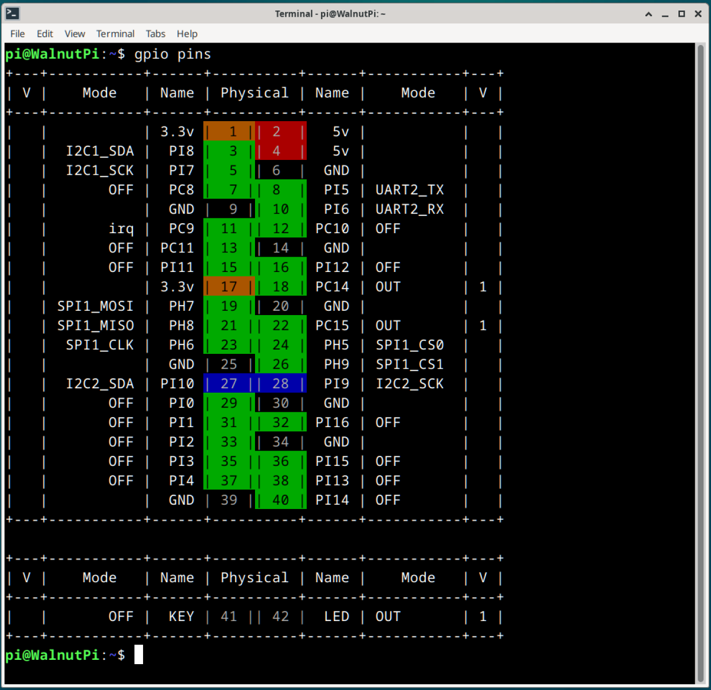
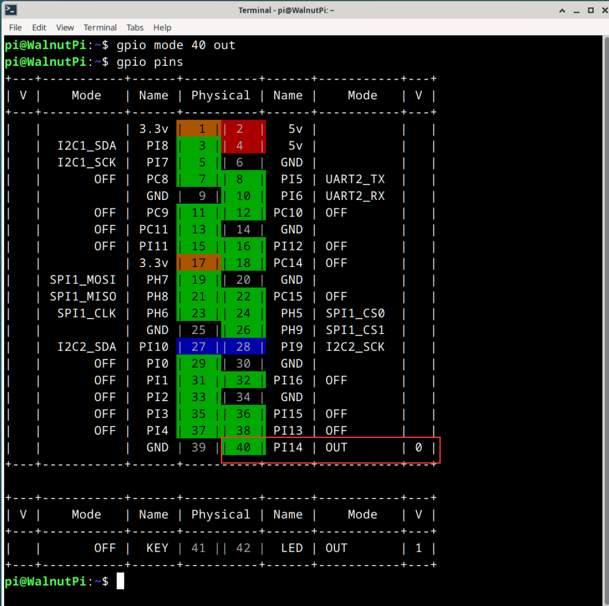
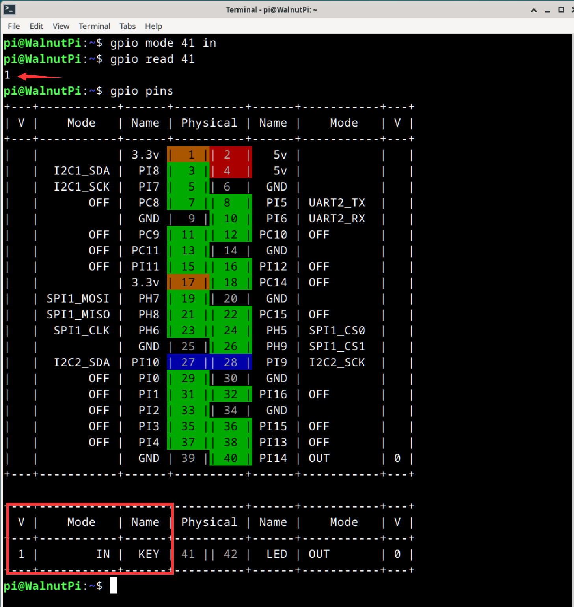
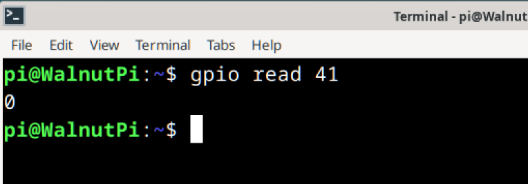

# GPIO指令操作

我们提供了一套在命令行快捷操作gpio的指令，本篇主要介绍该指令的使用方法

想使用python编程控制gpio，请点击这一章节  [**python嵌入式编程 - 点亮第1个LED**](../python/gpio/led.md)

想使用c语言编程控制gpio，请点击这一章节 [**c嵌入式编程 - 控制gpio**](../c/io_gpioc.md)

:::danger[版本兼容性提示]
从核桃派系统**v2.2.2**版本开始，废弃了基于wiringpi的引脚编号，改为使用排针编号来指代引脚。
:::


## 查看所有引脚状态

使用下面指令可以看到核桃派所有引脚定义：
```bash
gpio readall
```
或
```bash
gpio pins
```


上图每一列含义如下：
- `Physical` : 板上排针的编号，后续命令操作时都使用此编号
- `Name` : 引脚名称，在python编程时可使用此名称
- `mode`: 引脚当前所处工作模式：
    - `OFF`: 初始状态未设置
    - `IN`: 输入模式
    - `OUT`: 输出模式
    - `其他`: 引脚复用功能
- `V` : 当引脚为 IN/OUT 模式时，引脚的电平状态，1为高电平，0为低电平


## 查看i2c/uart等引脚的位置

这是核桃派特有功能，为了方便用户查询。

```bash
gpio pin [function]
```
会输出一张表格显示具备该功能的引脚的位置
- `[function]`:功能类型，可选择以下几个选项
    - `pwm`
    - `uart`
    - `spi`
    - `i2c`

例如我想知道i2c引脚是哪些，可以输入下面命令：

```bash
gpio pin i2c
```


## 设置引脚功能
```bash
gpio mode [PIN] [mode]
```
- `[PIN]`:目标引脚的排针编号，
- `[mode]`: 在下面几种中间选择:
    - `IN` : 输入模式,浮空
    - `IN_PULLUP` : 输入模式,开启内部上拉
    - `IN_PULLDOWN` : 输入模式,开启内部下拉
    - `OUT` : 输出模式
    - `OFF` : 回归初始未使用状态

例如我要将引脚40设为输出模式，可以使用下面指令。
```bash
gpio mode 40 out
```
配置完成后再使用**gpio pins**指令查看引脚状态，可以看到PC8的引脚模式改成了OUT输出。



## 控制引脚输出电平

```bash
gpio write [PIN] [status]
```

- `[PIN]` 是你要控制引脚的wpi编号。
- `[status]` ：引脚输出状态。
    - `0` : 低电平（0V）
    - `1` : 高电平（3.3V）


我们可以使用板载蓝色LED来测试一下，由于启动系统后LED默认点亮，我们这里可以使用指令将它熄灭试试。

从前面查表可以看到LED的pin编号为**42**，先设置LED引脚模式为输出：
```bash
gpio mode 42 out
```

再设置输出状态为0（低电平0V）：

```bash
gpio write 42 0
```


可以看到核桃派上的蓝灯熄灭了。


## 读取引脚输入电平

```bash
gpio read [PIN]
```

- `[PIN]` ：要读取引脚的编号。

我们可以使用板载按键来测试一下，读取按键的输入电平，核桃派板载按键没按下时输入1（高电平3.3V），按下是输出0（低电平0V）。

从前面查表可以看到按键KEY的wPi编号为**41**，因为板子上已经加了上拉电阻，只需要设置KEY引脚模式为输入即可：
```bash
gpio mode 41 in
```

先读取一下按键目前的电压状态：

```bash
gpio read 41
```

可以看到KEY的引脚状态为IN（输入），因为有上拉电阻存在，所以没有按下按键时引脚输入电平为1（高电平3.3V）。



接下来**按着按键不要松手**：


再执行读取电平指令，因为开关与地相连，会把引脚电平拉低，所以可以看到输入电平变为0（低电平0V）。
```bash
gpio read 42
```



## 翻转引脚输出电平

这个功能实现将一个输出模式的引脚电平变换，比如当前输出高电平，执行该指令后输出低电平，再次执行再翻转输出高电平。

```bash
gpio toggle [PIN]
```
- `[PIN]` ：输出引脚的wpi编号。

例如将板载LED输出状态翻转：
```bash
gpio toggle 42
```
