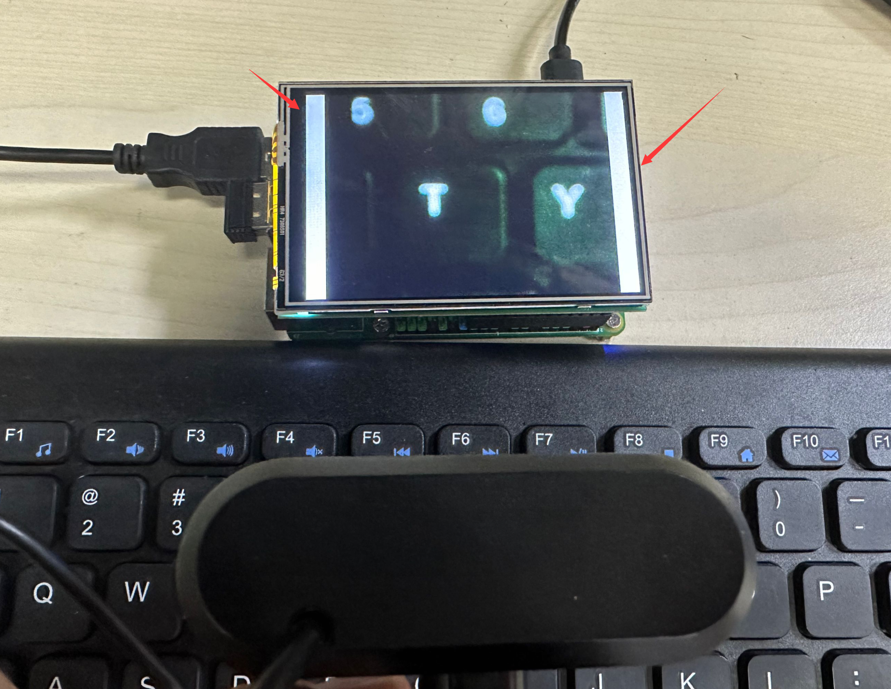

# LCD使用

## 核桃派3.5寸LCD

核桃派官方镜像提供3.5寸LCD屏驱动，烧录桌面板系统并配置启动即可通过LCD显示桌面，实现OpenCV可视化。如摄像头实时采集显示。

核桃派官方3.5寸LCD（电阻触摸）[点击查看使用教程](../os_software/3.5_LCD.md)

直接运行上一节USB摄像头代码即可：


可以通过下面代码实现无边框全屏显示：

```python
# 创建一个全屏无边框的窗口
cv2.namedWindow('Video', cv2.WND_PROP_FULLSCREEN)
cv2.setWindowProperty('Video', cv2.WND_PROP_FULLSCREEN, cv2.WINDOW_FULLSCREEN)
```

完成参考代码如下：
```python
'''
实验名称：USB摄像头使用（全屏显示）
实验平台：核桃派1B
说明：按空格键退出
'''

import cv2

# 创建一个全屏无边框的窗口
cv2.namedWindow('Video', cv2.WND_PROP_FULLSCREEN)
cv2.setWindowProperty('Video', cv2.WND_PROP_FULLSCREEN, cv2.WINDOW_FULLSCREEN)

cam = cv2.VideoCapture(1) # 打开摄像头

while (cam.isOpened()): # 确认被打开
    
    retval, img = cam.read() # 从摄像头中实时读取图像
    
    cv2.imshow("Video", img) # 在窗口中显示读取到的图像
    
    key = cv2.waitKey(1) # 窗口的图像刷新时间为1毫秒，防止阻塞
    
    if key == 32: # 如果按下空格键，打断
        break
    
cam.release() # 关闭摄像头
cv2.destroyAllWindows() # 销毁显示摄像头视频的窗口

```

运行代码效果（无边框）：



:::tip 提示
1.54寸LCD也可以实现以上相关操作。核桃派官方1.54寸LCD [点击查看使用教程](../os_software/1.54_LCD.md)
:::

