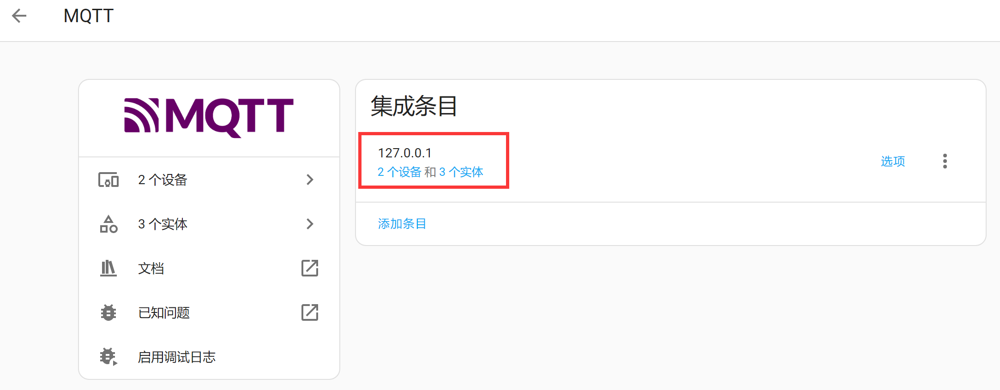
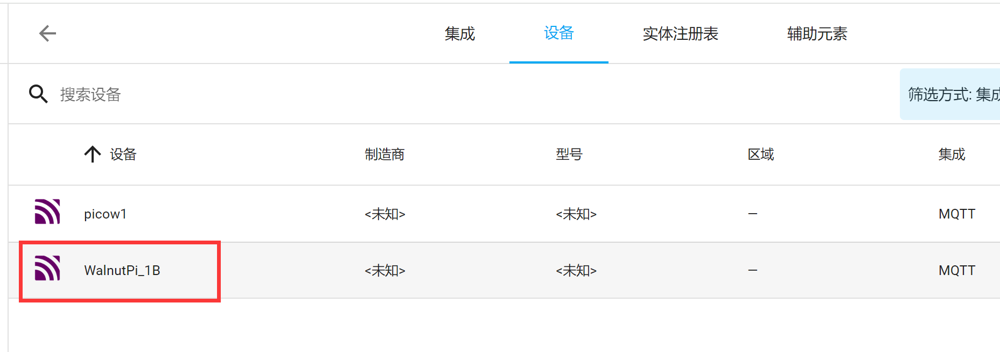
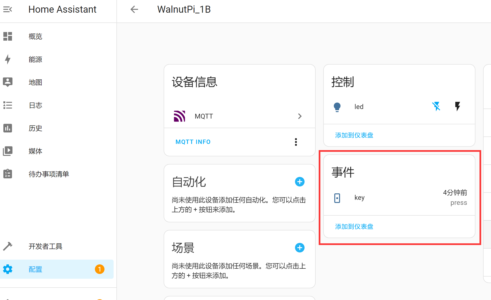
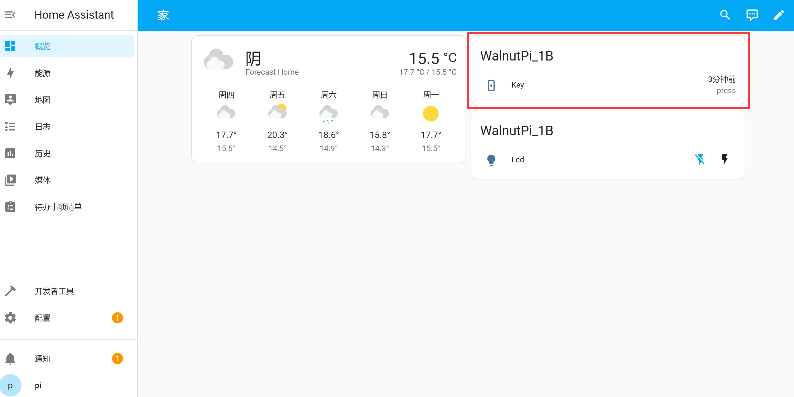
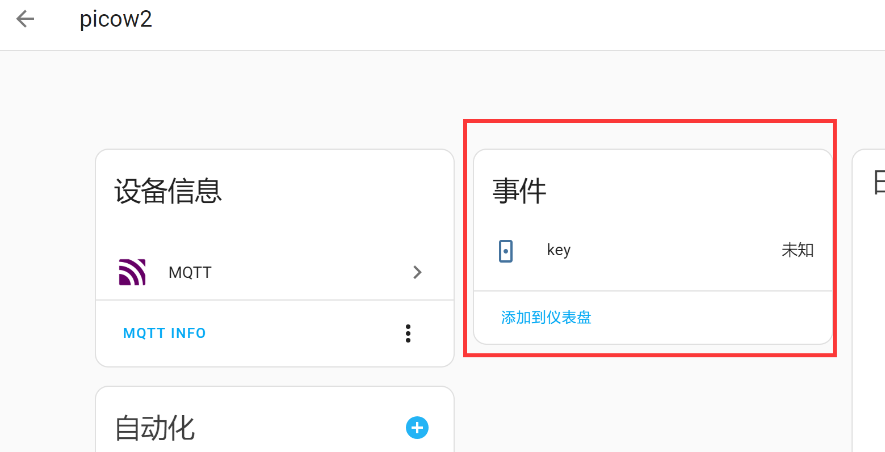
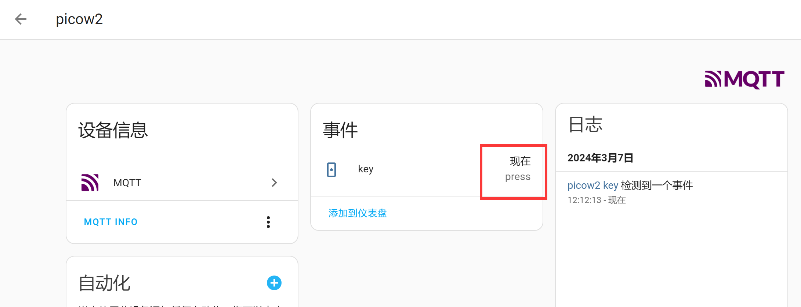
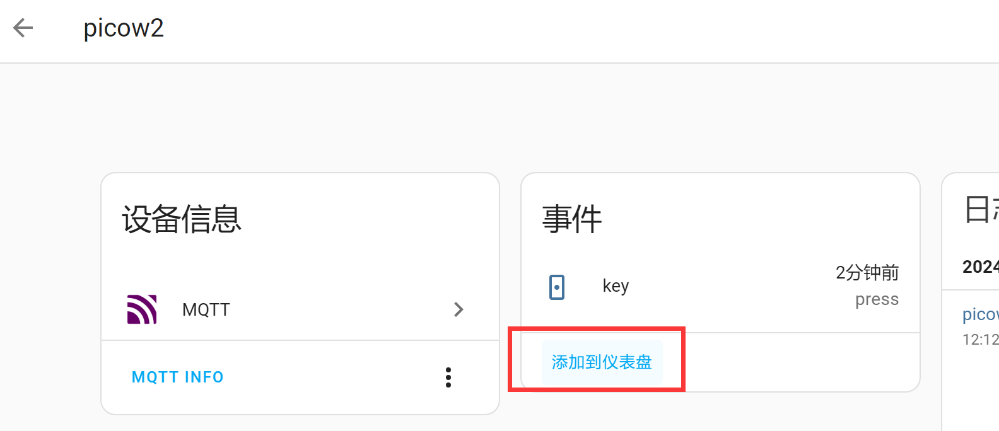
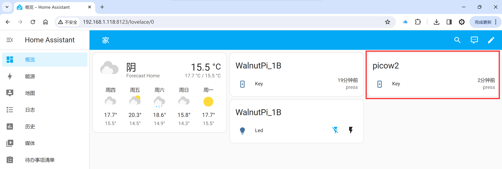

# 按键

## 前言
本节主要内容是为Home Assistant主机添加一个按键，实现按键按下事件检测。为了方便演示，本教程会分别使用核桃派1B和核桃派PicoW（ESP32S3）来作为mqtt节点来操作。

- 核桃派1B按键


- 核桃派PicoW按键


## 实验目的
核桃派Home Assistant主机添加按键并实现按键事件检测。

## 实验讲解

按键需要用到Home Assistant MQTT组件中的event。实验的关键是搞清楚发现MQTT设备的主题信息以及控制方法，具体说明如下：


## MQTT主题

下面这个主题用于Home Assistant主机通过MQTT发现该设备：

```
homeassistant/event/1b_key/config
```

- `homeassistant`:默认的前缀
- `event`: 按键使用的MQTT元件为event
- `1b_key`: 实体的ID，需要唯一，这里自定义的内容，表示核桃派1B的按键；
- `config`:默认的后缀

## MQTT消息

```json
{
    "name":"key",
    "device_class":"doorbell",
    "state_topic": "1b_key/event/state",
    "event_types": "press",
    "unique_id":"1b_key",
           
    "device":{
                "identifiers":"1b_01",
                "name":"WalnutPi_1B"
              }
}
```

### 实体

- `"name":"key"`: 实体名称，自定义填写；
- `"device_class":"doorbell"`: 组件类型，跟前面主题配置信息相关，不能填错，比如这里的`doorbell`是组件`event`下的一个可用实体；
- `"state_topic":"1b_key/event/state"`: 用于注册实体后发布相关属性主题，这里用来发送按键状态，主题内容自定义，保证不同实体的主题不一样即可；
- `"unique_id":"1b_key"`: 实体ID，自定义，务必保证每个实体唯一；

### 设备

告知Home Assistant实体对应的设备。

- `"identifiers":"1b_01"`: 识别标识符，每个设备唯一；
- `"name":"WalnutPi_1B"`: 设备名称，自定义；

更多MQTT light内容可查阅官方文档：https://www.home-assistant.io/integrations/event.mqtt/

代码编写流程如下：

```mermaid
graph TD
    导入相关模块-->构建KEY对象-->连接MQTT服务器-->注册KEY实体和设备-->检测按键状态-->MQTT发送状态信息-->检测按键状态;
```

## 基于核桃派1B实现

核桃派1B板载可编程按键，我们在前面教程中学习过核桃派使用Python编程实现MQTT通讯[MQTT通讯](../../../python/network/mqtt.md)，在这个基础上实现即可：

### 参考代码

```python
'''
实验名称：Home Assistant 按键
实验平台：核桃派1B
作者：WalnutPi
说明：编程实现Home Assistant 按键检测。
'''

#导入相关库
import paho.mqtt.client as mqtt

import board,time
from digitalio import DigitalInOut, Direction

#构建按键对象和初始化
key = DigitalInOut(board.KEY) #定义引脚编号
key.direction = Direction.INPUT #IO为输入

#MQTT服务器和用户信息
CLIENT_ID = 'WalnutPi-KEY' # 客户端ID
SERVER = '127.0.0.1' #表示本机IP地址
PORT = 1883    
USER='pi'
PASSWORD='pi'

#构建mqtt客户端对象
client = mqtt.Client(CLIENT_ID)

#配置用户名和密码
client.username_pw_set(USER, PASSWORD)

#发起连接
client.connect(SERVER,PORT)

#首次启动注册设备
topic = "homeassistant/event/1b_key/config"
message = """{
           "name":"key",
           "device_class":"doorbell",
           "state_topic": "1b_key/event/state",
           "event_types": "press",
           "unique_id":"1b_key",
           
           "device":{
                      "identifiers":"1b_01",
                      "name":"WalnutPi_1B"
                    }
            }"""

client.publish(topic, message)

# 开启新线程保持MQTT连接。
client.loop_start()

while True:
    
    if key.value == 0: #按键被按下
        
        time.sleep(0.01) #延时10ms消抖
        
        if key.value == 0: #按键被按下
            
            client.publish("1b_key/event/state", """{"event_type":"press"}""") #发送按键事件
            
            while key.value == 0: #等待按键松开
                
                pass
```

### 实验结果

这里使用Thonny远程核桃派运行以上Python代码，关于核桃派运行python代码方法请参考： [运行Python代码](../../../python/python_run.md)


运行后可以看到Home Assistant主机显示2个设备和3个实体，这是因为我们把按键注册到上一节LED的设备中去了。：



点击**设备**，打开WalnutPi_1B设备：



可以看到右边实体多了一个事件，就是刚刚添加的按键（一个设备可以拥有多个实体）：



按下核桃派1B上的按键：


在Home Assistant主机页面可以看到触发了Press事件：


可以点击**添加到仪表盘**：


Home Assistant系统会自动选择卡片类型：


添加后可在概览首页界面看到按键实体：



## 基于核桃派PicoW实现

核桃派PicoW（ESP32-S3）板载可编程按键，使用方法参考:[核桃派PicoW教程](https://www.walnutpi.com/picow/directory)，保证核桃派PicoW和核桃派1B连接到同一个路由器下即可：


### 参考代码
```python
'''
实验名称：Home Assistant 按键
实验平台：核桃派1B + 核桃派PicoW
作者：WalnutPi
说明：编程实现Home Assistant 按键检测
'''
import network,time
from simple import MQTTClient #导入MQTT板块
from machine import Pin,Timer

LED=Pin(46, Pin.OUT) #初始化WIFI指示灯

#WIFI连接函数
def WIFI_Connect():

    global LED

    wlan = network.WLAN(network.STA_IF) #STA模式
    wlan.active(True)                   #激活接口
    start_time=time.time()              #记录时间做超时判断

    if not wlan.isconnected():
        print('connecting to network...')
        wlan.connect('01Studio_2.4G', '01studio0123456789') #输入WIFI账号密码

        while not wlan.isconnected():

            #LED闪烁提示
            LED.value(1)
            time.sleep_ms(300)
            LED.value(0)
            time.sleep_ms(300)

            #超时判断,15秒没连接成功判定为超时
            if time.time()-start_time > 15 :
                print('WIFI Connected Timeout!')
                break

    if wlan.isconnected():
        #LED点亮
        LED.value(1)

        #串口打印信息
        print('network information:', wlan.ifconfig())

        return True

    else:
        return False


#接收数据任务
def MQTT_Rev(tim):
    client.check_msg()

#执行WIFI连接函数并判断是否已经连接成功
if WIFI_Connect():
    
    CLIENT_ID = 'WalnutPi-PicoW2' # 客户端ID
    SERVER = '192.168.1.118'  # MQTT服务器地址
    PORT = 1883    
    USER='pi'
    PASSWORD='pi'
    
    client = MQTTClient(CLIENT_ID, SERVER, PORT, USER, PASSWORD) #建立客户端对象
    client.connect()
    
    #注册设备
    TOPIC = "homeassistant/event/picow2_key/config"
    mssage = """{
                  "name": "key",
                  "device_class": "doorbell",
                  "state_topic": "picow2_key/event/state",
                  "event_types": "press",
                  "unique_id": "picow2_key",
                  
                  "device": {
                    "identifiers": "picow_2",
                    "name": "picow2"
                  }
                }
            """

    client.publish(TOPIC, mssage)


KEY=Pin(0,Pin.IN,Pin.PULL_UP) #构建KEY对象

#LED状态翻转函数
def fun(KEY):
    time.sleep_ms(10) #消除抖动
    if KEY.value()==0: #确认按键被按下
        
        #发送mqtt按键信息
        TOPIC = "picow2_key/event/state"
        mssage = """{"event_type":"press"}"""
        client.publish(TOPIC, mssage)

KEY.irq(fun,Pin.IRQ_FALLING) #定义中断，下降沿触发

while True:
    
    pass

```

### 实验结果

使用Thonny 连接核桃派PicoW开发板，运行上面代码：


连接成功后可以看到核桃派Home Assistant主机多了一个设备：


进入设备，可以看到出现了注册的key事件实体：



按下核桃派PicoW的按键：


核桃派Home Assistant主机检测到press事件：



同样可以在右边控制LED开关和添加到仪表盘：






