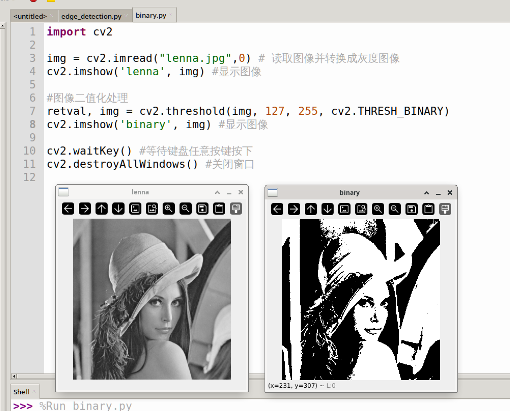

# 二值化

## 前言

我们在前面学习过灰度图像变换，灰度图像相对于彩色图像好处是信息量少，单通道0~255取值能实现更快的处理速度，而这节的二值化图像相对于灰度图像进一步处理，实现小于某个阈值转换为0（纯黑色），大于某个阈值转换为255（纯白色），这样能更明显保留图像主体轮廓。

## 实验目的

对图像进行二值化处理。

## 实验讲解

OpenCV Python库提供了threshold()函数进行阈值处理，进而实现图像二值化。

### threshold() 使用方法

```python
retval, img = cv2.threshold(src, thresh, maxval, type)
```

阈值处理。返回retval表示处理时候使用的阈值；返回img表示阈值处理后的图像。
- `src` ：原始图像。
- `thresh` ：阈值，通常取值125~150。
- `maxval` ：阈值处理采用的最大值，通常取值255。
- `type` ：处理类型。
    - `cv2.THRESH_BINARY` ：二值化阈值处理。
    - `cv2.THRESH_BINARY_INV` ：反二值化阈值处理。
    - `cv2.THRESH_TOZERO` ：低于阈值零处理。
    - `cv2.THRESH_TOZERO_INV` ：超出阈值零处理。
    - `cv2.THRESH_TRUNC` ：截断阈值处理。

本节实验用到 `cv2.THRESH_BINARY`二值化阈值处理实现图像二值化。中间值 thresh = 127 ， 最大值 maxval = 255。那么图像中像素<127的会改成0，下雨127的会改成255。变成一张非黑即白的图像。

代码编写流程如下：

```mermaid
graph TD
    打开图像-->图像二值化处理-->显示图像;
```

<br></br>

参考代码如下:


```python
'''
实验名称：图像二值化
实验平台：核桃派1B
'''

import cv2

img = cv2.imread("lenna.jpg",0) # 读取图像并转换成灰度图像
cv2.imshow('lenna', img) #显示图像

#图像二值化处理
retval, img = cv2.threshold(img, 127, 255, cv2.THRESH_BINARY) 
cv2.imshow('binary', img) #显示图像

cv2.waitKey() #等待键盘任意按键按下
cv2.destroyAllWindows() #关闭窗口

```

## 实验结果

在核桃派运行上面代码，可以看到实验结果如下图 (多个窗口可能会出现重叠，使用鼠标拖动一下)：



