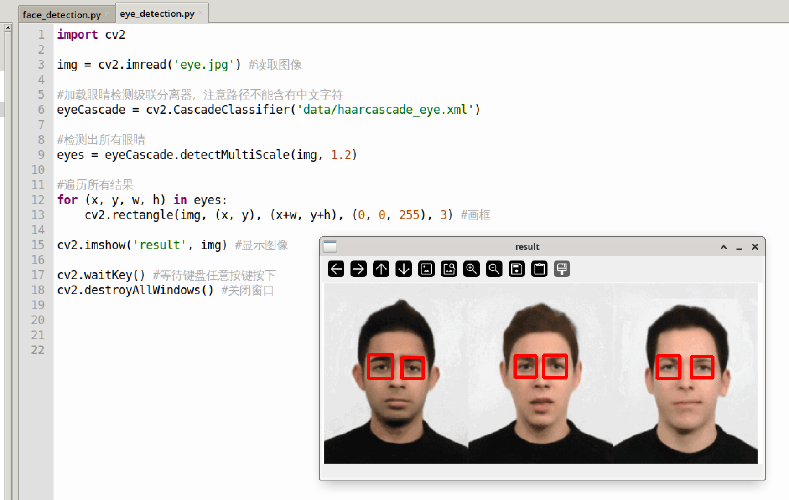
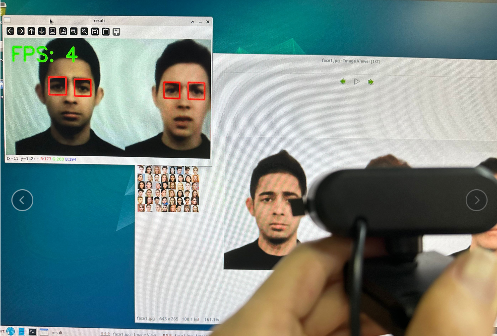

# 眼睛检测

## 前言

本节学习使用OpenCV对图像中的眼睛进行检测。

## 实验目的

检测图像中的眼睛并画矩形框显示。

## 实验讲解

这里前面介绍过的级联分类器使用方法，本节使用眼睛检测级联分类器 `haarcascade_eye.xml` ，代码编写流程如下：

```mermaid
graph TD
    读取图像-->加载级联分类器-->分类器识别指定目标-->画框-->显示图像;
```

<br></br>

## 参考代码

参考代码如下:

```python
'''
实验名称：眼睛检测
实验平台：核桃派1B
'''

import cv2

img = cv2.imread('eye.jpg') #读取图像

#加载眼睛检测级联分离器，注意路径不能含有中文字符
eyeCascade = cv2.CascadeClassifier('data/haarcascade_eye.xml')

#检测出所有眼睛
eyes = eyeCascade.detectMultiScale(img, 1.2)

#遍历所有结果
for (x, y, w, h) in eyes:
    cv2.rectangle(img, (x, y), (x+w, y+h), (0, 0, 255), 3) #画框
    
cv2.imshow('result', img) #显示图像

cv2.waitKey() #等待键盘任意按键按下
cv2.destroyAllWindows() #关闭窗口    

```

## 实验结果

在核桃派运行上面代码，实验结果如下：

 

## 使用USB摄像头识别

结合前面USB摄像头使用方法可以通过USB摄像头实时识别，参考代码如下：

### 参考代码

```python
'''
实验名称：眼睛检测（使用USB摄像头）
实验平台：核桃派1B
'''

import cv2, time

#加载眼睛检测级联分离器，注意路径不能含有中文字符
eyeCascade = cv2.CascadeClassifier('data/haarcascade_eye.xml')

cam = cv2.VideoCapture(1) # 打开USB摄像头

#降低分辨率能提高识别速度,可以设置为480x320或320x240
cam.set(3,480) # 设置采集图像宽为480
cam.set(4,320) # 设置采集图像高为320
 
#计算FPS（每秒帧率参数）
start = 0
end = 0

while True:
    
    start = time.time() #记录开始时间
    
    retval, img = cam.read() # 从摄像头中实时读取图像

    #检测出所有眼睛
    eyes = eyeCascade.detectMultiScale(img, 1.15)

    #遍历所有结果
    for (x, y, w, h) in eyes:
        cv2.rectangle(img, (x, y), (x+w, y+h), (0, 0, 255), 3) #画框
        
            
    end = time.time() #记录结束时间
    
    #计算FPS(每秒帧率),结果取整数
    fps = round(1/(end-start))
    print('FPS: ', fps)
    
    #图像上写字符
    cv2.putText(img, "FPS: "+ str(fps), (20, 70), cv2.FONT_HERSHEY_SIMPLEX, 2, (0, 255, 0), 5)
    
    cv2.imshow('result', img) #显示图像
    
    key = cv2.waitKey(1) # 窗口的图像刷新时间为1毫秒，防止阻塞    
    if key == 32: # 如果按下空格键，打断退出
        break
    
cam.release() # 关闭摄像头
cv2.destroyAllWindows() # 销毁显示摄像头视频的窗口

```

### 实验结果

