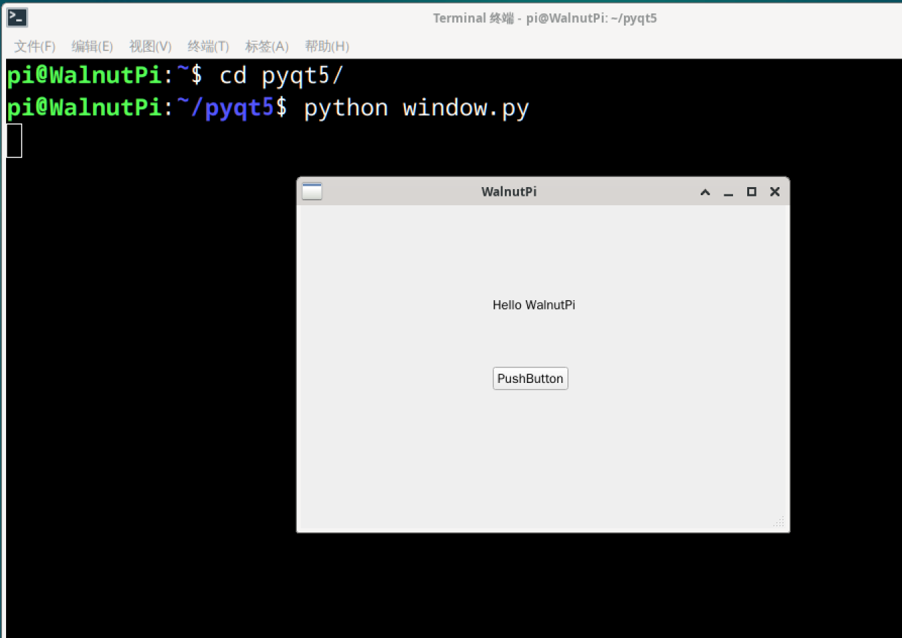
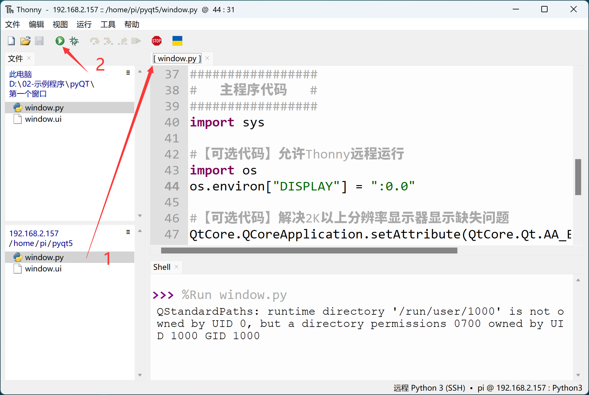
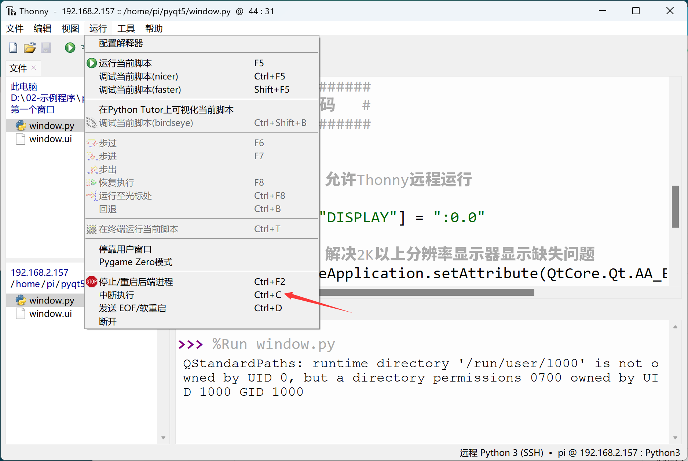
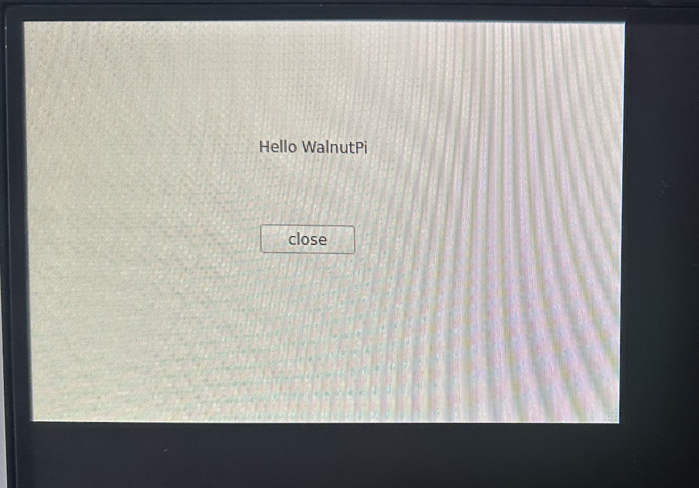

# 代码编写和运行

## 核桃派本地

在上一节我们通过Qt Designer设计了ui窗口并转换成了Python代码，由于是Python编程，因此我们可以在核桃派开发板打开Python代码进行编程。

在核桃派上推荐使用Thonny来打开编写Python文件, 使用请参考：[**Thonny IDE**](../python/python_run#thonny-ide)。

打开上一节生成的window.py文件，在代码后面添加下方程序入口代码, 添加后完整代码如下：

```python
# -*- coding: utf-8 -*-

# pyQT5 For WalnutPi

from PyQt5 import QtCore, QtGui, QtWidgets

class Ui_MainWindow(object):
    def setupUi(self, MainWindow):
        MainWindow.setObjectName("MainWindow")
        MainWindow.resize(480, 320)
        self.centralwidget = QtWidgets.QWidget(MainWindow)
        self.centralwidget.setObjectName("centralwidget")
        self.pushButton = QtWidgets.QPushButton(self.centralwidget)
        self.pushButton.setGeometry(QtCore.QRect(190, 160, 75, 23))
        self.pushButton.setObjectName("pushButton")
        self.label = QtWidgets.QLabel(self.centralwidget)
        self.label.setGeometry(QtCore.QRect(190, 90, 91, 16))
        self.label.setObjectName("label")
        MainWindow.setCentralWidget(self.centralwidget)
        self.menubar = QtWidgets.QMenuBar(MainWindow)
        self.menubar.setGeometry(QtCore.QRect(0, 0, 480, 22))
        self.menubar.setObjectName("menubar")
        MainWindow.setMenuBar(self.menubar)
        self.statusbar = QtWidgets.QStatusBar(MainWindow)
        self.statusbar.setObjectName("statusbar")
        MainWindow.setStatusBar(self.statusbar)

        self.retranslateUi(MainWindow)
        QtCore.QMetaObject.connectSlotsByName(MainWindow)

    def retranslateUi(self, MainWindow):
        _translate = QtCore.QCoreApplication.translate
        MainWindow.setWindowTitle(_translate("MainWindow", "WalnutPi"))
        self.pushButton.setText(_translate("MainWindow", "PushButton"))
        self.label.setText(_translate("MainWindow", "Hello WalnutPi"))

#################
#   主程序代码   #
#################
import sys

#【可选代码】允许Thonny远程运行
import os
os.environ["DISPLAY"] = ":0.0"

#【可选代码】解决2K以上分辨率显示器显示缺失问题
QtCore.QCoreApplication.setAttribute(QtCore.Qt.AA_EnableHighDpiScaling)

#主程序入口，构建窗口并显示
app = QtWidgets.QApplication(sys.argv)
MainWindow = QtWidgets.QMainWindow() #构建窗口对象
ui = Ui_MainWindow() #构建pyQT5设计的窗口对象
ui.setupUi(MainWindow) #初始化窗口
MainWindow.show() #显示窗口

#【建议代码】允许终端通过ctrl+c中断窗口，方便调试
import signal
signal.signal(signal.SIGINT, signal.SIG_DFL)
timer = QtCore.QTimer()
timer.start(100)  # You may change this if you wish.
timer.timeout.connect(lambda: None)  # Let the interpreter run each 100 ms

sys.exit(app.exec_()) #程序关闭时退出进程

```

在核桃派桌面的Thonny点击运行，可以看到弹出了我们上一节设计的第一个窗口。（终端警告提示可以忽略）


也可以在终端通过python指令运行修改好的window.py文件，效果一样。



点击关闭窗口可以关掉进程，如果是无关闭按钮的窗口可以通过终端按 Ctrl+C 组合键打断窗口进程。

:::tip 提示

由于pyQT5夸代码平台兼容。所以在Windows本地的操作跟上面内容完全一样。

:::

## Thonny远程开发（基于Windows）

上面使用核桃派系统里面的Thonny IDE编程，同样我们可以使用Windows上的Thonny IDE远程到核桃派进行Python编程。核桃派系统出厂已经预装ssh服务，可以通过ssh远程控制。这个方法适合使用自己电脑远程开发。远程方法参考Python嵌入式编程里面：[Thonny远程](../python/python_run#thonny-远程连接基于windows) 内容，这里不再重复。

需要注意的是Thonny远程时务必加入下面代码才可正常运行：

```python
# 允许Thonny远程运行
import os
os.environ["DISPLAY"] = ":0.0"
```

远程打开核桃派的window.py文件（上面完整的代码），点击运行：



在核桃派开发板的桌面就弹出了该窗口。


通过在Thonny主菜单**运行--中断** 或在下方终端按ctrl+c 即可退出窗口程序。




## 通过3.5寸LCD显示

上面方法既可通过核桃派HDMI显示器显示，也可以通过3.5寸LCD显示。3.5寸显示屏使用说明：[3.5寸触摸显示屏](../os_software/3.5_LCD.md)


## 无桌面系统运行pyQT5说明

无桌面系统需要开启进入**可使用鼠标的xterm终端**，才能进入QT调试模式。

```bash
sudo systemctl enable lightdm.service
```

执行完需要重启生效：
```bash
sudo reboot
```

重启后自动登录pi，命令在左上角，可以看到鼠标，如下图：


这时候就可以本地或远程运行pyQT5的python文件代码：



下面指令可以退出此功能：
```bash
sudo systemctl disable lightdm.service
```

也是要重启生效，就返回普通终端模式了：
```bash
sudo reboot
```