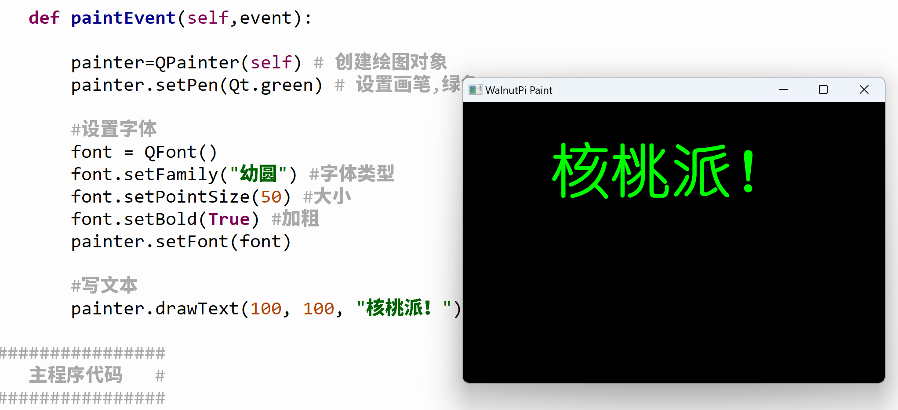

# 字体设置

上一节我们学会了基本的图形画法，这一节我们来学习画笔和画刷设置。

## 字体对象（QFont）

字体对象主要用来设置字体大小、样式等。

|  常用字体方法 |  说明 |
|  :---:  | --- | 
| setFamily()  |  设置字体类型 | 
| setPointSize()  |  设置字体大小  | 
| setBold()  |  设置粗体。参数: `True` 粗体，`False` 非粗体  | 
| setItalic()  |  设置斜体。参数: `True` 斜体，`False` 非斜体  | 
| setOverline()  |  设置文本上划线  | 
| setUnderline()  |  设置文本下划线  | 
| setStrikeOut()  |  设置文本中划线  | 

## 使用示例

**例：给上一节写字体例程的字体加大加粗。**

实现代码如下：

```python
# -*- coding: utf-8 -*-

# pyQT5 For WalnutPi

from PyQt5 import QtCore, QtGui, QtWidgets

from PyQt5.QtCore import Qt
from PyQt5.QtGui import QPainter, QFont
from PyQt5.QtWidgets import QWidget

class Window(QWidget):
    
    def __init__(self):
        super().__init__() #同时执行父对象QWidget的初始化程序
        self.setWindowTitle("WalnutPi Paint") # 设置窗口标题
        self.resize(480,320) # 设置窗口大小
        
        #窗口背景颜色设置
        self.setObjectName("Paint_Window")
        self.setStyleSheet("#Paint_Window{background-color: black}") #黑色

    def paintEvent(self,event):
        
        painter=QPainter(self) # 创建绘图对象
        painter.setPen(Qt.green) # 设置画笔,绿色
        
        #设置字体
        font = QFont()
        font.setFamily("幼圆") #字体类型
        font.setPointSize(50) #大小
        font.setBold(True) #加粗
        painter.setFont(font)
        
        #写文本
        painter.drawText(100, 100, "核桃派！")
     
#################
#   主程序代码   #
#################
import sys

#【可选代码】允许Thonny远程运行
import os
os.environ["DISPLAY"] = ":0.0"

#【可选代码】解决2K以上分辨率显示器显示缺失问题
QtCore.QCoreApplication.setAttribute(QtCore.Qt.AA_EnableHighDpiScaling)

#主程序入口，构建窗口并显示
app = QtWidgets.QApplication(sys.argv)
window = Window() #构建窗口对象
window.show() #显示窗口
#window.showFullScreen() #全屏显示窗口

#【建议代码】允许终端通过ctrl+c中断窗口，方便调试
import signal
signal.signal(signal.SIGINT, signal.SIG_DFL)
timer = QtCore.QTimer()
timer.start(100)  # You may change this if you wish.
timer.timeout.connect(lambda: None)  # Let the interpreter run each 100 ms

sys.exit(app.exec_()) #程序关闭时退出进程

```

这里代码和之前区别主要是加入了字体设置：
```python

    def paintEvent(self,event):

        ...

        #设置字体
        font = QFont()
        font.setFamily("幼圆") #字体类型
        font.setPointSize(50) #大小
        font.setBold(True) #加粗
        painter.setFont(font)
        
```

运行结果如下：
