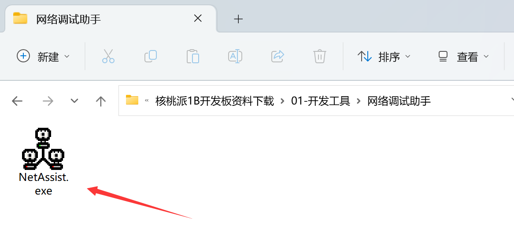
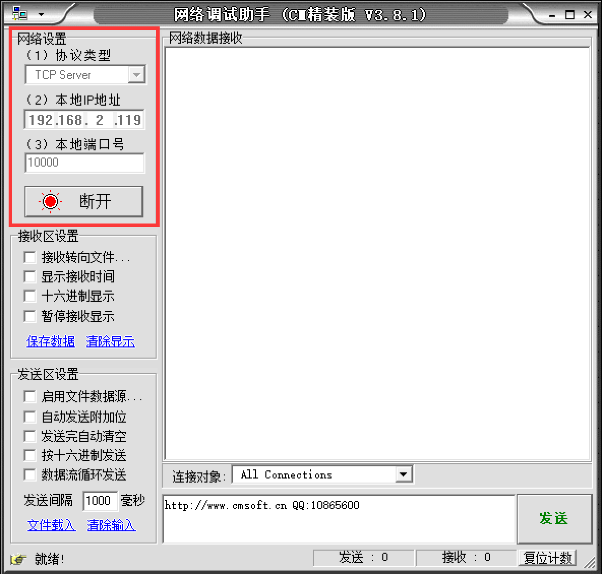
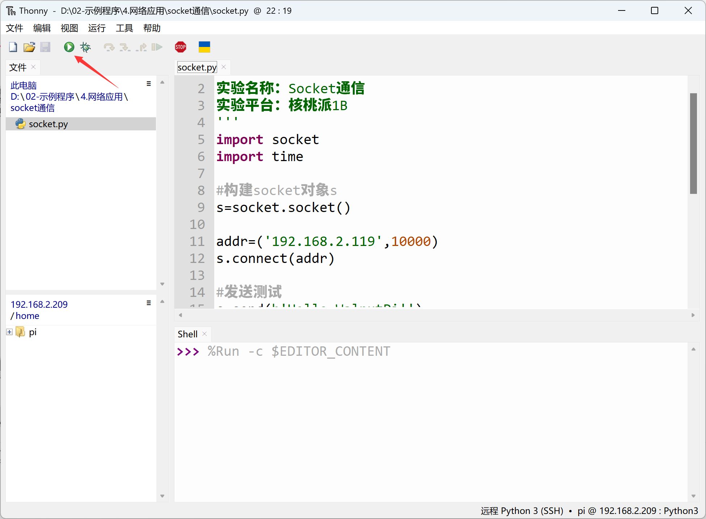
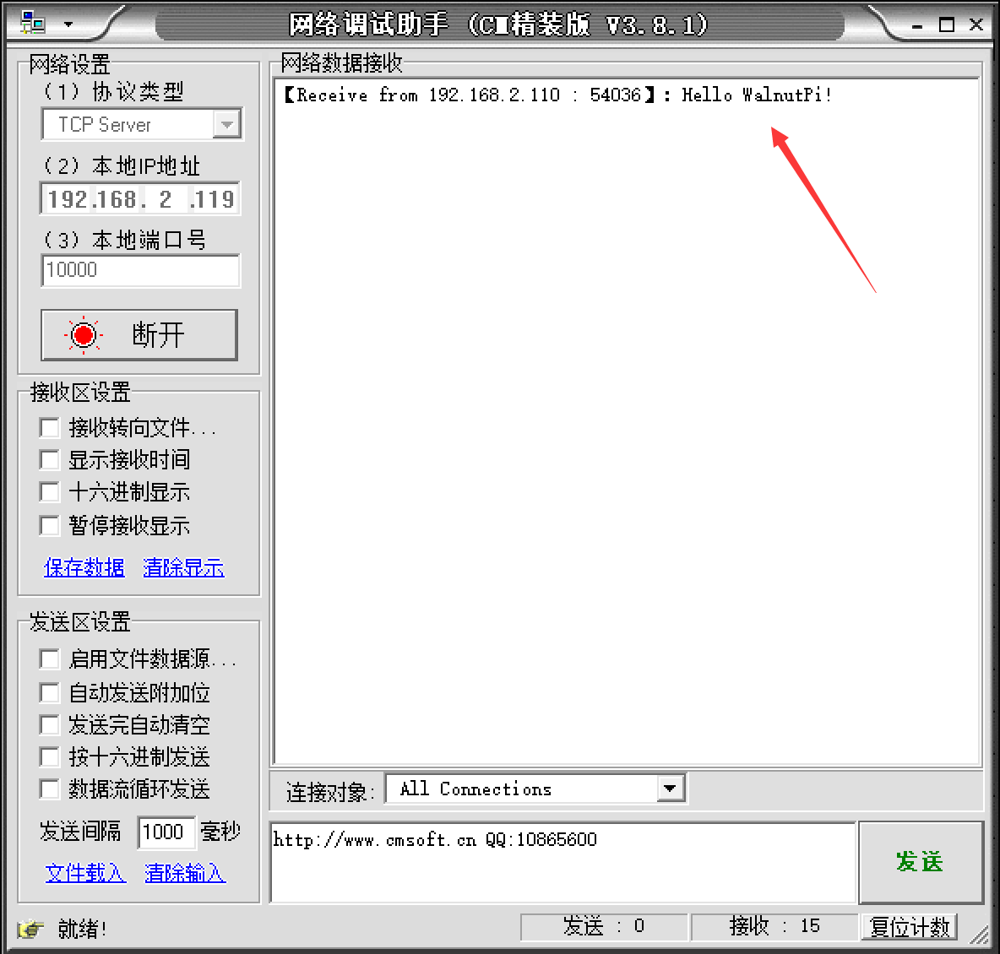
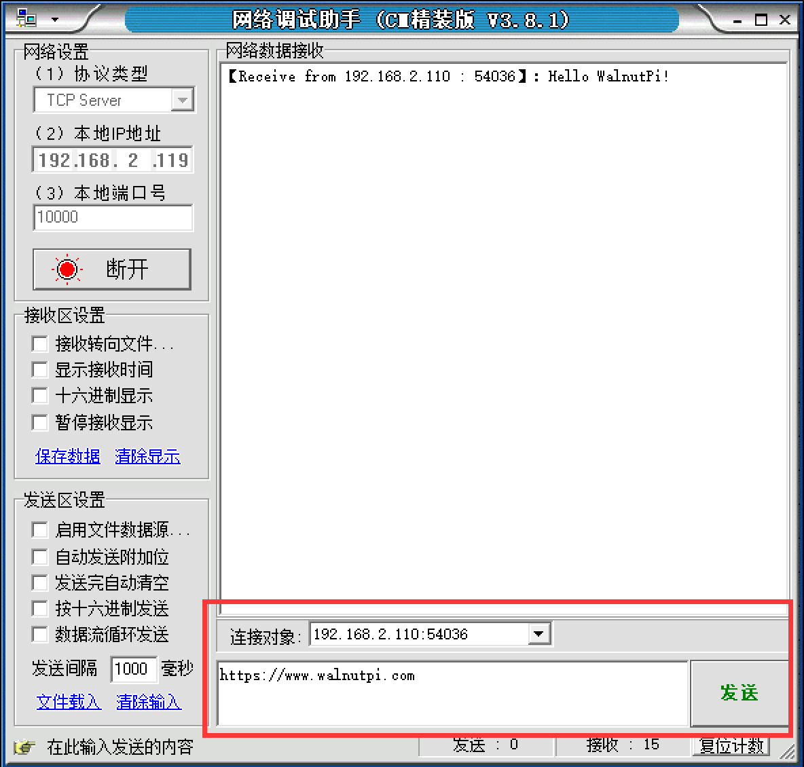
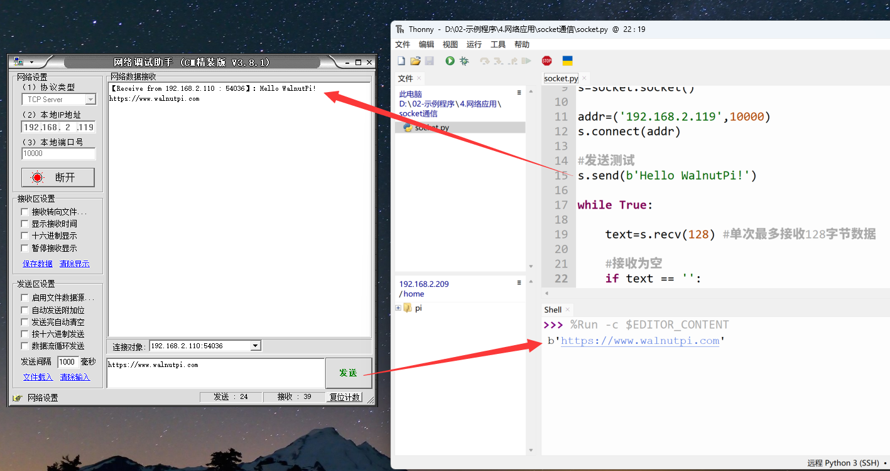

# Socket通讯

## 前言
在万物互联时代的今天，智能设备联网越来越普遍，然而大部分设备的最终连接到本地或者在线服务器都是通过传统的互联网机制连接。核桃派拥有WiFi（2.4G/5G）和以太网的接入方式，这在操作系统启动后自动完成，因此我们着
重通讯编程即可。而跑着Liunx系统的核桃派，甚至可以成为一台轻量级的本地服务器。

这一节我们则来学习一下最常见的Socket通信实验。 Socket几乎是总个互联网通信的基础。

## 实验目的
通过Socket编程实现核桃派与电脑网络服务器助手建立连接，相互收发数据。

## 实验讲解
Socket我们听得非常多了，但由于网络工程是一门系统工程，涉及的知识非常广，概念也很多，任何一个知识点都能找出一堆厚厚的的书，因此我们经常会混淆。在这里，我们尝试以最容易理解的方式来讲述Socket，如果需要全面了解，可以自行查阅相关资料学习。

我们先来看看网络层级模型图，这是构成网络通信的基础：


我们看看TCP/IP模型的传输层和应用层，传输层比较熟悉的概念是TCP和UDP，UPD协议基本就没有对IP层的数据进行任何的处理了。而TCP协议还加入了更加复杂的传输控制，比如滑动的数据发送窗口（Slice Window），以及接收确认和重发机制，以达到数据的可靠传送。应用层中网页常用的则是HTTP。那么我们先来解析一下这TCP和HTTP两者的关系。

我们知道网络通信是最基础是依赖于IP和端口的，HTTP一般情况下默认使用端口80。举个简单的例子：我们逛淘宝，浏览器会向淘宝网的网址（本质是IP）和端口发起请求，而淘宝网收到请求后响应，向我们手机返回相关网页数据信息，实现了网页交互的过程。而这里就会引出一个多人连接的问题，很多人访问淘宝网，实际上接收到网页信息后就断开连接，否则淘宝网的服务器是无法支撑这么多人长时间的连接的，哪怕能支持，也非常占资源。

也就是应用层的HTTP通过传输层进行数据通信时，TCP会遇到同时为多个应用程序进程提供并发服务的问题。多个TCP连接或多个应用程序进程可能需要通过同一个 TCP协议端口传输数据。为了区别不同的应用程序进程和连接，许多计算机操作系统为应用程序与TCP／IP协议交互提供了套接字(Socket)接口。应用层可以和传输层通过Socket接口，区分来自不同应用程序进程或网络连接的通信，实现数据传输的并发服务。

简单来说，Socket抽象层介于传输层和应用层之间，跟TCP/IP并没有必然的联系。Socket编程接口在设计的时候，就希望也能适应其他的网络协议。


套接字（socket）是通信的基石，是支持TCP/IP协议的网络通信的基本操作单元。它是网络通信过程中端点的抽象表示，包含进行网络通信必须的五种信息：**连接使用的协议（通常是TCP或UDP），本地主机的IP地址，本地进程的协议端口，远地主机的IP地址，远地进程的协议端口。**

所以，socket的出现只是可以更方便的使用TCP/IP协议栈而已，简单理解就是其对TCP/IP进行了抽象，形成了几个最基本的函数接口。比如**create，listen，accept，connect，read和write**等等。以下是通讯流程：


从上图可以看到，建了Socket通信需要一个服务器端和一个客户端，以本实验为例，核桃派作为客户端，电脑使用网络调试助手作为服务器端，双方使用TCP协议传输。对于客户端，则需要知道电脑端的IP和端口即可建立连接。（端口可以自定义，范围在0~65535，注意不占用常用的80等端口即可。）

以上的内容，简单来说就是如果用户面向应用来说，那么核桃派只需要知道**通讯协议是TCP或UDP、服务器的IP和端口号**这3个信息，即可向服务器发起连接和发送信息。就这么简单。

一般来说，操作系统已经自带socket模块，我们直接使用python编程调用即可，socket对象如下介绍：

## socket对象

### 构造函数
```python
s=socket.socekt(family=AF_INET, type=SOCK_STREAM)
```
参数说明：
- `family` IPV类型
    - `socket.AF_INET` IPV4
    - `socket.AF_INET6` IPV6

- `type` 通讯类型
    - `socket.SCOK_STREAM` TCP
    - `socket.SOCK_DGRAM` UDP

### 使用方法
```python
addr=socket.getaddrinfo('www.baidu.com', 80)[0][-1]
```
获取Socket通信格式地址。返回：('14.215.177.38',80)
<br></br>

```python
s.connect(address)
```
创建连接。
- `address` :地址格式为IP+端口。例：('192.168.1.115',10000)    

<br></br>

```python
s.send(bytes)
```
发送数据。
- `bytes`：发送内容格式为字节。

<br></br>

```python
s.recv(bufsize)
```
接收数据。
- `bufsize`：单次最大接收字节个数。

<br></br>

```python
s.bind(address)
```
绑定，用于服务器角色。

<br></br>

```python
s.listen([backlog])
```
监听，用于服务器角色。
- `backlog`: 允许连接个数，必须大于0。

<br></br>

```python
s.accept()
```
接受连接，用于服务器角色。

<br></br>

更多用法请阅读python socket官方文档：
https://docs.python.org/zh-cn/3.7/library/socket.html#functions

本实验中核桃派属于客户端，因此只用到客户端的函数即可。实验代码编写流程如下：

```mermaid
graph TD
    导入相关模块-->初始化相关模块-->建立socket连接-->判断是否连接成功--是-->相互收发数据;
    判断是否连接成功--否-->结束;
```


## 参考代码

```python
'''
实验名称：Socket通信
版本： v1.0
日期： 2023.8
平台： 核桃派
说明：跟电脑网络助手进行Socket通信
'''
import socket
import time

#构建socket对象s
s=socket.socket()

addr=('192.168.1.111',10000)
s.connect(addr)

#发送测试
s.send(b'Hello 01Studio!')

while True:
    
    text=s.recv(128) #单次最多接收128字节数据
    
    #接收为空
    if text == '':
        pass
    
    #接收到数据，打印并回传
    else:
        print(text) 
        s.send(text)
        
    time.sleep(0.1) #100ms查询间隔
```

## 实验结果

保证电脑和核桃派在同一个网段下（通常是指连接在同一个路由器），同时最好关闭电脑防火墙。通过"sudo ifconfig"指令[获取核桃派IP地址](../../os_software/ip_get)

电脑打开网络调试助手：



选择TCP Server，填写电脑的IP地址，端口这里测试用10000，点击连接，等待接收数据：



使用Thonny远程核桃派运行以上Python代码，关于核桃派运行python代码方法请参考： [运行Python代码](../python_run)




运行后可以看到电脑网络助手接收到核桃派发来的信息：




在网络助手发送栏连接对象选择核桃派的IP和端口项，输入要发送的信息，点击发送：



可以看到thonny下方终端打印接收到的数据（实际是核桃派开发板接收到的数据）



通过本节学习，我们了解了socket通信原理以及使用python进行socket编程并且通信的实验。得益于优秀的封装，让我们可以直接面向socket对象编程就可以快速实现socket通信，从而开发更多的网络应用，例如将前面采集到的传感器数据发送到其它核桃派开发板板、电脑或者远程服务器。