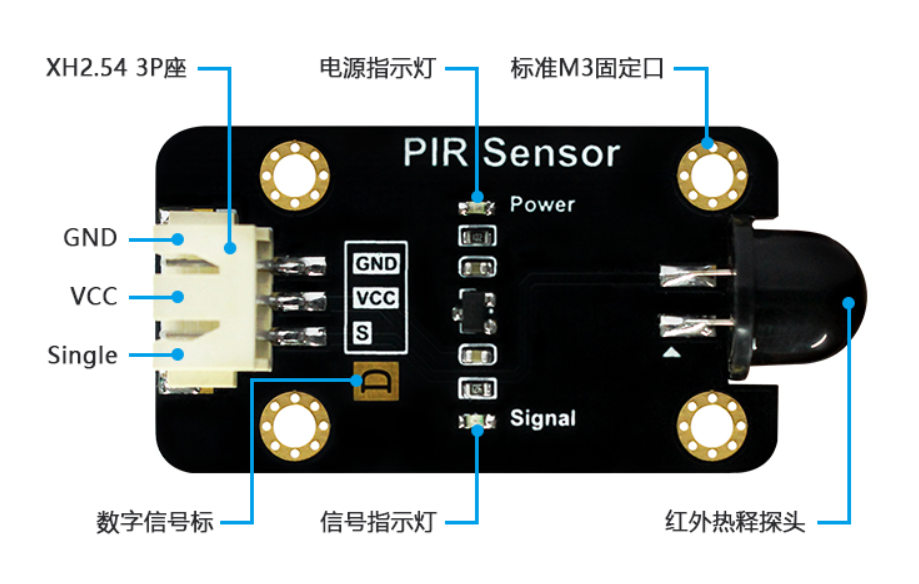
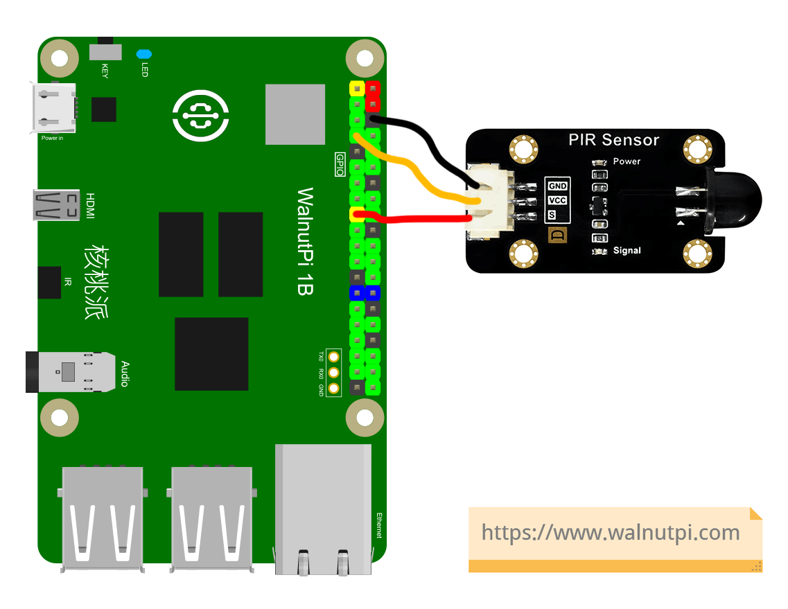
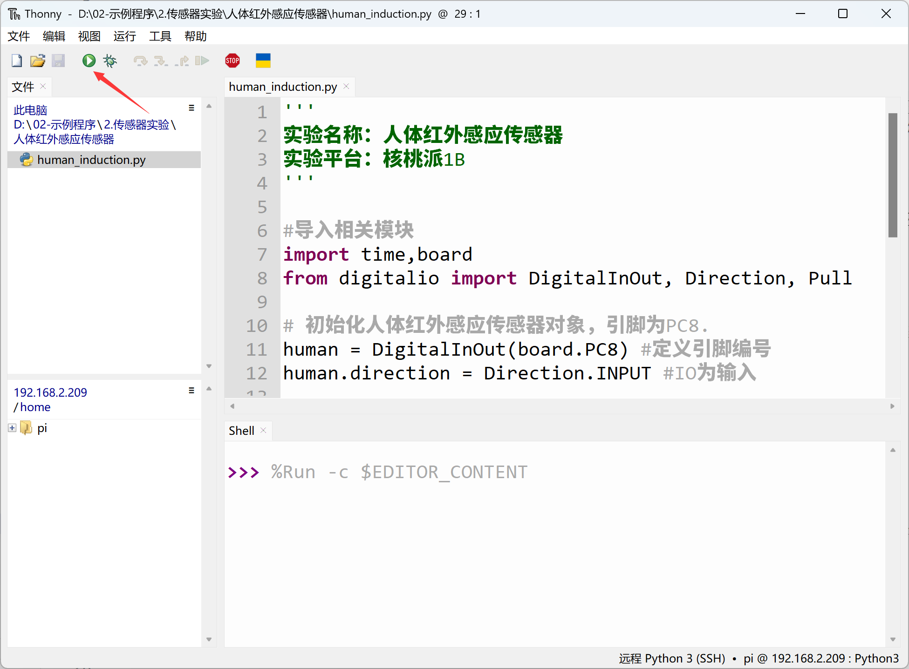
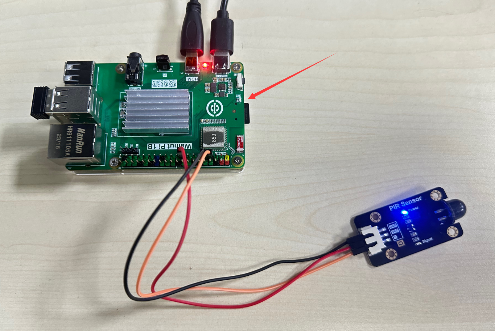

# 人体感应传感器

## 前言
人体感应传感器，在室内安防应用非常普遍，其原理是由探测元件将探测到人体的红外辐射转变成微弱的电压信号，经过放大后输出。为了提高探测器的探测灵敏度以增大探测距离，一般在探测器的前方装设一个塑料的菲涅尔透镜，它和放大电路相配合，可将信号放大 70dB 以上，这样就可以测出 5~10 米范围内人的行动。

## 实验目的
通过python编程来检测人体感应模块，当有人出现时候蓝色指示灯点亮（没人时候熄灭）。

## 实验讲解

下图是一款常用的人体感应传感器模块，主要有供电引脚和信号输出引脚（供电电压一般为3.3V，具体以厂家参数为准）。

 

这款模块通电后，当检测到有人时候，传感器信号输出引脚输出高电平并持续3-5秒。

 

所以这款传感器跟前面gpio章节按键的操作方式类似，只需要将模块信号引脚连接到核桃派，然后核桃派检测引脚电平变化即可。核桃派跟人体红外感应传感器的连线方式如下：

 

## digitalio对象

在CircuitPython中可以直接使用 digitalio（数字 IO）模块编程实现IO输入从而实现按键的输入电平检测。具体介绍如下：

### 构造函数
```python
human=digitalio.DigitalInOut(pin)
```
参数说明：
- `pin` 开发板引脚编号。例：board.PC8

### 使用方法
```python
human.direction = value
```
引脚定义输入/输出。value匹配值如下：
- `digitalio.Direction.INPUT` ：输入。
- `digitalio.Direction.OUTPUT` ：输出。

<br></br>

```python
human.pull = value
```
设置上下拉电阻。value匹配值如下：
- `digitalio.Pull.UP` :上拉。  
- `digitalio.Pull.DOWN` :下拉。  

<br></br>

```python
value = human.value
```
按键输入返回值。value返回值如下：
- `True` 或 `1` ：高电平。
- `False` 或 `0` ：低电平。

<br></br>

代码编写流程如下：

```mermaid
graph TD
    导入digitalio相关模块-->构建人体感应和led对象-->检测信号输入电平-->高电平点亮LED,低电平熄灭-->检测信号输入电平;
```

## 参考代码

```python
'''
实验名称：人体红外感应传感器
实验平台：核桃派1B
'''

#导入相关模块
import time,board
from digitalio import DigitalInOut, Direction, Pull

# 初始化人体红外感应传感器对象，引脚为PC8.
human = DigitalInOut(board.PC8) #定义引脚编号
human.direction = Direction.INPUT #IO为输入

#构建LED对象和初始化
led = DigitalInOut(board.LED) #定义引脚编号
led.direction = Direction.OUTPUT  #IO为输出

while True:

    if human.value == 1: #有人
        
        led.value = 1 #点亮LED

    else: #没人
        
        led.value = 0 #关闭LED

    time.sleep(0.5) #检测周期0.5秒
```

## 实验结果

这里使用Thonny远程核桃派运行以上Python代码，关于核桃派运行python代码方法请参考： [运行Python代码](../python_run.md)

 

当传感器检测到有人时候，蓝灯亮。

 

没人时候蓝灯熄灭。

 

