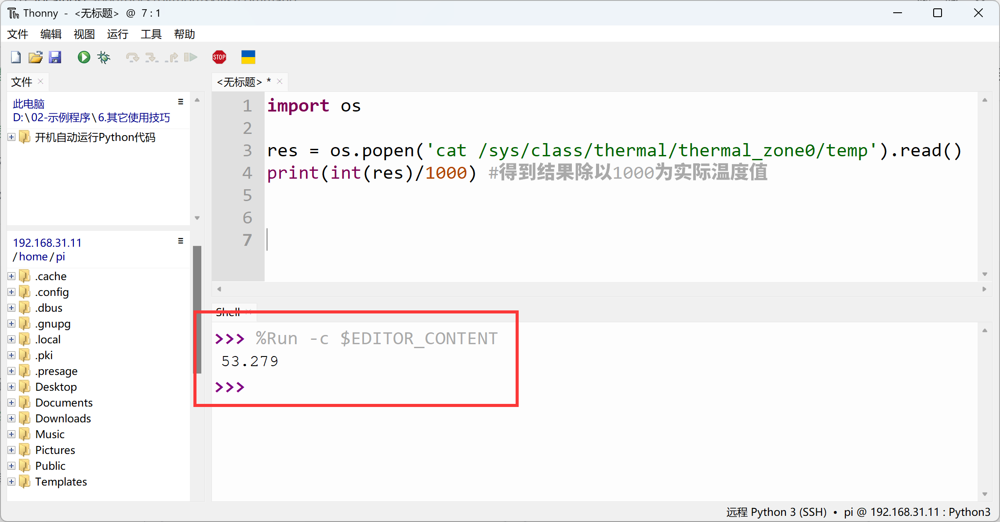
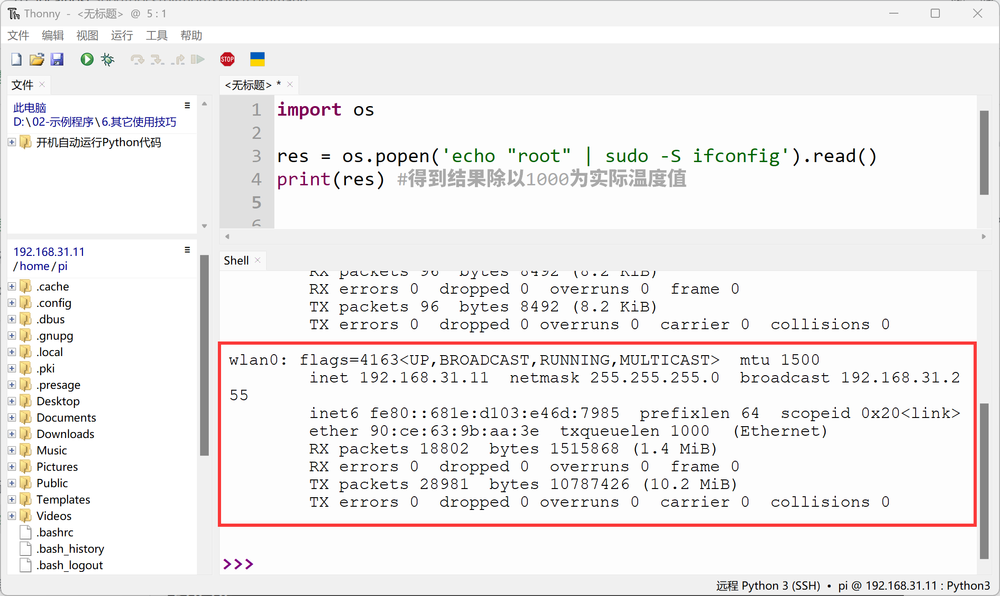

# Python调用终端命令

本章已经学习了Python控制硬件和一些常用的编程，除此之外我们还可以使用Python直接调用核桃派系统Linux的命令，有了这个功能，Python编程可以通过指令读取系统信息、执行打开软件等功能，让Python在核桃派里面使用变得更广泛。

## os.popen对象

可以通过os.popen()方法调用命令。

### 语法
```python
os.popen(command[, mode[, bufsize]])
```

- `command` :命令。
- `mode` : 模式。
    -`r` : 读（默认）
    -`w` : 写
- `bufsize` : 读或写缓冲区大小。默认0无缓冲。

## 使用例子

### 获取CPU温度
在终端下我们可以通过下面指令或者CPU温度。详见： [主控温度信息章节内容](../../os_software/core_temp.md)。
**得到结果除以1000为实际温度值。**

```bash
cat /sys/class/thermal/thermal_zone0/temp
```


那么在Python里面可以这么编程实现：
```python
import os

res = os.popen('cat /sys/class/thermal/thermal_zone0/temp').read()
print(int(res)/1000) #得到结果除以1000为实际温度值
```


### 获取IP信息（root权限使用）

有些时候我们需要root权限来操作命令，那么如何用python实现呢？这里以 sudo ipconfig 指令来演示一下。

在Linux终端下可以用下面指令来实现sudo不用手动输入密码的功能：

```bash
'echo "root" | sudo -S ifconfig'
```

上面指令中**sudo -S**命令直接从echo的输入获取了管理员密码**root**。

在Python下可以这么编程：

```python
import os

res = os.popen('echo "root" | sudo -S ifconfig').read()
print(res) #得到结果除以1000为实际温度值
```


