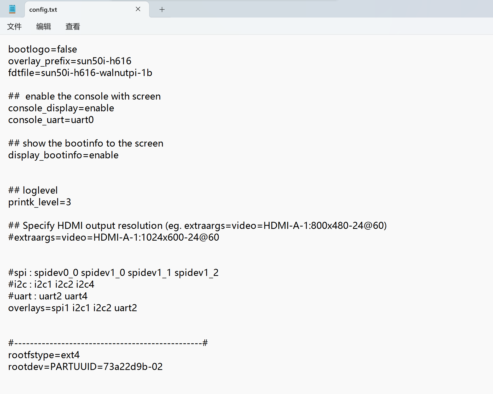

# config.txt

**config.txt主要用于配置核桃派的部分功能。**

sd卡有两个分区，config.txt存放在第一个分区内。在核桃派开发板上，可以在`/boot`路径下访问config.txt。如果用读卡器在Windows电脑上读取sd卡，由于分区2是windows无法识别的ext4格式，系统会弹出sd卡损坏的报错，请无视他。




## 显示屏配置

默认是使用HDMI显示，`screen=hdmi`, 可以修改参数使能其它屏幕显示。

- 核桃派官方3.5寸SPI屏

```bash
screen=lcd35-st7796
```

- 核桃派官方1.54寸SPI屏

```bash
screen=lcd15-st7789
```

- 市面上树莓派mipi屏(分辨率为800x480)

```bash
screen=dsi-800x480
```


## 是否在显示器（hdmi或lcd屏）上开启控制台终端
`console_display`, 默认是开启。如果选择关闭，则在开机信息输出完之后，不会再有那个要求输入账号密码登陆，给你敲命令行的终端。

典型应用场景：编写了一个qt程序让他显示到fb，并设置开机自启动。如果显示器上的终端没有关闭，你在键盘上的所有输入都会同时被qt窗口以及终端接收。而且终端还会输出一些东西到显示器上。

- 开启
```
console_display=enable
```
- 关闭
```
console_display=disable
```

## 设置串口终端位置
`console_uart`，默认是uart0作为串口终端，可以设置到其他串口。

uboot的信息固定从uart0输出。

- 设置到串口2
```
console_uart=uart2
```


## 是否在显示器上输出开机信息
`display_bootinfo`,默认为是。如果关闭，则开机时的那堆信息不会输出到显示器上

- 开启
```
display_bootinfo=enable
```
- 关闭
```
display_bootinfo=disable
```

## 内核日志可输出等级
`printk_level`,默认是3。驱动输出信息时都会带一个等级数字，如果数字小于这个变量设置值的，就会被直接输出到终端。

| 数字 | 含义 |
| - | - |
| 0 | 系统无法使用 
| 1 | 必须立即采取行动
| 2 | 紧急
| 3 | 错误
| 4 | 警告
| 5 | 正常但重要
| 6 | 信息
| 7 | 调试信息 


## 启用设备树插件
`overlay_prefix`,指定设备树文件的前缀，默认是`sun50i-h616`

`overlays`, 该变量指示linux内核启动时会启用哪些设备树插件，例如当 overlays=spi1 ，则系统会加载/boot/overlays路径下的 sun50i-h616-spi1.dtbo 这个设备树文件

我们提供了一个set-device指令，会扫描/boot/overlays路径下所有设备树文件，并一键控制启用与关闭 ---> [set-device](../gpio/gpio_config)