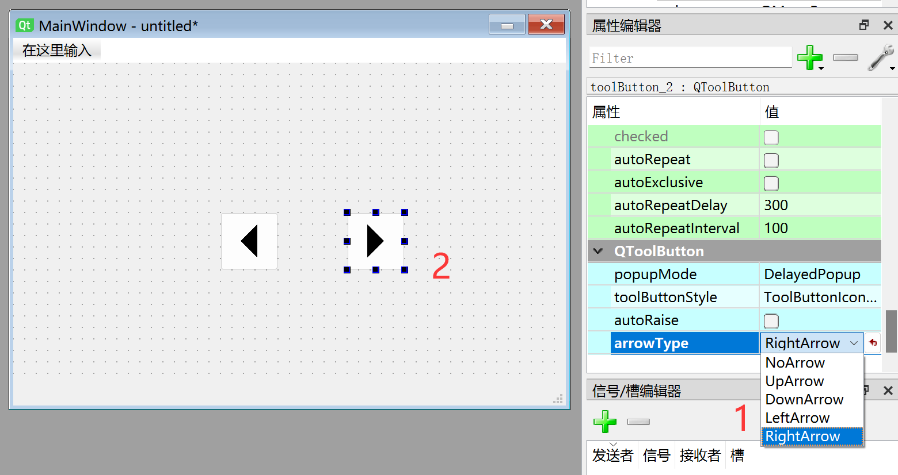

# ToolButton（工具按钮）

## 介绍

工具按钮跟PushButton按钮的主要区别是可以添加一个方向箭头。


<br></br>
工具按钮的编辑很简单，双击可以修改按钮文字内容，拖动边缘可以放大缩小按钮。其它所有属性都可以在右边属性栏都可以设置。



该窗口生成的py代码如下：
```python

# -*- coding: utf-8 -*-

from PyQt5 import QtCore, QtGui, QtWidgets


class Ui_MainWindow(object):
    def setupUi(self, MainWindow):
        MainWindow.setObjectName("MainWindow")
        MainWindow.resize(480, 320)
        self.centralwidget = QtWidgets.QWidget(MainWindow)
        self.centralwidget.setObjectName("centralwidget")
        self.toolButton = QtWidgets.QToolButton(self.centralwidget)
        self.toolButton.setGeometry(QtCore.QRect(180, 130, 50, 50))
        self.toolButton.setArrowType(QtCore.Qt.LeftArrow)
        self.toolButton.setObjectName("toolButton")
        self.toolButton_2 = QtWidgets.QToolButton(self.centralwidget)
        self.toolButton_2.setGeometry(QtCore.QRect(290, 130, 50, 50))
        self.toolButton_2.setArrowType(QtCore.Qt.RightArrow)
        self.toolButton_2.setObjectName("toolButton_2")
        MainWindow.setCentralWidget(self.centralwidget)
        self.menubar = QtWidgets.QMenuBar(MainWindow)
        self.menubar.setGeometry(QtCore.QRect(0, 0, 480, 22))
        self.menubar.setObjectName("menubar")
        MainWindow.setMenuBar(self.menubar)
        self.statusbar = QtWidgets.QStatusBar(MainWindow)
        self.statusbar.setObjectName("statusbar")
        MainWindow.setStatusBar(self.statusbar)

        self.retranslateUi(MainWindow)
        QtCore.QMetaObject.connectSlotsByName(MainWindow)

    def retranslateUi(self, MainWindow):
        _translate = QtCore.QCoreApplication.translate
        MainWindow.setWindowTitle(_translate("MainWindow", "MainWindow"))
        self.toolButton.setText(_translate("MainWindow", "..."))
        self.toolButton_2.setText(_translate("MainWindow", "..."))

```

其中跟工具按钮相关的代码如下：

```python
# -*- coding: utf-8 -*-

from PyQt5 import QtCore, QtGui, QtWidgets

class Ui_MainWindow(object):
    def setupUi(self, MainWindow):

        ...

        #工具按键（左箭头）
        self.toolButton = QtWidgets.QToolButton(self.centralwidget) 
        self.toolButton.setGeometry(QtCore.QRect(180, 130, 50, 50))
        self.toolButton.setArrowType(QtCore.Qt.LeftArrow) #左箭头
        self.toolButton.setObjectName("toolButton")

        #工具按键（右箭头）
        self.toolButton_2 = QtWidgets.QToolButton(self.centralwidget)
        self.toolButton_2.setGeometry(QtCore.QRect(290, 130, 50, 50))
        self.toolButton_2.setArrowType(QtCore.Qt.RightArrow) #右箭头
        self.toolButton_2.setObjectName("toolButton_2")

        ...

    def retranslateUi(self, MainWindow):

        ...

        self.toolButton.setText(_translate("MainWindow", "..."))
        self.toolButton_2.setText(_translate("MainWindow", "..."))

        ...

```
## QToolButton对象

|  常用方法 |  说明 |
|  :---:  | --- | 
| setText()  |  设置按钮显示的文本  | 
| setArrowType()  |  设置箭头方向。参数：<br></br> ● QtCore.Qt.NoArrow :无<br></br> ● QtCore.Qt.UpArrow :上 <br></br> ● QtCore.Qt.DownArrow :下 <br></br> ● QtCore.Qt.LeftArrow :左<br></br> ● QtCore.Qt.RightArrow :右| 

<br></br>

|  常用信号 |  说明 |
|  :---:  | --- | 
| clicked  |  点击触发  | 


## 示例

**例：编程实现点击2个按钮分别执行不同的函数。**

按钮最常用的信号是点击，即clicked, 使用pushButton.clicked.connect()指定按钮被点击后执行指定函数。

参考信号和槽章节内容在self.retranslateUi(MainWindow)后面加入：

```python

self.toolButton.clicked.connect(self.fun1) # 按下执行fun1函数
self.toolButton_2.clicked.connect(self.fun2) # 按下执行fun2函数

```

然后在 Ui_MainWindow 类下加入要执行函数，这里让终端输出信息：

```python

#工具按钮1按下执行函数
def fun1(self):
    print('Left')
        
#工具按钮2按下执行函数
def fun2(self):
    print('Right')

```

完整代码如下：

```python
# -*- coding: utf-8 -*-

from PyQt5 import QtCore, QtGui, QtWidgets


class Ui_MainWindow(object):
    def setupUi(self, MainWindow):
        MainWindow.setObjectName("MainWindow")
        MainWindow.resize(480, 320)
        self.centralwidget = QtWidgets.QWidget(MainWindow)
        self.centralwidget.setObjectName("centralwidget")
        self.toolButton = QtWidgets.QToolButton(self.centralwidget)
        self.toolButton.setGeometry(QtCore.QRect(180, 130, 50, 50))
        self.toolButton.setArrowType(QtCore.Qt.LeftArrow)
        self.toolButton.setObjectName("toolButton")
        self.toolButton_2 = QtWidgets.QToolButton(self.centralwidget)
        self.toolButton_2.setGeometry(QtCore.QRect(290, 130, 50, 50))
        self.toolButton_2.setArrowType(QtCore.Qt.RightArrow)
        self.toolButton_2.setObjectName("toolButton_2")
        MainWindow.setCentralWidget(self.centralwidget)
        self.menubar = QtWidgets.QMenuBar(MainWindow)
        self.menubar.setGeometry(QtCore.QRect(0, 0, 480, 22))
        self.menubar.setObjectName("menubar")
        MainWindow.setMenuBar(self.menubar)
        self.statusbar = QtWidgets.QStatusBar(MainWindow)
        self.statusbar.setObjectName("statusbar")
        MainWindow.setStatusBar(self.statusbar)

        self.retranslateUi(MainWindow)
        self.toolButton.clicked.connect(self.fun1) #按下执行fun1函数
        self.toolButton_2.clicked.connect(self.fun2) #按下执行fun2函数
        QtCore.QMetaObject.connectSlotsByName(MainWindow)

    def retranslateUi(self, MainWindow):
        _translate = QtCore.QCoreApplication.translate
        MainWindow.setWindowTitle(_translate("MainWindow", "MainWindow"))
        self.toolButton.setText(_translate("MainWindow", "..."))
        self.toolButton_2.setText(_translate("MainWindow", "..."))
        
    #工具按钮1按下执行函数
    def fun1(self):
        print('Left')
        
    #工具按钮2按下执行函数
    def fun2(self):
        print('Right')

#################
#   主程序代码   #
#################
import sys

#【可选代码】允许Thonny远程运行
import os
os.environ["DISPLAY"] = ":0.0"

#【可选代码】解决2K以上分辨率显示器显示缺失问题
QtCore.QCoreApplication.setAttribute(QtCore.Qt.AA_EnableHighDpiScaling)

#主程序入口，构建窗口并显示
app = QtWidgets.QApplication(sys.argv)
MainWindow = QtWidgets.QMainWindow() #构建窗口对象
ui = Ui_MainWindow() #构建pyQT5设计的窗口对象
ui.setupUi(MainWindow) #初始化窗口
MainWindow.show() #显示窗口

#【建议代码】允许终端通过ctrl+c中断窗口，方便调试
import signal
signal.signal(signal.SIGINT, signal.SIG_DFL)
timer = QtCore.QTimer()
timer.start(100)  # You may change this if you wish.
timer.timeout.connect(lambda: None)  # Let the interpreter run each 100 ms

sys.exit(app.exec_()) #程序关闭时退出进程

```

运行代码，按下左箭头键打印“Left”，按下右箭头键打印“Right”。

