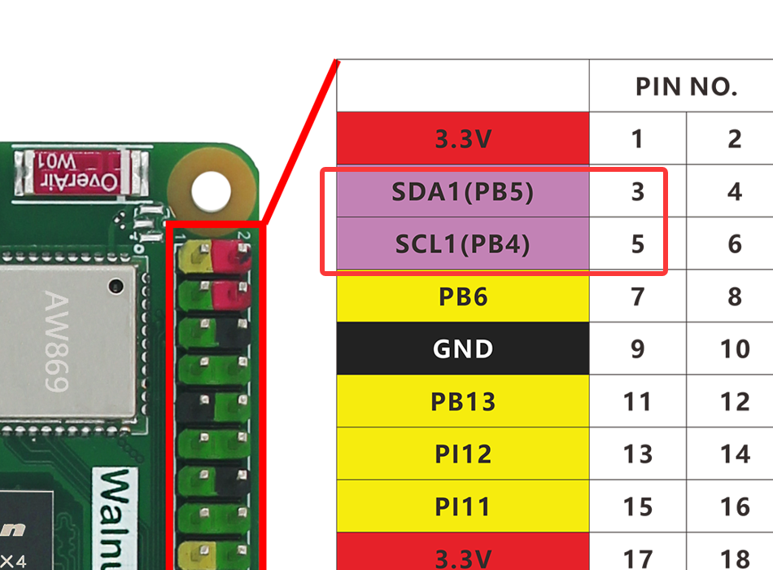
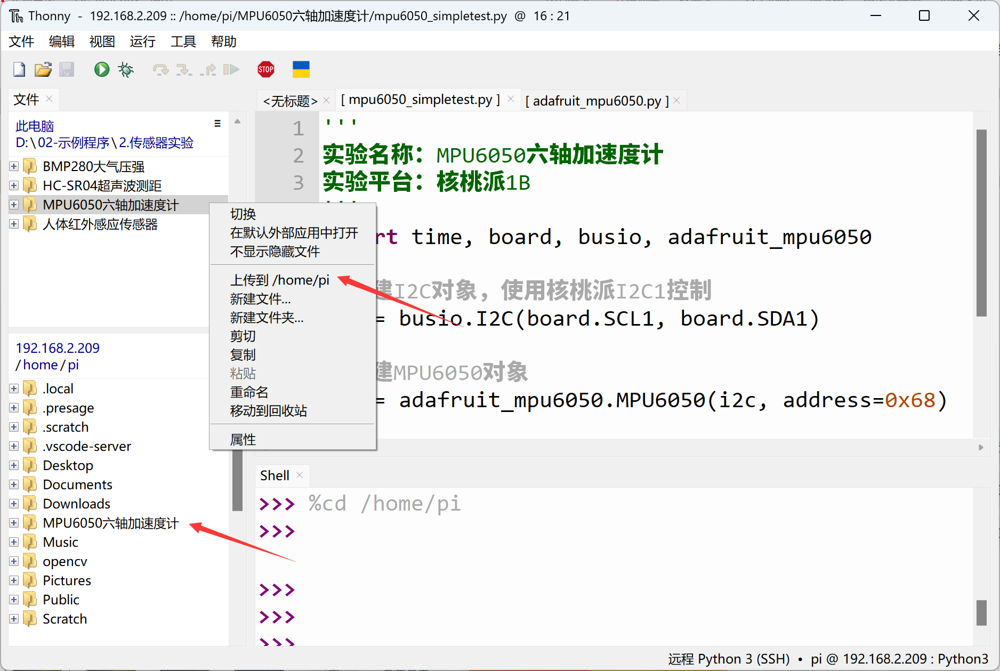
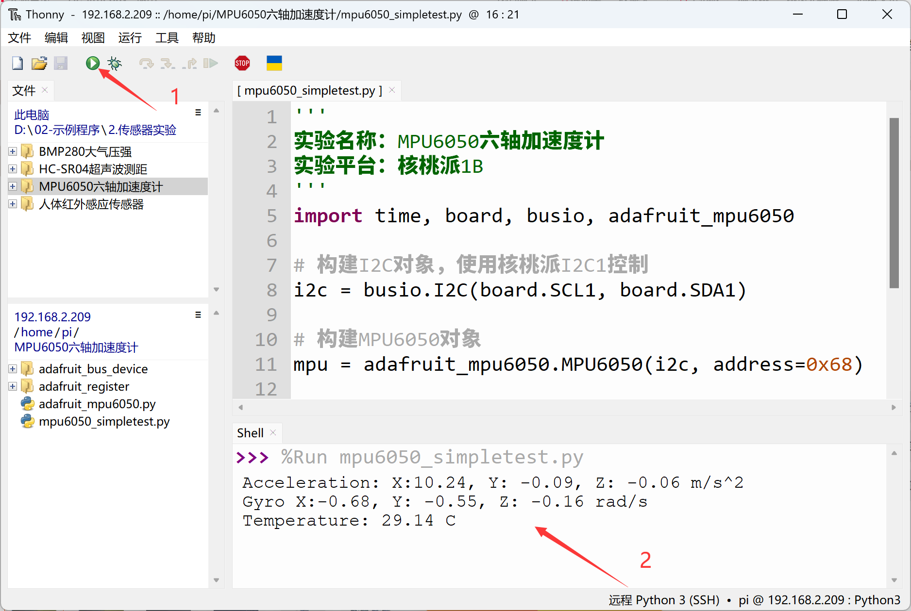

# MPU6050六轴加速度计

## 前言
MPU6050是一款高性能的6轴（三轴加速度+三轴陀螺仪）传感器模块，用于测试物体的运动姿态，I2C接口，常用于四轴飞控，平衡车等场景。

## 实验目的
通过python编程实现测量MPU6050加速度、角速度和温度值！

## 实验讲解

市面上大多MPU6050模块都通用，使用I2C总线通讯，下图是一款MPU6050传感器模块：

 

|  模块参数 |
|  :---:  | ---  |
| 供电电压  | 3.3V |
| 通信方式  | I2C总线（默认地址：0x68） |
| 测量维度  | 加速度：3维 <br></br> 陀螺仪：3维|
| 加速度测量范围  | ±2/±4/±8/±16g |
| 陀螺仪测量范围  | ±250/±500/±1000/±2000°/s |
| 温度传感器  | 测量范围：-40℃~85℃（精度：±1℃） |
| 引脚说明  | `VCC`: 接3.3V <br></br> `GND`: 接地 <br></br>  `SDA`: I2C数据引脚  <br></br> `SCL`: I2C时钟引脚 |

<br></br>

**MPU6050六轴方向说明：**

 

从上面介绍可以看到MPU6050是一款通过I2C接口驱动的传感器。我们通过核桃派I2C接口编程，即可以对该模块实现数据通讯。

本例程使用核桃派的I2C1来连接MPU6050传感器：
 

 

## 开启I2C1

在终端输入下面指令：
```bash
sudo set-device enable i2c1
```

重启开发板：
```bash
sudo reboot
```

启动后查看开启情况：
```bash
gpio pins
```

出现下图表示开启成功：


更多GPIO配置教程请看：[GPIO设备配置](../../gpio/gpio_config.md)

## MPU6050对象

在CircuitPython中可以直接使用写好的Python库来获取MPU6050传感器数据。具体介绍如下：

### 构造函数
```python
mpu = adafruit_mpu6050.MPU6050(i2c, address=0x68)
```
构建MPU6050对象。

参数说明：
- `i2c` 需要构建i2c对象，参考: [I2C对象说明](../gpio/i2c_oled#i2c对象)；这里不再重复。
- `address` 模块I2C地址。默认：0x68；

### 使用方法

```python
mpu.acceleration
```
返回x、y、z的加速度值，单位m/s^2，数据类型为`float`

<br></br>

```python
mpu.gyro
```
返回x、y、z的角速度值，单位rad/s，数据类型为`float`

<br></br>

```python
mpu.temperature
```
返回温度值，单位℃, 数据类型为`float`

<br></br>

理解了MPU6050传感器原理和对象使用方法后，我们可以整理出编程思路，流程图如下 ：

```mermaid
graph TD
    导入相关模块-->构建MPU6050对象-->获取加速度/角速度/温度值并打印-->获取加速度/角速度/温度值并打印;
```

## 参考代码

```python
'''
实验名称：MPU6050六轴加速度计
实验平台：核桃派1B
'''
import time, board, busio, adafruit_mpu6050

# 构建I2C对象，使用核桃派I2C1控制
i2c = busio.I2C(board.SCL1, board.SDA1)

# 构建MPU6050对象
mpu = adafruit_mpu6050.MPU6050(i2c, address=0x68)

while True:
    print("Acceleration: X:%.2f, Y: %.2f, Z: %.2f m/s^2" % (mpu.acceleration))
    print("Gyro X:%.2f, Y: %.2f, Z: %.2f rad/s" % (mpu.gyro))
    print("Temperature: %.2f C" % mpu.temperature)
    print("")
    time.sleep(1)
```

## 实验结果

终端输入下面指令确认I2C1开启情况：
```bash
gpio pins
```

出现下图表示开启成功：

 

如没开启请按前面内容打开：[开启I2C1](#开启i2c1)

将MPU6050传感器按下图连接到核桃派， SDA1连接到模块SDA引脚, SCL1连接到模块SCL引脚：

 

由于本例程代码依赖其它py库，所以需要将整个例程文件夹上传到核桃派：

 

发送成功后需要打开远程目录（核桃派）的py文件来运行，因为运行会导入文件夹里面的其它库文件，因此这类型代码在电脑本地运行是无效的。

 

这里使用Thonny远程核桃派运行以上Python代码，关于核桃派运行python代码方法请参考： [运行Python代码](../python_run.md)。运行成功后可以看到终端打印出温度、气压和海拔高度信息：

 
