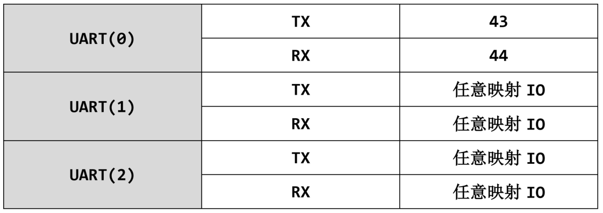
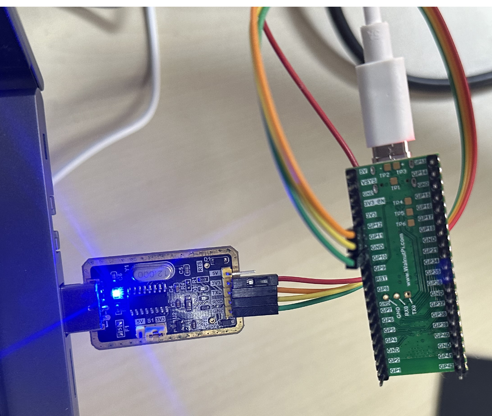
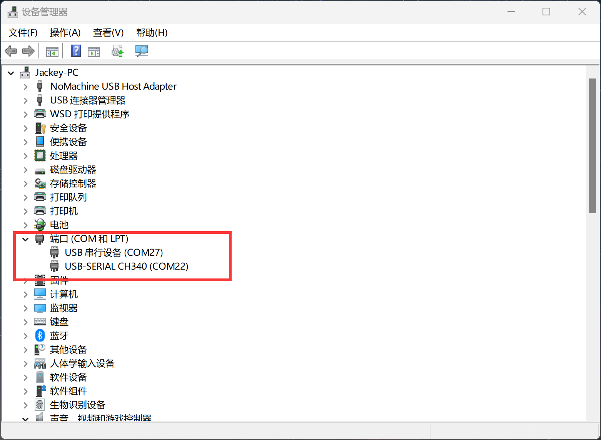
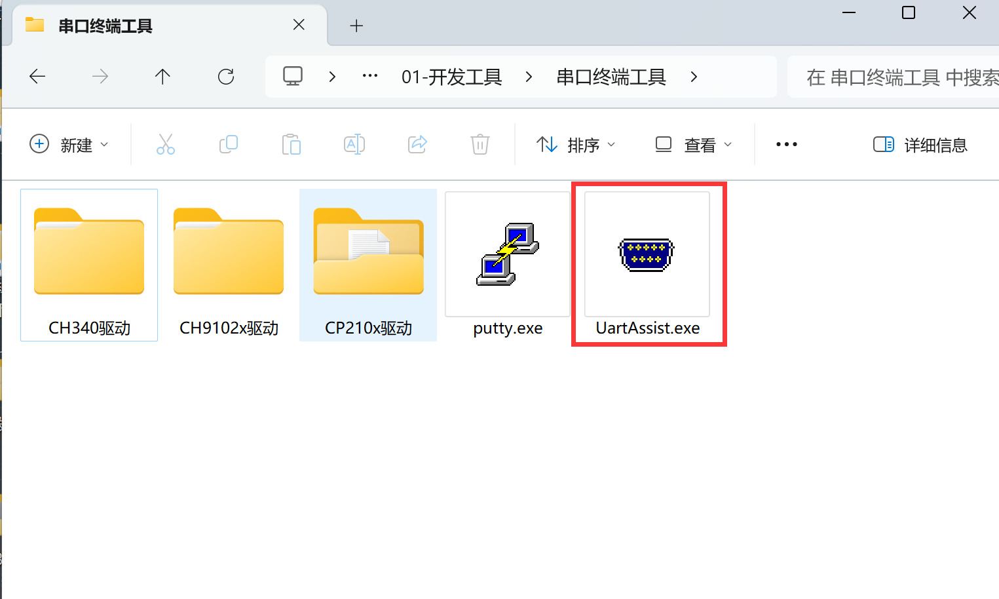

# UART（串口通讯）

## 前言
串口是非常常用的通信接口，有很多工控产品、无线透传模块都是使用串口来收发指令和传输数据，以及和其它开发板如树莓派，核桃派，STM32，Arduio等带串口的开发板通讯，这样用户就可以在无须考虑底层实现原理的前提下将各类串口功能模块灵活应用起来。

## 实验目的
编程实现串口收发数据。

## 实验讲解

核桃派PicoW一共有3个串口，编号0-2，如下表：其中uart0为调试串口不能使用，实验可以使用uart1或uart2。



我们来了解一下串口对象的构造函数和使用方法：

## UART对象

### 构造函数
```python
uart = machine.UART(id,baudrate,tx=None,rx=None bits=8, parity=None, stop=1,…)
```
创建UART对象。

- `id` ：串口编号，共2个可用, 1或2。

- `baudrate`：波特率，常用115200、9600;

- `tx` ：核桃派PicoW发送引脚，可自定义IO，例：tx = 12。

- `rx` ：核桃派PicoW接收引脚，可自定义IO，例：rx = 11。

- `bits` ：数据位，默认8;

- `parity` ：奇偶校验，默认None;
    - `0`: 偶校验；
    - `1`: 奇校验；

- `stop`: 停止位，支持 1， 1.5, 2， 默认 1 。

### 使用方法

```python
uart.any()
```
返回等待读取的字节数据，0表示没有，用于判断是否有接收到数据。

<br></br>

```python
uart.read([nbytes])
```
读取字符。
- `nbytes`: 读取字节数量。

<br></br>

```python
uart.readline()
```
读行。

<br></br>

```python
UART.write(buf)
```
发送数据。
- `buf`: 需要发送的数据。

<br></br>

```python
UART.deinit()
```
注销串口。

更多用法请阅读官方文档：<br></br>
https://docs.01studio.cc/library/machine.UART.html#machine-uart

<br></br>

我们可以用一个USB转TTL工具，配合电脑上位机串口助手来跟核桃派PicoW开发板进行通信测试。


注意要使用3.3V电平的USB转串口TTL工具，本实验我们让核桃派PicoW的rx=12 , tx = 11 接线示意图如下（交叉接线）：


在本实验中我们可以先初始化串口，然后给串口发去一条信息，这样PC机的串口助手就会在接收区显示出来，然后进入循环，当检测到有数据可以接收时候就将数据接收并打印，并通过REPL打印显示。代码编写流程图如下：


```mermaid
graph TD
    导入UART相关模块 --> 构建UART对象 --> 串口发送信息 --> 判断是否有信息--是-->接收并在终端打印-->判断是否有信息;
    判断是否有信息--否-->判断是否有信息;
```

## 参考代码

```python
'''
实验名称：串口通信
版本：v1.0
作者：WalnutPi
实验平台：核桃派PicoW
说明：通过编程实现串口通信，跟电脑串口助手实现数据收发。
'''

#导入串口模块
from machine import UART

uart=UART(1,115200,rx=12,tx=11) #设置串口号1和波特率

uart.write('Hello 01Studio!')#发送一条数据

while True:

    #判断有无收到信息
    if uart.any():

        text=uart.read(128) #接收128个字符
        print(text) #通过REPL打印串口3接收的数据
```

## 实验结果

我们按照上述方式将USB转TTL的TX接到核桃派PicoW引脚12，RX接到核桃派PicoW引脚11。GND接一起，3.3V可以选择接或不接。



这时候打开电脑的设备管理器，能看到2个COM。写着CH340的是串口工具，另外一个则是核桃派PicoW的串口。**如果CH340驱动没安装，则需要手动安装，驱动在：<u>配套资料包\开发工具\串口终端\CH340文件夹</u> 下。**



本实验要用到串口助手，打开配套资料包\开发工具\串口终端工具下的【UartAssist.exe】软件。



根据上图将串口工具配置成COM22（根据自己电脑的串口号调整）。波特率115200。然后打开。

运行程序，可以看到一开始串口助手收到核桃派PicoW上电发来的信息“Hello WalnutPi!”。我们在串口助手的发送端输入“https://www.walnutpi.com”， 点击发送，可以看到核桃派PicoW在接收到该信息后在REPL里面打印了出来。如下图所示：


## 跟其它开发板或串口模块通讯

只需要将本实验中的串口TTL工具接线换成开发板的即可。接线方式是交叉接线，接核桃派PicoW的TX，RX分别连接其它开发板的RX，TX ，GND连接一起。注意其它开发板的IO电平也是3.3V即可。
