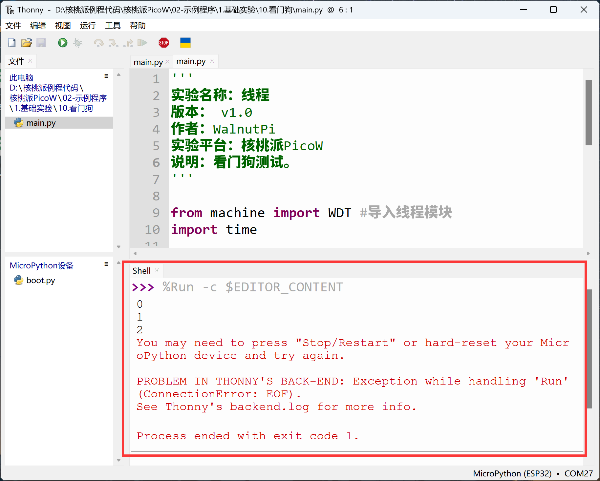

# 看门狗

## 前言
任何代码在运行过程中都可能出现崩溃的情况，这时候就可以加入看门狗代码。看门狗的用途是在应用程序崩溃并最终进入不可恢复状态时自动重新启动系统。一旦启动，就无法以任何方式停止或重新配置。启用后，应用程序必须定期“喂食”看门狗，以防止其过期并重置系统。

## 实验目的
测试看门狗自动复位功能。

## 实验讲解

核桃派PicoW的MicroPython固件已经集成了看门狗WDT模块。我们直接调用即可。

## WTD对象

### 构造函数
```python
wdt = WDT(timeout=5000)
```
创建看门狗对象。

- `timeout` ：看门狗喂食周期时间，单位ms。默认5000ms。

### 使用方法

```python
wdt.feed()
```
喂狗。需要在构建看门狗对象时指定的时间内执行该指令。

<br></br>

更多用法请阅读官方文档：<br></br>
https://docs.micropython.org/en/latest/library/machine.WDT.html

编程流程如下：

```mermaid
graph TD
    导入看门狗模块 --> 初始化看门狗对象 --> 喂狗 --> 停止喂狗模拟死机系统自动重启;
```

## 参考代码

```python
'''
实验名称：线程
版本： v1.0
作者：WalnutPi
实验平台：核桃派PicoW
说明：看门狗测试。
'''

from machine import WDT #导入线程模块
import time

#构建看门狗对象，喂狗周期2秒内。
wdt = WDT(timeout=2000)


#每隔1秒喂一次狗，执行3次。
for i in range(3):
    
    time.sleep(1)
    print(i)
    
    wdt.feed() #喂狗

#停止喂狗，系统会重启。
while True:
    pass
```

## 实验结果

运行代码，可以看到串口终端打印了3次信息后自动重启。



有了看门狗，当开发板死机时候就可以自动重启了。