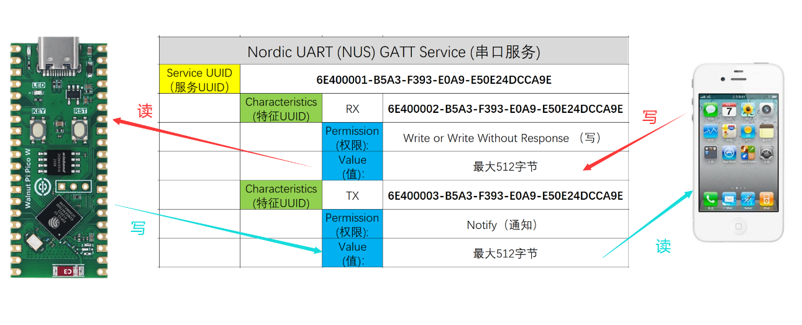
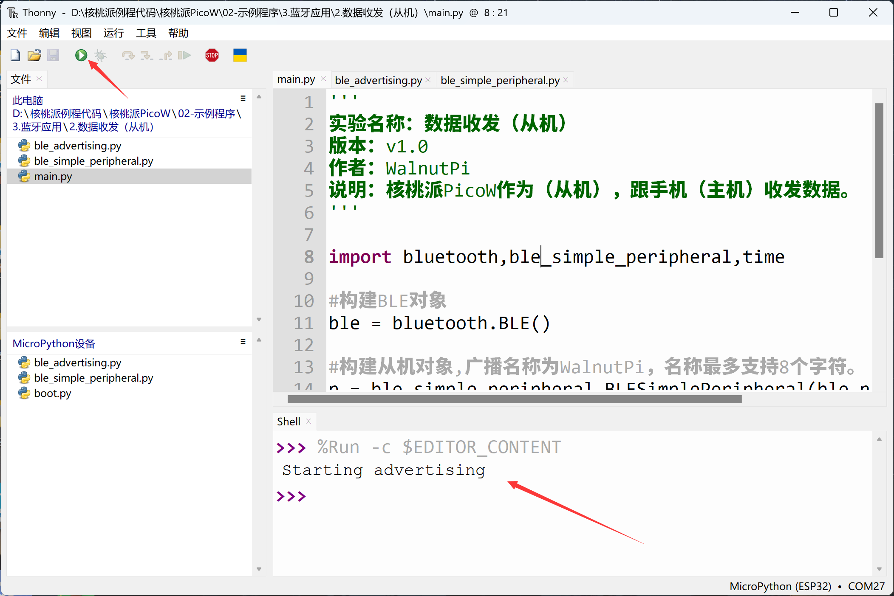
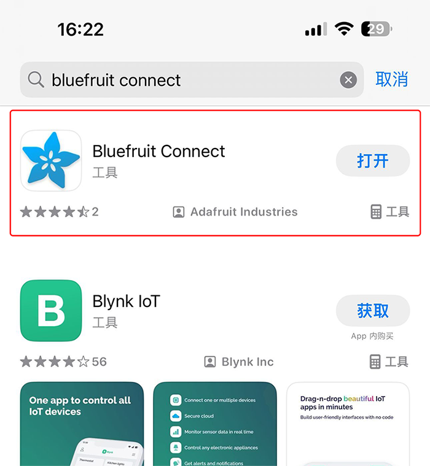
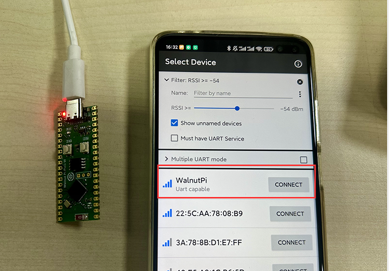
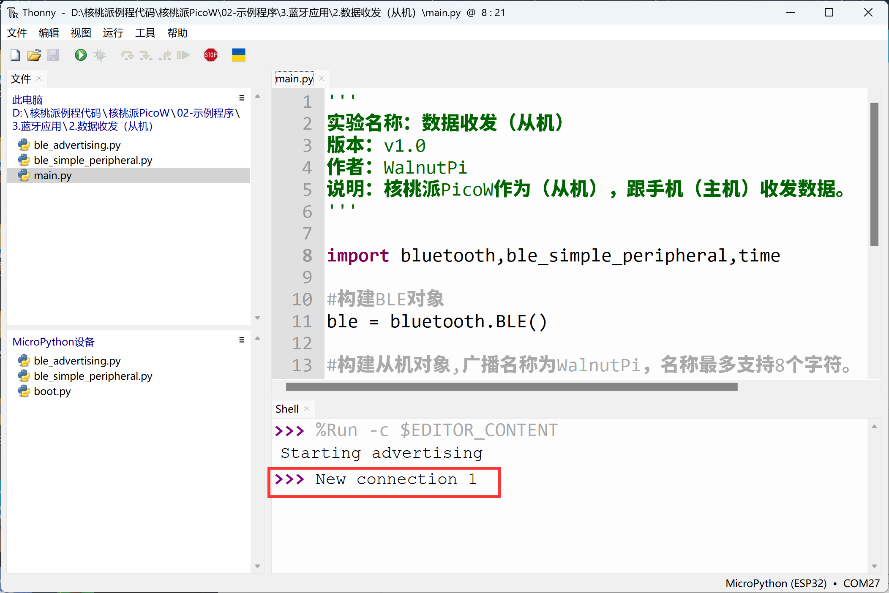
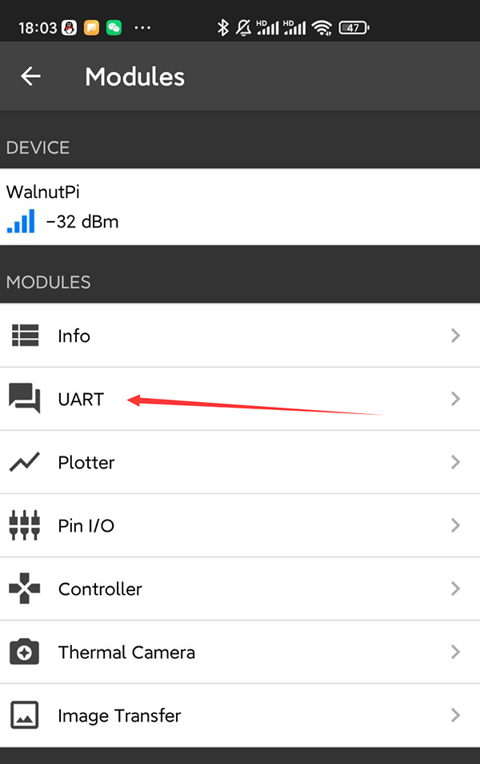
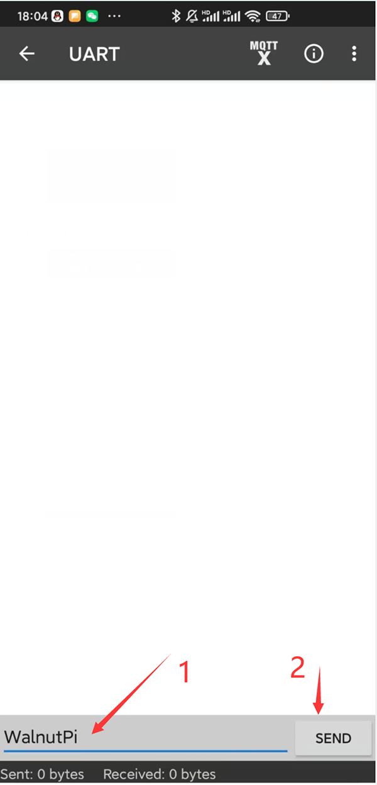
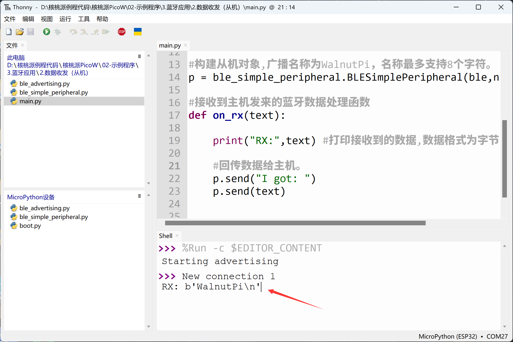

# 蓝牙从机（数据收发）

## 前言
BLE（Bluetooth Low Energy，低功耗蓝牙）数据收发（UART服务），可能是最通用的功能和服务了，基本上所有的BLE数据传输设备都使用UART服务。这里的UART并非指硬件串口，而是BLE的一个服务，有了它，手机APP和蓝牙设备就能建立数据传输，事不宜迟，我们马上来开始学习。


## 实验目的
编程实现核桃派PicoW作为（从机），跟手机（主机）收发数据。

## 实验讲解

本实验以核桃派PicoW作为从机，手机为主机。蓝牙设备和手机通讯主要依赖“服务”，简单来说服务就是一个指定编号的黑盒子。

**<font color='#00c0ff' size='4'>黑盒子的故事：</font>**

蓝牙设备和手机约定了一个黑盒子，名称为“AAA”，在双方建立连接后，这个黑盒子只允许手机写入数据，蓝牙设备从里面读取数据，当手机往黑盒子写入数据123，蓝牙设备从黑盒子读取，这便完成了一个从手机发送数据到蓝牙设备的过程！

反过来再约定一个黑盒子，名称为“BBB”，这个黑盒子规定则和前面“AAA”相反，允许蓝牙设备写入数据，手机读取数据。这样便完成了一个从蓝牙设备发送数据到手机的过程。

就这样，各式各样的黑盒子构成了整个蓝牙服务，后来人们又考虑到为了让不同厂家之间的蓝牙设备尽量兼容，于是便制定了一系列固定编号的黑盒子。并约定了很多细节的东西，这便是蓝牙标准协议。

本节使用的UART服务，也就是UART协议。我们以此为例说明一下手机和BLE设备通讯真实过程，先看下表，核桃派PicoW先通过代码先定义了串口服务的服务UUID（Service UUID），长度为128bit（有16bit和128bit两个标准）：6E400001-B5A3-F393-E0A9-E50E24DCCA9E；在这个服务UUID下有2个特征值，分别是RX和TX，这些特征值也是通过128bit UUID来识别。每个特征值下有权限和value, 权限决定写和读（通知），value则是要写和读的数据。


在串口服务中，手机和BLE设备就是通过上面协议来实现数据传输，如下图所示：



讨论到这，我们都是基于应用层，大部分蓝牙芯片原厂和提供蓝牙C SDK开发协议栈，做好了底层包括射频传输等功能，让开发变得简单。而MicroPython的出现，可以说是如虎添翼，学会原理后直接面向对象编程，几行代码即可实现蓝牙数据通讯。

## BLE对象

### 构造函数
```python
import bluetooth

ble = bluetooth.BLE()
```
构建BLE对象。 

## 蓝牙从机对象

### 构造函数

```python
import ble_simple_peripheral

p = ble_simple_peripheral.BLESimplePeripheral(ble,name='WalnutPi')
```
构建蓝牙从机对象。 构建后会自动发起蓝牙广播。
- `ble`: 前面构建好的BLE对象；
- `name` : 广播名称，这里最多支持8个字符。

### 使用方法

```python
p.on_write(callback)
```
从机接收回调函数，收到手机发来数据会进入callback函数。

- `callback`: 回调函数；

<br></br>

```python
p.send(data) 
```
发送数据给手机（主机）。

- `data`: 发送内容。


更多用法请阅读官方文档：<br></br>
https://docs.micropython.org/en/latest/library/bluetooth.html

代码编写流程如下：

```mermaid
graph TD
    导入相关模块 --> 构建BLE对象 --> 构建从机对象:设置广播名称 --> 自动发起广播 -->手机通过蓝牙APP连接核桃派PicoW并发送数据 --> 核桃派PicoW回传数据给手机-->手机通过蓝牙APP连接核桃派PicoW并发送数据 ;
```

## 参考代码

```python
'''
实验名称：数据收发（从机）
版本：v1.0
作者：WalnutPi
说明：核桃派PicoW作为（从机），跟手机（主机）收发数据。
'''

import bluetooth,ble_simple_peripheral,time

#构建BLE对象
ble = bluetooth.BLE()

#构建从机对象,广播名称为WalnutPi，名称最多支持8个字符。
p = ble_simple_peripheral.BLESimplePeripheral(ble,name='WalnutPi')

#接收到主机发来的蓝牙数据处理函数
def on_rx(text):
    
    print("RX:",text) #打印接收到的数据,数据格式为字节数组。
    
    #回传数据给主机。
    p.send("I got: ") 
    p.send(text)
    

#从机接收回调函数，收到数据会进入on_rx函数。
p.on_write(on_rx)
```

## 实验结果

由于本例程依赖蓝牙相关库，所以需要使用thonny把例程源码中配套py库文件上传到核桃派PicoW开发板：


运行主程序main.py，核桃派picow就开始蓝牙广播了, 等待手机连接：



<br></br>

**手机APP测试:**

由于ble不是经典蓝牙协议，无法在手机直接搜索操作，需要安装app来测试。这里推荐Adafruit的**bluefruit connect**应用软件来测试。

- 苹果手机安装方法：

在APP Store 搜索：“bluefruit connect” 直接安装即可。



<br></br>

- 安卓手机安装方法：

使用核桃派资料包提供的apk安装，位于资料包 **开发工具-->蓝牙测试APP -->安卓手机** 目录下：


安装后打开APP （本教程基于安卓APP测试），可以看到搜索到核桃派PicoW发出的蓝牙广播信号。



点击APP **CONNECT** 按钮即可连接核桃派PicoW, 连接成功后可以看到核桃派PicoW终端显示新链接：




手机APP上出现几个服务选项，这里选择UART服务：



现在链接成功了，可以开始收发数据，在APP下方输入发送内容，点击**SEND**发送：



可以在核桃派PicoW终端打印出看到接收到的信息：



同时APP收到核桃派PicoW回传的信息：


