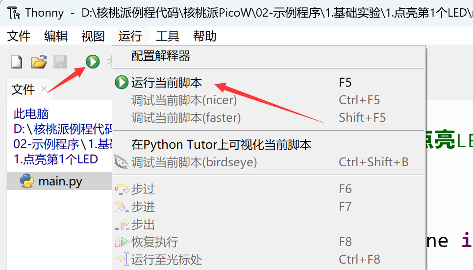

# 例程测试

前面我们已经安装好了Thonny IDE，接下来我们使用最简单的方式来做一个点亮LED蓝灯的实验，大家暂时先不用理解代码意思，后面章节会有解释。这里主要是为了让大家了解一下MicroPython编程软件Thonny的使用方法和原理。具体如下：

连接开发板，在thonny左上角本地文件区域找到 **核桃派PicoW（ESP32-S3）资料下载\02-示例程序\1.基础实验\1.点亮第1个LED** 下的main.py文件，双击打开后看到右边编程区出现相关代码。


```python
'''
实验名称：点亮LED蓝灯
版本：v1.0
'''

from machine import Pin #导入Pin模块

led=Pin(46,Pin.OUT) #构建led对象，GPIO46,输出
led.value(1) #点亮LED，也可以使用led.on()

```

点击 **运行—运行当前脚本** 或者直接点绿色按钮：



可以看到核桃派PicoW开发板上的蓝灯被点亮：

