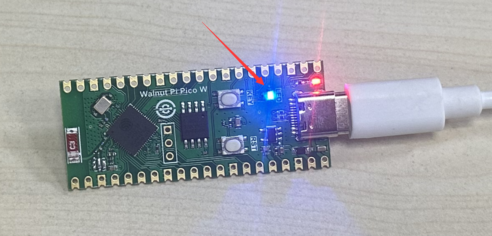

# 代码离线运行

上一节直接在IDE里面运行功能代码是保存在开发板的RAM（内存）里面，方便调试，但断电后丢失，那么如何实现开发板上电运行我们的代码呢？方法如下：

Micropython机制是上电默认先运行名字为boot.py文件，然后在运行main.py文件，如果没有boot.py那么直接运行main.py。

**boot.py: 一般用于配置初始化参数（可以不需要）；**

**main.py：主程序。**

也就是我们只需要将代码以main.py文件发送到开发板，那么开发板就可以实现上电运行相关程序。

我们将LED例程的main.py发送到开发板:

然后关闭IDE，按下核桃派PicoW复位键，可以看到核桃派PicoW开发板每次复位后的蓝灯被点亮。代码实现了离线运行：

我们只需要将编写好的代码改成main.py发送到开发板，即可实现离线上电自动运行。