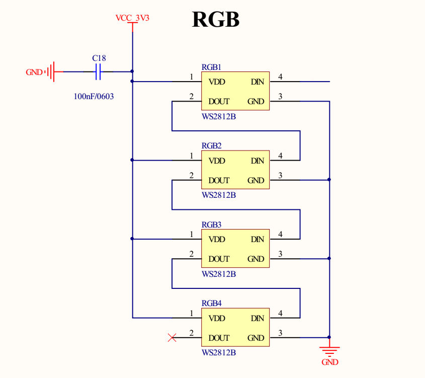
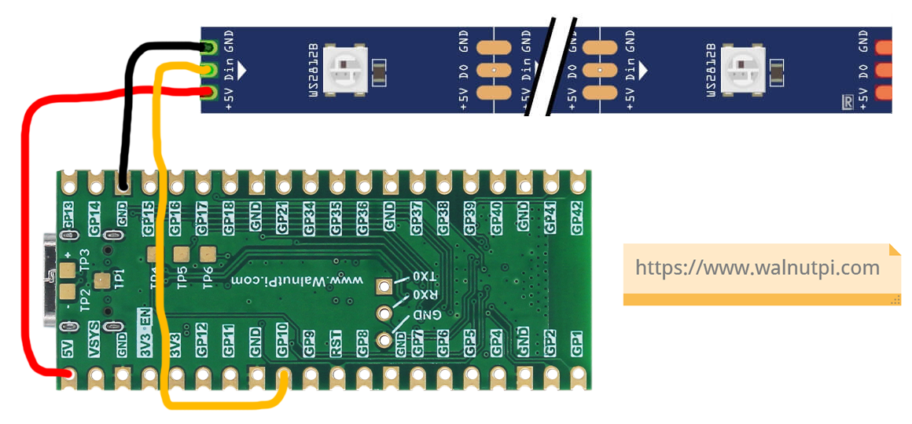
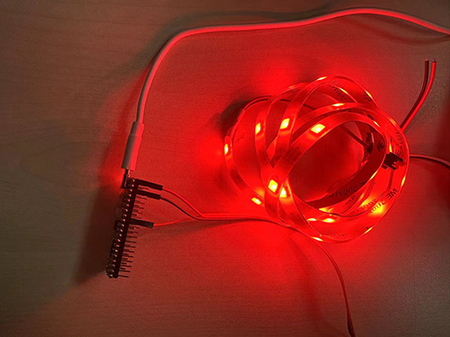
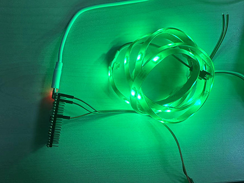
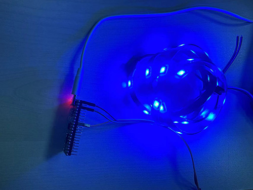
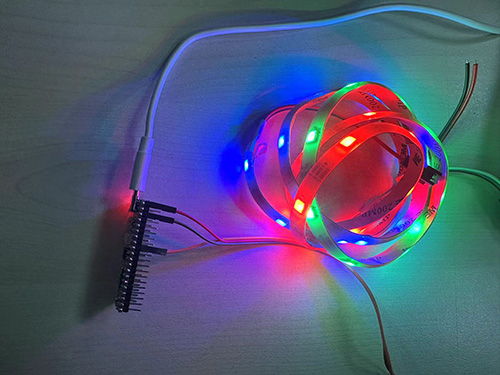

# Neopixel彩灯

## 前言
RGB灯带是彩灯的一种，我们看到长长的灯带以及LED彩色显示屏，都是采用一个个灯珠组合而成。在本章节我们将通过编程实现RGB灯带的控制，可以应用到家居布置、节日气氛的场景中去。

## 实验目的
通过编程实现灯带循环显示红色（RED）、绿色（GREEN）、蓝色（BLUE）和混合（红、绿、蓝）。

## 实验讲解

先来介绍一下本实验用到的RGB灯带。


该灯带为3线接口，长1米，有30颗灯珠，每个灯珠里面都有一个驱动IC，型号是WS2812B，单总线驱动。每个灯珠首尾相连。灯带末端预留了接口可以串联更多的灯带。也就是说在电源充足情况下只需要通过1个GPIO口就可以控制了数十上百的灯珠了。



本实验实验核桃派PicoW引脚10控制灯带，供电使用3.3V或5V，推荐使用5V，会更亮一点。**（市面上大部分灯珠能5V供电然后使用3.3V电平的IO控制）**



在了解了接线方式后，我们知道颜色是由最基本的三种颜色的不同亮度混合出新颜色。这3个最基本的颜色顺序分别是红，绿，蓝（RGB）。这里每个颜色的亮度级别从0-255,0表示没有，255表示最亮。如(255,0,0)则表示红色最亮。GPIO口就是将这些数据逐一发送给灯带。

核桃派PicoW的MicroPython固件集成了彩灯驱动模块（NeoPixel），适用于WS2812B驱动的灯珠。因此我们可以直接使用。对象说明如下：


## NeoPixel对象

### 构造函数
```python
np = neopixel.NeoPixel(pin, n, bpp=3, timing=1)
```
构建NeoPixel对象。

- `pin`: 控制引脚；需要使用machine.Pin接口。
- `num`: 灯珠数量。
- `bpp`: 灯珠类型。
    - `3`: RGB LEDs。   
    - `4`: RGBW LEDs。内部多一个白光灯珠。
- `timing`: 灯珠类型。
    - `0`: 400KHz。   
    - `1`: 800KHz（大部分灯珠使用这个频率）


### 使用方法
```python
np.fill(pixel)
```
设置所有灯珠为指定颜色。
- `pixel`: 颜色值，例：(255,0,0)表示红色。

<br></br>

```python
np[i] = pixel
```
设置某个灯珠的颜色。
- `pixel`: 颜色值，例：np[0] =(255,0,0) 表示第一个灯珠设置成红色。

<br></br>

```python
np.write()
```
将数据写入灯珠。前面配置完颜色后务必执行这个语句灯珠才会显示相应颜色。

<br></br>

更多用法请阅读官方文档：<br></br>
https://docs.micropython.org/en/latest/library/neopixel.html#module-neopixel

代码编程流程图如下：


```mermaid
graph TD
    导入NeoPixel模块 --> 构建NeoPixel对象 --> 灯带显示指定颜色 --> 延时 --> 灯带显示指定颜色;
```

## 参考代码

```python
'''
实验名称：RGB彩灯控制
版本：v1.0
作者：WalnutPi
说明：通过编程实现灯带不同颜色的变化。
'''
import time
from machine import Pin,Timer
from neopixel import NeoPixel

#定义红、绿、蓝三种颜色
RED=(255,0,0)
GREEN=(0,255,0)
BLUE=(0,0,255)

#22引脚连接灯带，灯珠数量30
pin = Pin(10, Pin.OUT)
np = NeoPixel(pin, 30)

#设置灯珠RGB颜色，本实验供30个灯珠
def rgb():
    
    global RED,GREEN,BLUE
    
    for i in range(30):
        if i < 10:
            np[i]=RED
        elif i <20:
            np[i]=GREEN
        else:
            np[i]=BLUE

while True:

    np.fill(RED) #红色
    np.write()     # 写入数据
    time.sleep(1)

    np.fill(GREEN) #红色
    np.write()     # 写入数据
    time.sleep(1)

    np.fill(BLUE) #红色
    np.write()     # 写入数据
    time.sleep(1)
    
    #RGB彩色模式
    rgb()
    np.write()
    time.sleep(1)
```

## 实验结果

运行代码，可以看到灯带的颜色在红、绿、蓝和混合4钟色中循环变化。









RGB灯带的单总线特点使得我们可以轻易的增加和减少灯带的数量而无需过多的修改程序。但需要注意的是如果灯带数量过多，那么需要外接电源供电，否则会因为电流不足而影响使用。
