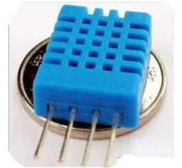
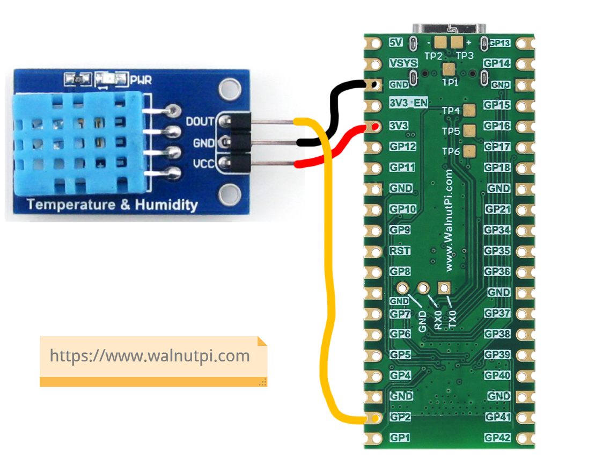
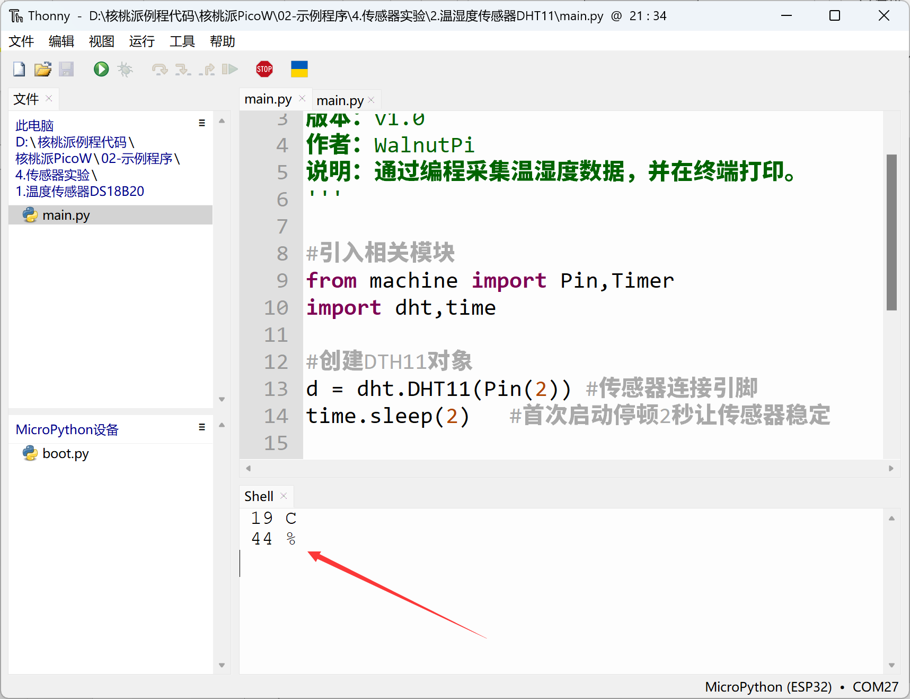

# 温湿度传感器（DHT11）

## 前言
温湿度也是我们日常非常常见的指标，我们使用的是DHT11数字温湿度传感器。这是一款含有已校准数字信号输出的温湿度复合传感器，它应用专用的数字模块采集技术和温湿度传感技术，确保产品具有极高的可靠性和卓越的长期稳定性。

DHT11具有小体积、极低的功耗，信号传输距离可达20米以上，使其成为给类应用甚至最为苛刻的应用场合的最佳选择。产品为4针单排引脚封装，连接方便。



**DHT11温湿度传感器**


## 实验目的
通过MicroPython编程采集DHT11传感器温湿度数据。

## 实验讲解

DHT11虽然有4个引脚，但其中第3个引脚是悬空的，也就是说DHT11也是单总线的传感器，只占用1个IO口。：


下图是一款常用的DHT11模块，本例程使用GPIO2来连接，接线图如下：



也就是说我们需要针对核桃派PicoW引脚2编写程序来驱动DHT11。核桃派PicoW的MicroPython固件已经集成了dht对象，专门用于DHT11传感器，我们直接python编程使用即可，模块说明如下：

## dht对象

### 构造函数
```python
d = dht.DHT11(machine.Pin(id))
```
构建DHT11传感器对象

- `id` ：芯片引脚编号。如：1、2。


### 使用方法
```python
d.measure()
```
测量温湿度。

<br></br>

```python
d.temperature()
```
获取温度值。

<br></br>

```python
d.humidity()
```
获取湿度值。

<br></br>


建议上电先延时1~2秒，让DHT11稳定后再开始读取。代码编写流程如下：


```mermaid
graph TD
    导入相关模块 --> 构建DHT11对象,延时2秒 --> 每隔2秒读取当前温湿度值并在终端打印信息;
```

## 参考代码

```python
'''
实验名称：温湿度传感器DHT11
版本：v1.0
作者：WalnutPi
说明：通过编程采集温湿度数据，并在终端打印。
'''

#引入相关模块
from machine import Pin,Timer
import dht,time

#创建DTH11对象
d = dht.DHT11(Pin(2)) #传感器连接引脚
time.sleep(2)   #首次启动停顿2秒让传感器稳定

def dht_get(tim):

    d.measure()  #温湿度采集
    
    #终端打印温湿度信息
    print(str(d.temperature() )+' C') 
    print(str(d.humidity())+' %') 

#开启RTOS定时器，编号为1
tim = Timer(1)
tim.init(period=2000, mode=Timer.PERIODIC,callback=dht_get) #周期为2000ms
```

## 实验结果

将DHT11模块按下图连接到核桃派PicoW的引脚2。


运行代码，可以看到终端打印传感器采集到的温湿度信息：



通过本节学习我们学会了使用MicroPython来驱动DTH11温湿度传感器，DHT11性价比比较高，是很适合学习使用的，但精度和响应速度有点低，需要更高要求应用的用户可以使用DHT22或者其他更高级的传感器。