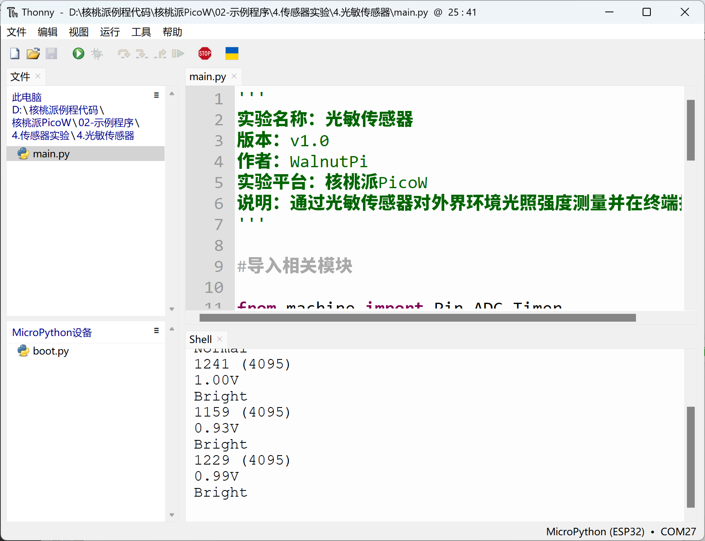

# 光敏传感器

## 前言
光敏传感器实际是一个款可以检测光照强度的传感器，可以应用于我们日常生活中植物光照强度、室内光线检测、以及某些场合的亮度检测。传感器的原理就是将外界模拟变化的信号转变成数字信号（电压值）让单片机出来，处理方式就是常用的ADC（模拟数字转换）。

## 实验目的
采集当前环境的光照强度并在终端打印，显示方式为：Bright-强，Normal-中等，Weak-弱。

## 实验讲解

下图是一款光敏传感器模块，主要有供电引脚和信号输出引脚。

 

本实验实验核桃派PicoW引脚10连接传感器信号输出引脚：

 

当使用3.3V供电时候，光敏传感器输出的是模拟信号：0-3.3V，这代表了外界的光照强度。接近0V时光线最强，接近3.3V时，光线最弱。因此我们可以使用ADC功能来编程实现检测，具体可参考 [**ADC(电压测量)**](../basic_examples/adc.md) 章节内容，这里不再重复。

:::tip 提示
核桃派PicoW (ESP32-S3) ADC默认量程为1V，芯片内部配备了衰减器，通过配置可以提高量程获得更大的测量电压。详见：**https://docs.micropython.org/en/latest/esp32/quickref.html#ADC**
:::

ADC默认是12bit精度，即最大值为2^12-1=4095。然后我们将检测到的数值0-4095分成三段，分别代表光线强：【0- 1365】，中等：【1365- 2730】，弱：【2730-4095】。当然开发者可以根据自己实际情况来调整数值。


代码编写流程如下：

```mermaid
graph TD
    导入ADC模块-->构建ADC对象-->获取光照强度值,即ADC电压值-->判断光照强度并在终端打印-->获取光照强度值,即ADC电压值;
```

## 参考代码

```python
'''
实验名称：光敏传感器
版本：v1.0
作者：WalnutPi
实验平台：核桃派PicoW
说明：通过光敏传感器对外界环境光照强度测量并在终端打印。
'''

#导入相关模块

from machine import Pin,ADC,Timer

#初始化ADC,Pin=10，11DB衰减，测量电压0-3.3V
Light = ADC(Pin(10))
Light.atten(ADC.ATTN_11DB)

#中断回调函数
def fun(tim):

    value=Light.read() #获取ADC数值

    #显示数值
    print(str(value)+' (4095)')
    #计算电压值，获得的数据0-4095相当于0-3.3V，（'%.2f'%）表示保留2位小数
    print(str('%.2f'%(value/4095*3.3)))

    #判断光照强度，分3档显示。
    if 0 < value <=1365:
        print('Bright')

    if 1365 < value <= 2730:
        print('Normal')

    if 2730 < value <= 4095:
        print('Weak')

#开启RTOS定时器
tim = Timer(1)
tim.init(period=1000, mode=Timer.PERIODIC, callback=fun) #周期1s
```

## 实验结果

使用Thonny IDE运行代码，可以看到终端输出光敏模块测量值和光照强度信息。

 

使用手机闪光灯改变亮度，可以看到测量值发生变化。

 

 

