# Image Flashing

WalnutPi 1B Android uses the Android TV system, which has been adapted for WalnutPi 1B hardware. After flashing this system, you can install various Android APPs or build a TV set-top box.

WalnutPi 1B 1G version (H616) is based on Android 10, while the 2G/4G version (H618) is based on Android 12. There is little difference in the system and related software.

::::danger Warning
Flashing the wrong Android image for H616 vs H618 will prevent booting. Please make sure to distinguish between them.
::::

## Image Download:

- Baidu Netdisk: https://pan.baidu.com/s/1-ytTK-KI1RP2KsoZpjFSrA?pwd=WPKJ
- Extraction code: **WPKJ**

Open the Android folder. Image update notes can be found in the **说明文档.txt** file inside. If the Baidu Netdisk download is too slow, you can download from QQ group files: 677173708

**(After downloading, extract the archive to get the .img image file for use)**

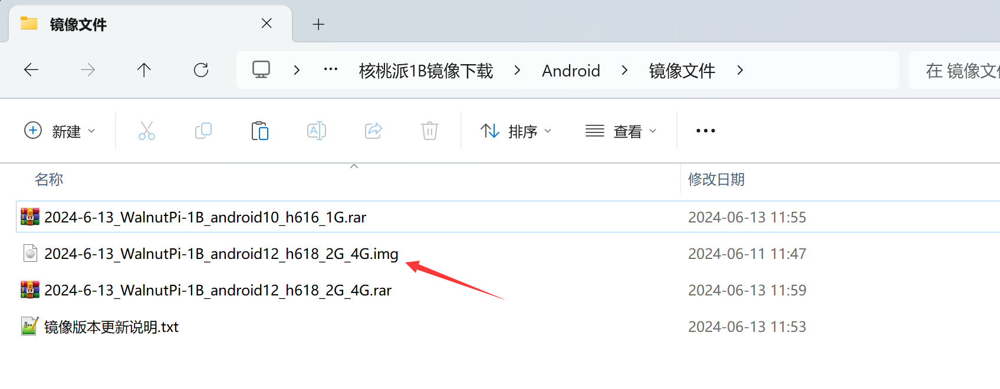

## SD Boot Card Flashing

### Using PhoenixCard

After downloading the image, you also need a flashing tool — PhoenixCard. The software is located in the "Flasher Tools" folder inside the WalnutPi Android image package:

**(Download and extract to get the folder)**

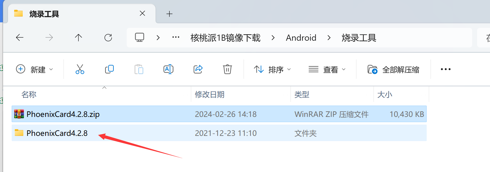

Enter the folder and open the software shown below:

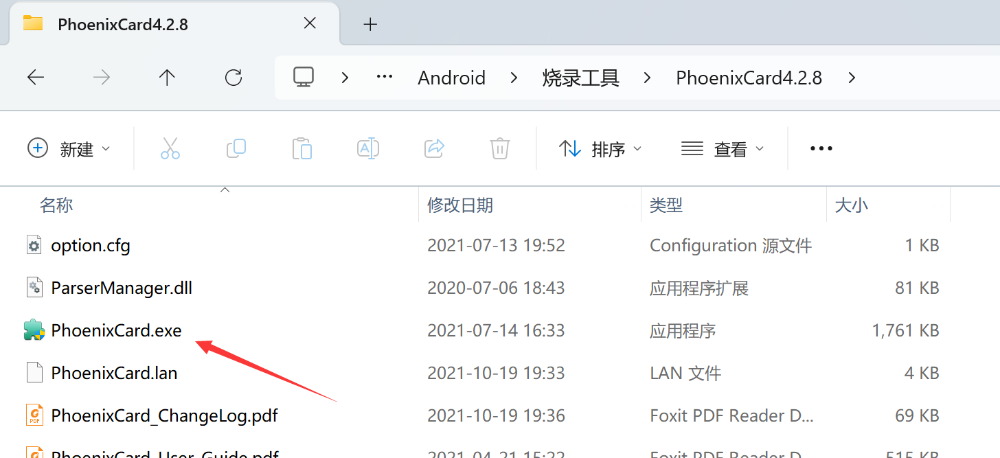

Insert the SD card into the computer:

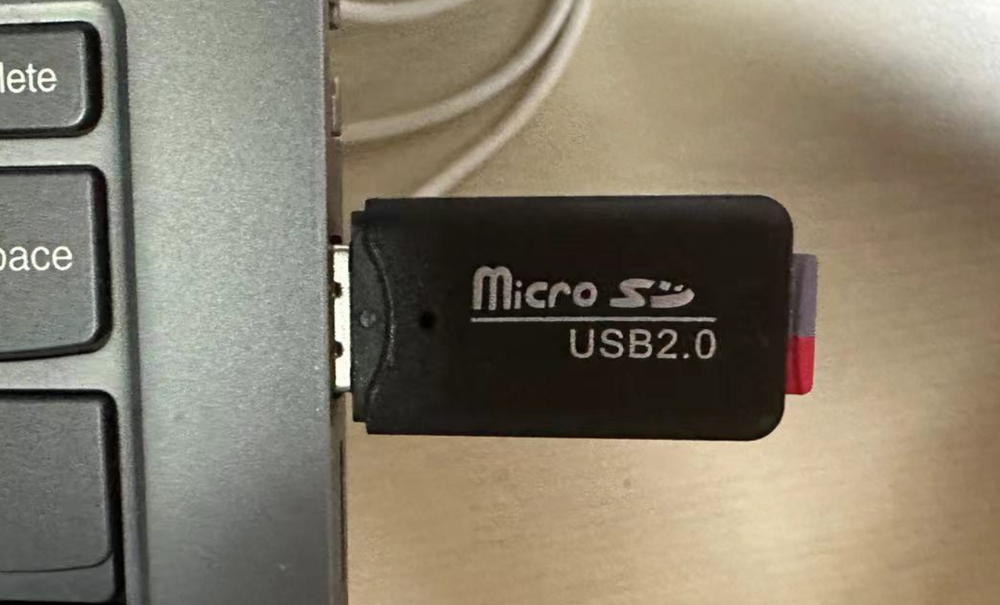

Follow these steps to start flashing:

1. Select the image to flash;
2. Choose "Boot Card";
3. Select the inserted SD card drive letter;
4. Click "Burn" to start flashing.

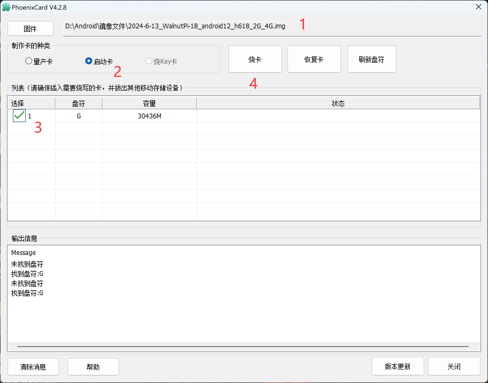

The progress bar may not move during the flashing process — you need to wait a few minutes. Please be patient. When flashing is complete, it will look like the image below:

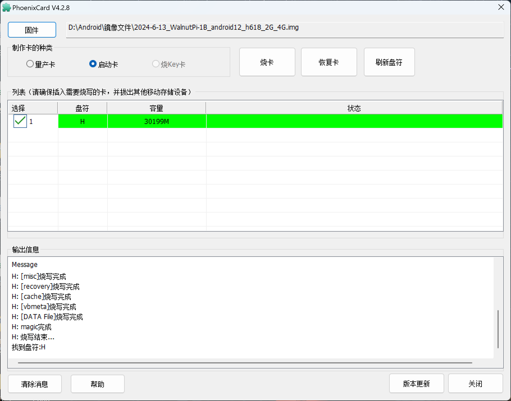

A 100+ MB drive letter will appear in My Computer. This contains some configuration files for the WalnutPi Android system.

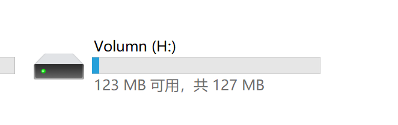

The `bootlogao.bmp` file inside is the boot logo. It must be in BMP format and supports a maximum resolution of 1280x720. Users can replace it with their own.

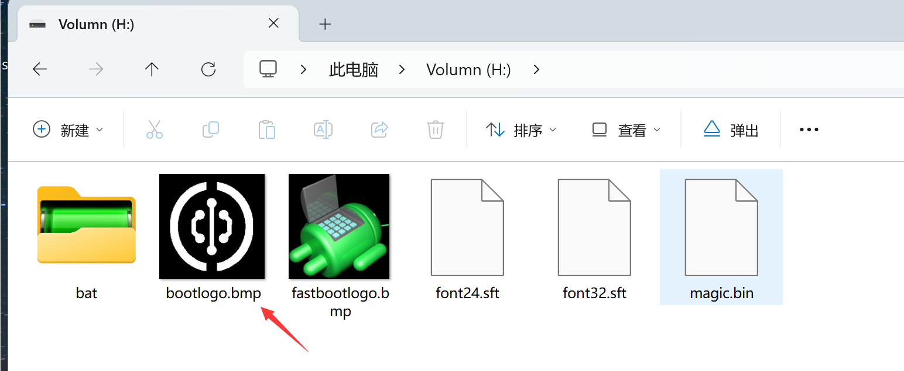

## EMMC Flashing

Download the EMMC version image and extract it to get the .img file.

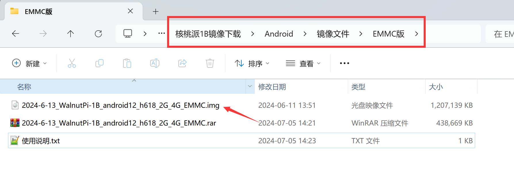

Follow the [flashing tutorial above](#sd-boot-card-flashing) to flash to the SD card. The difference is that you need to select "Mass Production Card"; the rest of the process is the same.

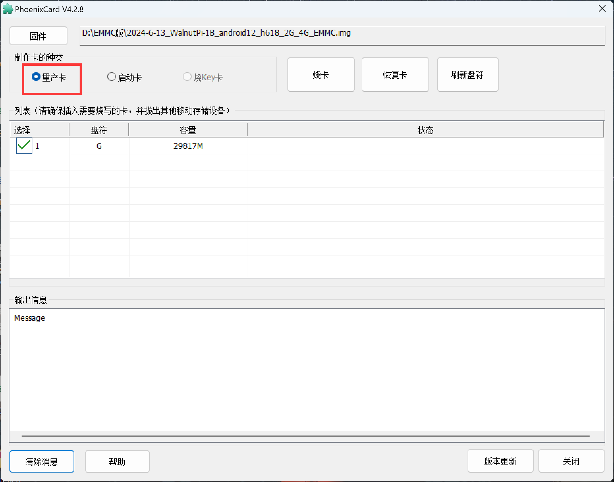

After flashing is complete, insert the SD card into the WalnutPi EMMC version hardware, connect an HDMI display, and power on. You will see the flashing progress.

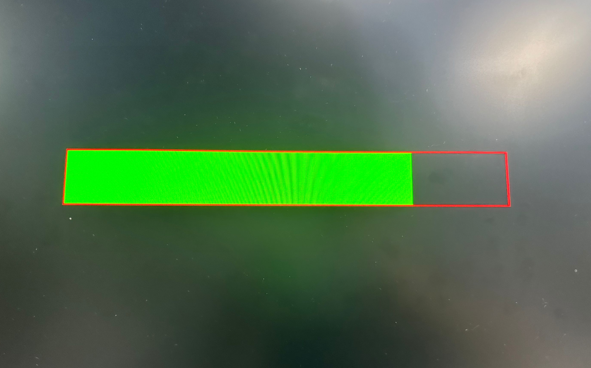

When the progress bar finishes, flashing is complete. Power off, remove the SD card, and power on again. If it boots into the Android system, the EMMC system has been flashed successfully.
