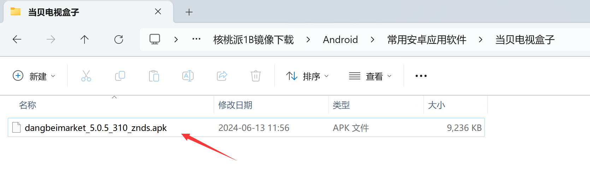
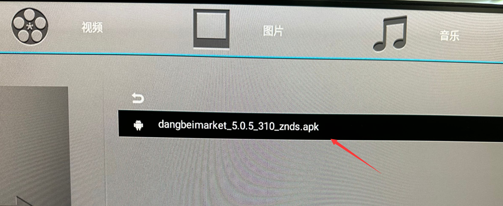
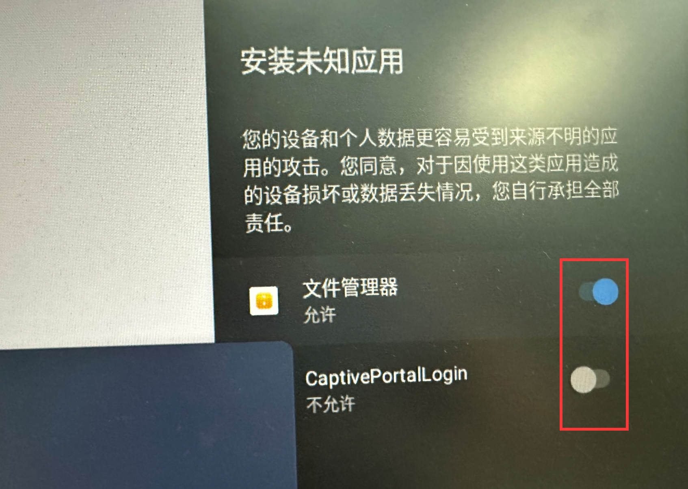
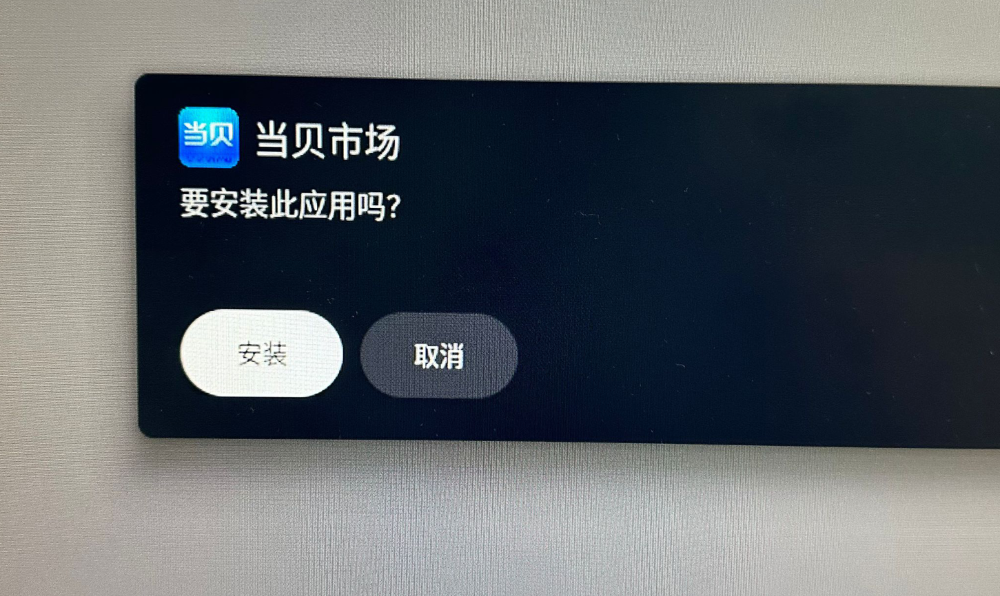
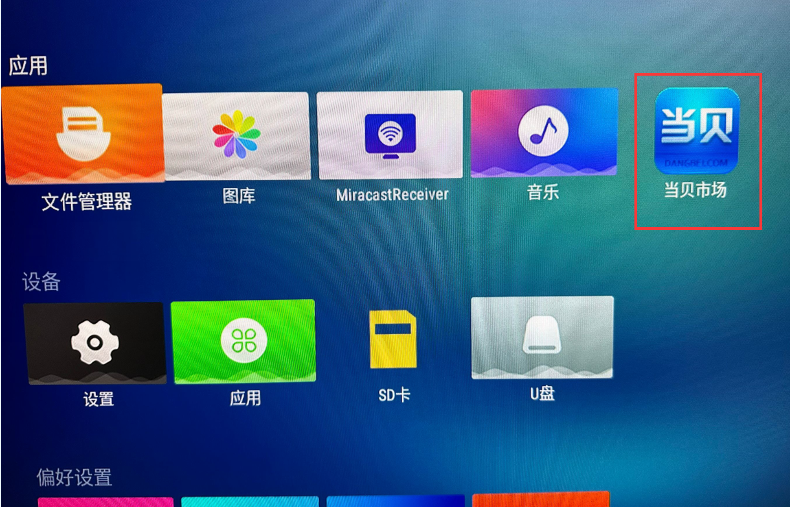
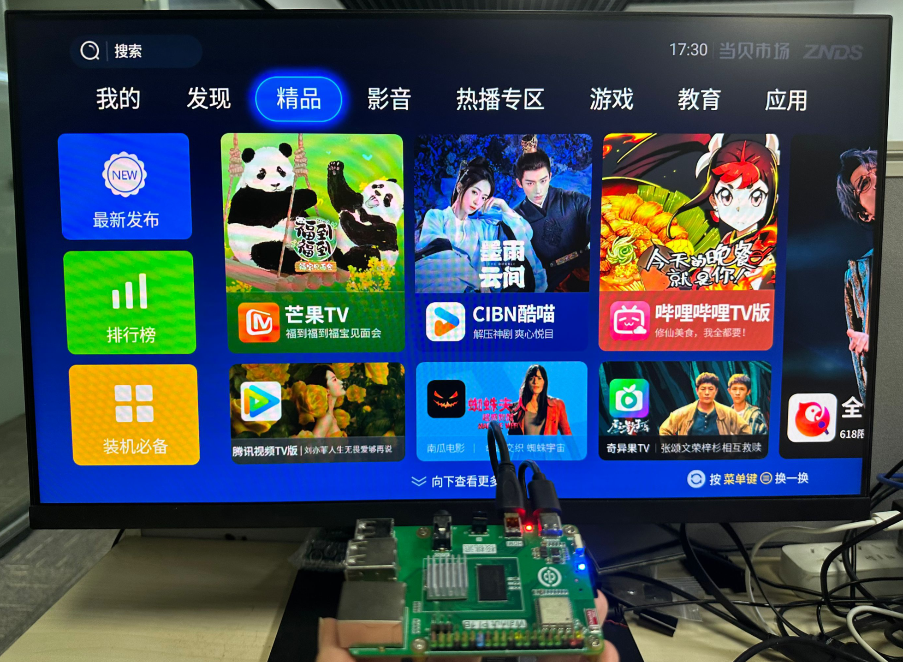

# Building a TV Box

Since the WalnutPi Android system is an Android TV version, you can build your own TV box by installing apps. This guide uses the Dangbei Market app. Through Dangbei Market, you can install various video and entertainment apps.

The Dangbei installation package is located in the **常用安卓应用软件** (Common Android Apps) folder inside the image directory:

You can copy the app using a USB flash drive, then install it on the WalnutPi's Android system. Tutorial: [USB Flash Drive File Transfer](./android_os.md#usb-flash-drive-file-transfer)

Click the app:

If the following prompt appears, check all and allow:

Then click Install:

After installation, the **Dangbei Market** app icon will appear on the desktop:

Make sure the WalnutPi is connected to the internet. Refer to: [Connecting to the Internet](./android_os.md#connecting-to-the-internet)

Then open Dangbei Market:

Audio is supported via both HDMI audio and 3.5mm Audio jack output.
