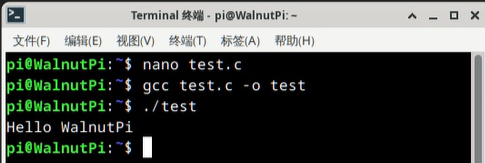
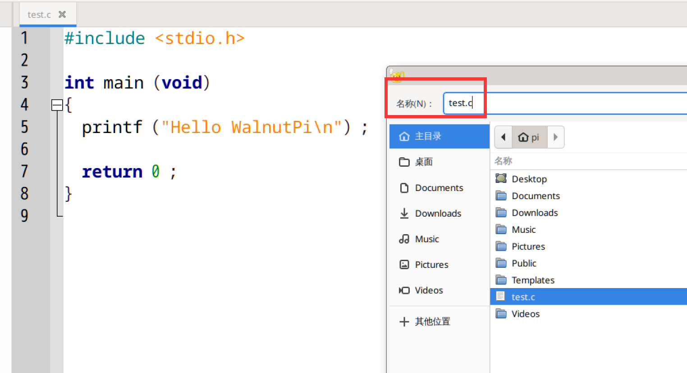
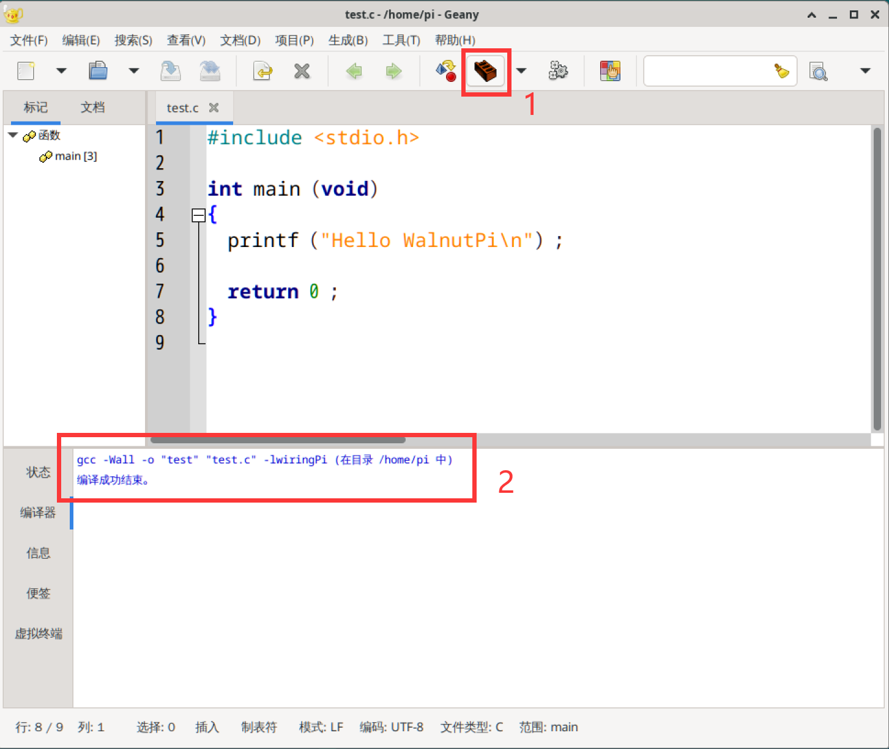

# Compiling C Code on the Board

## Command Line Method

First, create a `test.c` file in the current directory on the WalnutPi and enter the following content (this code prints "Hello WalnutPi" in the terminal):

```c
#include <stdio.h>

int main (void)
{
  printf ("Hello WalnutPi\n") ;

  return 0 ;
}
```

To compile the code, use the `gcc` command, which is very simple. For example, to compile `test.c` into an executable named `test`, just run:

```bash
gcc test.c -o test
```

Run the compiled program:

```bash
./test
```

You will see the terminal print: Hello WalnutPi:



## Geany IDE (Local on WalnutPi)

The WalnutPi desktop system comes with Geany IDE pre-installed, located under **Start > Development**. You can use Geany for C programming, compilation, and execution.

Open Geany:


Create a new file, enter the test code below, and save it as a `.c` file.

```c
#include <stdio.h>

int main (void)
{
  printf ("Hello WalnutPi\n") ;

  return 0 ;
}
```



Click the **Build** button to see the compilation results in the lower panel. If compilation is successful, an executable file will be generated in the current directory.



Click the **Execute** button to run the compiled executable. A new terminal window will pop up displaying the "Hello WalnutPi" message.


