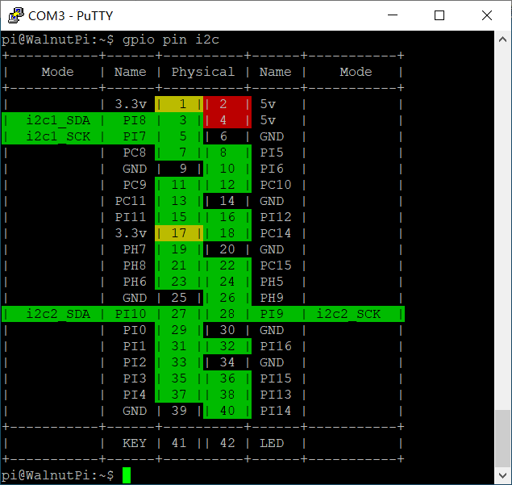
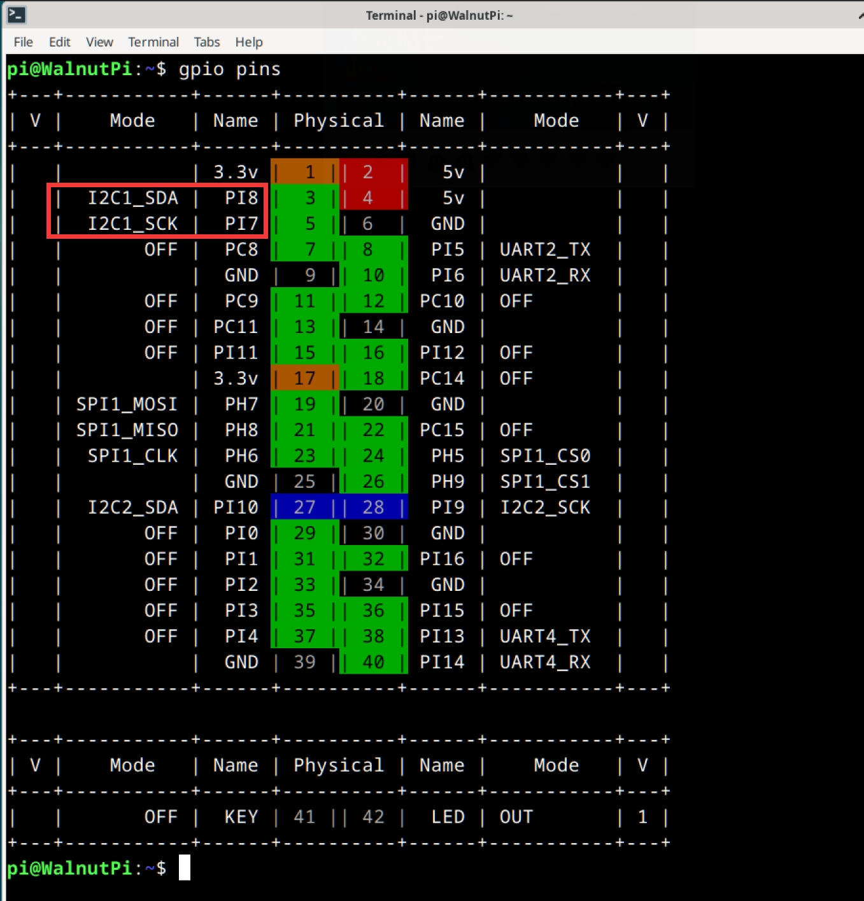
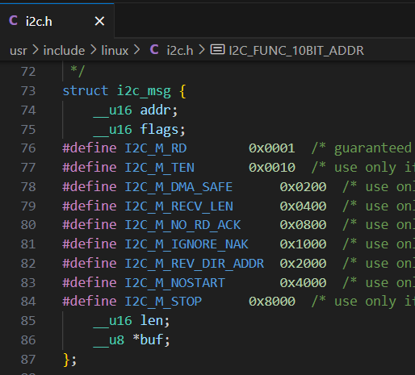

# I2C

## Configuring Pins

### Finding I2C Pins on the Board

For easy lookup, we've added a feature to display functional pin positions. Run the following command to see how many I2C buses are available on the board's 40-pin header:

```bash
gpio pin i2c
```




### Enabling I2C

We use the `set-device` command to enable/disable the underlying driver for a specified device. Once enabled, the pins will switch from GPIO mode to their corresponding alternate function. (A reboot is required for the changes to take effect.)


First, check the status of each device:

```bash
set-device status
```


Run the following command to enable i2c1. Note that a reboot is required for the changes to take effect:

```bash
sudo set-device enable i2c1
```

After reboot, check the pin status. You can see that pins 3 and 5 are now in I2C alternate function mode:



Also verify that the `/dev/i2c-1` device file exists, as we will need to operate this file for I2C communication later:


## I2C Read/Write Program

In Linux, everything is a file. The i2c1 bus is abstracted as the `/dev/i2c-1` file. Open it with `open`, trigger read/write with `ioctl`, and close it with `close`.

### 1. Opening the File

In Linux, everything is a file. First, use the `open` function to open the device file corresponding to the device we want to operate, obtaining a file descriptor.

You'll need these header files:

```c
#include <sys/types.h>
#include <sys/stat.h>
#include <fcntl.h>
#include <unistd.h>
```

Open the device node:

```c
    int fd = open("/dev/i2c-1", O_RDWR);
    if (fd < 0)
    {
        perror("Fail to Open\n");
        return -1;
    }
```

### 2. i2c_msg

In Linux, I2C operations don't use `write` and `read` functions directly. Instead, they use an `i2c_msg` structure to configure the operations from I2C start to stop.

- `addr`: Target address
- `flags`: Read or write
- `buf`: Address of the buffer. Depending on whether `flags` is read or write, after the address frame is sent, its contents will either be sent out (write) or the bus contents will be stored here (read).
- `len`: Size of the buffer





### 3. Writing to the I2C Bus

Here's the I2C timing diagram downloaded from TI:


Suppose I want to write the value 0x55 to register 0x01 on a device at address 0x3c. The msg structure should be set up as follows. `addr` and `flags` together determine the content of the first address frame. Since `flags` indicates a write, after the address frame is sent, the contents of buf will be sent sequentially.

First, you'll need these header files:

```c
#include <sys/ioctl.h>
#include <linux/i2c.h>
#include <linux/i2c-dev.h>
```

```c

    uint8_t addr = 0x3c;
    uint8_t reg = 0x01;
    uint8_t value = 0x55;

    uint8_t buf[2];
    buf[0] = reg; // Register
    buf[1] = value; // Data

    struct i2c_msg msg;
    msg.addr = addr; // Target address
    msg.flags = 0;   // Read/write flag
    msg.len = 2;     // buf length
    msg.buf = buf; 
```

After setting up the msg, you also need to create an `i2c_rdwr_ioctl_data` structure specifying how many msgs this I2C communication will handle, then use the `ioctl` function to trigger the I2C transaction.

```c
    struct i2c_rdwr_ioctl_data data;
    data.msgs = &msg;
    data.nmsgs = 1;

    int ret = ioctl(fd, I2C_RDWR, &data);
    if (ret < 0)
        printf("i2c write failed");
    return ret;
```

### 4. Reading from the I2C Bus

Here's the I2C timing diagram downloaded from TI:


Now I want to read the value of register 0x01 from a device at address 0x3c.

According to the timing diagram, two msgs are needed: the first msg is a write, with only the register number following the address frame. The second msg is a read — after the address frame is sent, the slave returns the content of that register.

```c
    uint8_t addr = 0x3c;
    uint8_t reg = 0x01;
    uint8_t value;

    struct i2c_msg msgs[2];
    msgs[0].addr = addr;
    msgs[0].flags = 0;
    msgs[0].len = 1;
    msgs[0].buf = &reg;

    msgs[1].addr = addr;
    msgs[1].flags = I2C_M_RD;
    msgs[1].len = 1;
    msgs[1].buf = &value;

```

After setting up the msgs, you also need to create an `i2c_rdwr_ioctl_data` structure specifying how many msgs this I2C communication will handle, then use the `ioctl` function to trigger the I2C transaction.

```c
    struct i2c_rdwr_ioctl_data data;
    data.msgs = msgs;
    data.nmsgs = 2;

    int res = ioctl(fd, I2C_RDWR, &data);
    if (res < 0)
        printf("Read failed\n");

    return res;
```

### 5. Closing the File

Remember to call `close` after each `open` to manually close the file. Otherwise, the file descriptor will remain open until the program exits. The system limits a single process to opening at most 1024 files at once. If a program continuously calls `open` without `close`, it won't be long before it errors out and exits.

```
close(fd);
```

## Example — Reading Temperature Data from MLX90614


First, read the MLX90614 datasheet to understand its read/write timing:


According to the timing given in the datasheet, we need to create two msgs. The first is a write, with the buffer containing the temperature read command 0x07. The second is a read of 3 consecutive bytes, where the first two are temperature data. Also, the MLX90614 address is 0. The final code is as follows:

```c
#include <stdio.h>
#include <stdint.h>
#include <string.h>

#include <sys/types.h>
#include <sys/stat.h>
#include <fcntl.h>
#include <unistd.h>

#include <sys/ioctl.h>
#include <linux/i2c.h>
#include <linux/i2c-dev.h>


#define DEV_I2C "/dev/i2c-1"

// Calculate actual temperature value from MLX90614
uint16_t mlx_data_transform(uint8_t Data[3])
{
    uint16_t temp;
    temp = (Data[1] << 8) + Data[0]; // Combine high and low bytes
    temp = temp * 2 - 27315;          // Multiply by 100
    return temp;
}

int main()
{

    int fd = open(DEV_I2C, O_RDWR);
    if (fd < 0)
    {
        perror("Fail to Open\n");
        return -1;
    }

    uint8_t addr = 0;
    uint8_t reg = 0x07;
    uint8_t value[3];

    struct i2c_msg msgs[2];
    msgs[0].addr = addr;
    msgs[0].flags = 0;
    msgs[0].len = 1;
    msgs[0].buf = &reg;

    msgs[1].addr = addr;
    msgs[1].flags = I2C_M_RD;
    msgs[1].len = 3;
    msgs[1].buf = value;

    struct i2c_rdwr_ioctl_data data;
    data.msgs = msgs;
    data.nmsgs = 2;

    while (1)
    {

        int res = ioctl(fd, I2C_RDWR, &data);
        if (res < 0)
            printf("Read failed\n");
        printf("temp=[%d]\r\n", mlx_data_transform(value));
        sleep(1);
    }
}
```

I've written the code in a file called `i2c.c`. To compile it into an executable named `exe`, simply run:

```bash
gcc i2c.c -o exe
```

The execution result is shown below. The ambient temperature around me is about 30°C, rising to 34°C when my hand approaches:


