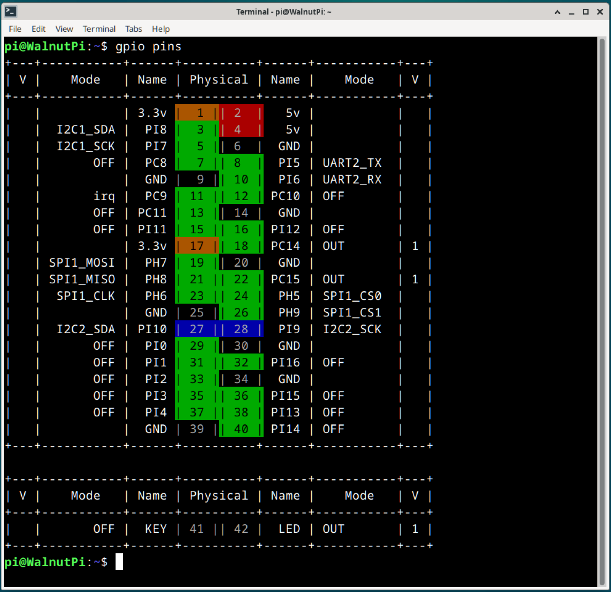

# GPIO Control

:::tip Note
Please use WalnutPi OS v2.3 or above.
:::

## About Pin Numbering

Run the following command to check the status of each pin. In subsequent programming, use the **Physical** number from this table to refer to pins:

```
gpio pins
```



For detailed operations, please refer to: [**GPIO Command-Line Operations**](../gpio/gpio_command.md). This will not be repeated here.


## Sample Code

Here is a sample program: when the button on the WalnutPi board is pressed, the LED turns on; when released, the LED turns off.

```
#include <stdio.h>
#include <unistd.h>
#include "gpio.h" // GPIO control library

#define KEY 41
#define LED 42
// These pin numbers are obtained using the gpio pins command

int main()
{
    pin_set_mode(LED, OUTPUT); 
    pin_set_mode(KEY, INPUT); 
    pin_set_pullUpDn(KEY, PULL_UP); // Enable internal pull-up
    while (1)
    {
        if (pin_read(KEY) == 0)
            pin_write(LED, 1);
        else
            pin_write(LED, 0);
    }
    return 0;
}
```

## Command-Line Compilation and Execution

To compile the code, since the GPIO library exists as a dynamic library, you need to add `-lgpio` to the compilation command. The following command compiles `test.c` in the current directory into an executable named `test`:

```bash
gcc -Wall -o test test.c -lgpio
```

Run the compiled program. Note that you need administrator privileges to control GPIO:

```bash
sudo ./test
```


## Geany IDE Compilation

For instructions on using Geany IDE, refer to this tutorial: [**Compiling C Code on the Board**](./c_run.md)

If you are using the Geany IDE that comes pre-installed with the WalnutPi desktop system, you need to make the following configuration changes.

Open **Build > Set Build Commands**:


Add `-lgpio` at the end of the **Build** command so that the GPIO library is included during compilation when you click the Build button:

```bash
gcc -Wall -o "%e" "%f" -lgpio
```

Add `sudo ` before the **Execute** command so that the program runs with administrator privileges when you click the Run button:

```bash
sudo "./%e"
```

Click **OK** to save.
