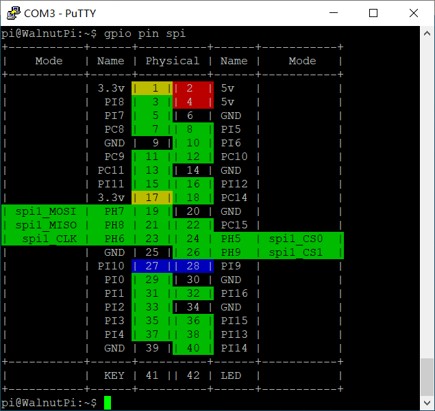
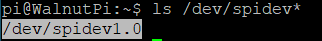
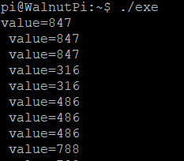

# SPI

## Configuring Pins

### Finding SPI Pins on the Board

For easy lookup, we've added a feature to display functional pin positions. Run the following command to see how many SPI buses are available on the board's 40-pin header:

```
gpio pin spi
```



As shown, there is only spi1 on this 40-pin header, along with two CS pins belonging to spi1. A single SPI interface can be connected to multiple modules, with each module connected to a different CS pin. The CS pin determines which module to communicate with.

### Enabling SPI-Dev

We use the `set-device` command to enable/disable the underlying driver for a specified device. Once enabled, the pins will switch from GPIO mode to their corresponding alternate function. (A reboot is required for the changes to take effect.)


To use spi1, first enable spi1, then enable a spidev1_x. For example, enabling `spidev1_0` corresponds to spi1-cs0. After reboot, a `/dev/spidev1.0` file will appear. When operating this file for SPI communication, it will automatically assert the spi1 cs0 pin (pull low) and deassert all other CS pins (pull high).

Note: Enabling spidev1_0 will cause all other device drivers using spi1-cs0 to become invalid, such as the 3.5-inch LCD screen.


Here I'm enabling spidev1_0. Note that a reboot is required for the changes to take effect:

```
sudo set-device enable spidev1_0
```


After reboot, you'll see that the `/dev/spidev1.0` file has appeared, as we will need to operate this file for spi1_cs0 communication later:




## SPI Read/Write Program

We need to operate the `/dev/spidev1.0` file. Open it with `open`, configure and trigger SPI read/write with `ioctl`, and close it with `close`.

### 1. Opening the File

In Linux, everything is a file. First, use the `open` function to open the device file corresponding to the device we want to operate, obtaining a file descriptor.

The `open` function requires these header files:

```c
#include <sys/types.h>
#include <sys/stat.h>
#include <fcntl.h>
#include <unistd.h>
```

Open the device node:

```c
    int fd = open("/dev/spidev1.0", O_RDWR);
    if (fd < 0)
    {
        perror("Fail to Open\n");
        return -1;
    }

```

### 2. Configuring SPI Mode

SPI mode — depending on CPOL and CPHA, SPI is divided into 4 modes. Different chips may require you to operate in a specific mode.

The `ioctl` function requires these header files:

```
#include <sys/ioctl.h>
```

Configure for mode 0, i.e., CPOL=0, CPHA=0:

```c
static uint32_t SPI_MODE = SPI_MODE_0;
    if (ioctl(fd, SPI_IOC_WR_MODE32, &SPI_MODE) == -1)
        printf("err: can't set spi mode");
```

### 3. SPI Transfer

The two SPI pins work simultaneously — MISO and MOSI operate synchronously. Use the `spi_ioc_transfer` structure to describe a single SPI transfer. SPI can be used to simulate many protocols, or rather, many chips claiming to have an SPI interface have quirky timings.

- `tx_buf`: Buffer to send out via MOSI
- `rx_buf`: Buffer to store MISO data
- `len`: Buffer size
- `speed_hz`: SPI transfer speed
- `cs_change`: Whether to keep the CS line asserted after the transfer completes
- `bits_per_word`: Size of each word during transfer
- `delay_usecs`: Delay after sending
- `tx_nbits`: How many lines to use for SPI transmission. 4-line QSPI also uses this interface for transmission, so this option is provided for selection


First, you'll need the following header file:

```c
#include <linux/spi/spidev.h>
```

Here's an example:

```c
static uint8_t BITS_PER_WORD = 8;
static uint32_t SPEED = 80 * 1000;
    transfer.tx_buf = (unsigned long)tx_buf;
    transfer.rx_buf = (unsigned long)rx_buf;
    transfer.len = len;
    transfer.delay_usecs = 500;     // Delay after sending
    transfer.speed_hz = SPEED;
    transfer.bits_per_word = BITS_PER_WORD;
    transfer.tx_nbits = 1;  // Single-line
    transfer.rx_nbits = 1;  // Single-line
    transfer.cs_change = 0; // Release CS line after transfer
```

Then use the `ioctl` function with `SPI_IOC_MESSAGE(x)` (where x = the number of transfers passed in) to trigger an SPI transfer. Each time a clock pulse is sent, the contents of tx_buf are output from MOSI while simultaneously reading MISO contents into rx_buf:

```
    int res = ioctl(fd, SPI_IOC_MESSAGE(1), &transfer);
    if (res < 0)
        printf("err: spi_transfer failed");
```

### 4. Closing the File

Remember to call `close` after each `open` to manually close the file. Otherwise, the file descriptor will remain open until the program exits. The system limits a single process to opening at most 1024 files at once. If a program continuously calls `open` without `close`, it won't be long before it errors out and exits.

```
close(fd);
```

## Example Program

Here we use the MCP3004 ADC chip, which converts 4 analog input channels to SPI output. First, read the chip datasheet to understand the read procedure, as shown below:


Now I want to read the value of channel 0. I need to send 3 bytes of data: the first byte is 0x01 as a start signal, the second byte is the configuration word 0x80, and the third byte has no function — it's only there to trigger reception. The code is as follows:

```c
#include <stdio.h>
#include <stdint.h>

#include <sys/types.h>
#include <sys/stat.h>
#include <fcntl.h>
#include <unistd.h>

#include <sys/ioctl.h>

#include <linux/spi/spidev.h>

#define DEV_SPI "/dev/spidev1.0"

static uint32_t SPI_MODE = SPI_MODE_0;
static uint8_t BITS_PER_WORD = 8;
static uint32_t SPEED = 100 * 1000;

// MOSI and MISO work simultaneously — data is sent from tx_buf
// while at the same time data is read into rx_buf
int spi_transfer(int fd, uint8_t *tx_buf, uint8_t *rx_buf, int len)
{
    struct spi_ioc_transfer transfer;

    transfer.tx_buf = (unsigned long)tx_buf;
    transfer.rx_buf = (unsigned long)rx_buf;
    transfer.len = len;
    transfer.delay_usecs = 500; // Delay after sending
    transfer.speed_hz = SPEED;
    transfer.bits_per_word = BITS_PER_WORD;
    transfer.tx_nbits = 1;  // Single-line
    transfer.rx_nbits = 1;  // Single-line
    transfer.cs_change = 0; // Release CS line after transfer

    int res = ioctl(fd, SPI_IOC_MESSAGE(1), &transfer); // Trigger transfer
    if (res < 0)
        printf("err: spi_transfer failed");
    return res;
}

int main()
{
    int fd0 = open(DEV_SPI, O_RDWR);
    if (fd0 < 0)
    {
        perror("Fail to Open\n");
        return -1;
    }

    // Configure SPI mode
    if (ioctl(fd0, SPI_IOC_WR_MODE32, &SPI_MODE) == -1)
        printf("err: can't set spi mode");

    uint8_t tx_buf[3] = {0x01, 0x80, 0x00};
    uint8_t rx_buf[3];

    // MCP3004 requires the CS0 falling edge as the start of SPI communication
    // Since there's only one CS0 device under spi1, CS0 is initially low
    // Send one byte first to trigger CS0 high
    spi_transfer(fd0, tx_buf, rx_buf, 1); 

    uint16_t value;
    while (1)
    {
        spi_transfer(fd0, tx_buf, rx_buf, 3);
        value = (rx_buf[1] << 8) + rx_buf[2];
        printf("value=%d\r\n ", value);
        sleep(1);
    }

    return 0;
}

```

Compiling on the board is straightforward. I've written the code in a file called `spi.c`. To compile it into an executable named `exe`, simply run:

```
gcc spi.c -o exe
```

The test result is shown below. As I turn the potentiometer connected to channel 0 of the MCP3004, the value changes accordingly:



The initial timing when the code first runs is as follows:


