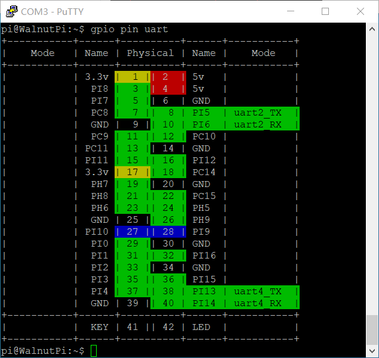
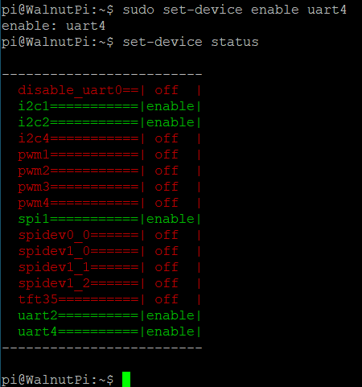
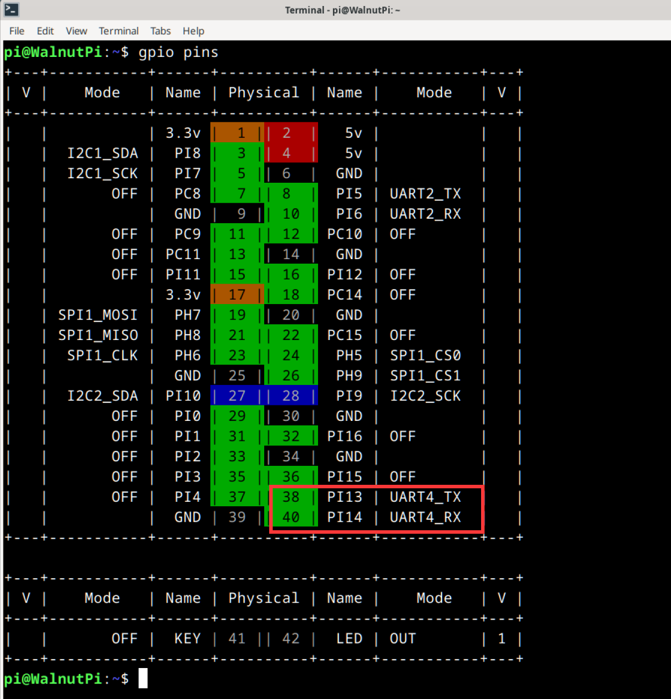

# UART (Serial Port)

## Configuring Pins

### Finding UART Pins on the Board

For easy lookup, we've added a feature to display functional pin positions. Run the following command to see how many UART ports are available on the board's 40-pin header:

```
gpio pin uart
```




### Enabling the UART

We use the `set-device` command to enable/disable the underlying driver for a specified device. Once enabled, the pins will switch from GPIO mode to their corresponding alternate function. (A reboot is required for the changes to take effect.)

First, check the status of each device:

```
set-device status
```


Run the following command to enable UART4. Note that a reboot is required for the changes to take effect:

```
sudo set-device enable uart4
```



After reboot, check the pin status. You can see that pins 38 and 40 are now working in UART alternate function mode:



## UART Read/Write Program

In Linux, everything is a file. The serial port is also abstracted as a special file — UART4 is the `/dev/ttyS4` file. Open it with `open`, configure it with `ioctl`, read/write with `write` & `read`, and close it with `close`.

### 1. Opening the File

In Linux, everything is a file. First, use the `open` function to open the device file corresponding to the device we want to operate, obtaining a file descriptor.

The `open` function requires these header files:

```
#include <sys/types.h>
#include <sys/stat.h>
#include <fcntl.h>
#include <unistd.h>
```

Open the device node:

```c
    int fd = open("/dev/ttyS4", O_RDWR);
    if (fd < 0)
    {
        perror("Fail to Open\n");
        return -1;
    }

```

### 2. Configuring UART Parameters

In Linux, `ioctl` is typically used to configure device-specific parameters — different devices support different configurable parameters. The following code implements the most commonly used 8N1 configuration at 115200 baud rate.


You'll need these header files:

```c
#include <sys/ioctl.h>
#include <termios.h>
```

- Data bits: Available options include `CS8`, `CS7`, `CS6`, etc.
- Parity: If the bit corresponding to `PARENB` is set to 1, parity is enabled. If the bit corresponding to `PARODD` is set to 1, it's odd parity; otherwise, it's even parity.
- Stop bits: If the bit corresponding to `CSTOPB` is set to 1, there are 2 stop bits; otherwise, 1 stop bit.

```c
    struct termios opt;
    ioctl(fd, TCGETS, &opt); // Get UART parameters into opt

    cfsetospeed(&opt, B115200); // Set output baud rate to 115200
    cfsetispeed(&opt, B115200); // Set input baud rate to 115200
    
    opt.c_cflag &= ~CSIZE; // Clear the data bits setting
    opt.c_cflag |= CS8;    // Data bits = 8

    opt.c_cflag &= ~PARENB; // No parity

    opt.c_cflag &= ~CSTOPB; // 1 stop bit

    ioctl(fd, TCSETS, &opt); // Apply the configured settings

```

### 3. Sending Data

Simply write data to this file, and the underlying driver will send it out via the serial port.

The `write` function requires this header file:

```c
#include <unistd.h>
```

Sending data:

```c
    char buf[1024] = "hello\n";
    write(fd, buf, strlen(buf));
```

### 4. Receiving Data

The underlying driver automatically stores data received by the serial port into a buffer. We just need to use the `read` function on this file, which effectively reads the contents of the serial port buffer.

The `read` function attempts to read a specified number of characters, and the return value is the actual number of characters read.

If the buffer is empty, the `read` function will block here until the serial port receives data ending with a `\n` (newline), at which point the buffer is flushed and the data is handed to `read`.


The `read` function depends on the same header file as the `write` function:

```
#include <unistd.h>
```

Here's an example of reading code:

```c
    tcflush(fd, TCIOFLUSH); // Clear the serial receive buffer
    while (1)
    {
        int res = read(fd, buf, 3); // Read 3 characters
        if (res > 0)
        {
            buf[res] = '\0';
            printf("Read [%d] bytes  data: %s\n", res, buf);
        }
    }

```

### 5. Closing the File

Remember to call `close` after each `open` to manually close the file. Otherwise, the file descriptor will remain open until the program exits. The system limits a single process to opening at most 1024 files at once. If a program continuously calls `open` without `close`, it won't be long before it errors out and exits.

```c
close(fd);
```

## Testing

Here's the full example code. At runtime, it sends the string "hello" via the serial port, then continuously reads and prints any data received:

```c
#include <stdio.h>
#include <stdint.h>
#include <string.h>

#include <sys/types.h>
#include <sys/stat.h>
#include <fcntl.h>
#include <unistd.h>

#include <sys/ioctl.h>
#include <termios.h>


#define DEV_UART "/dev/ttyS4"

int main()
{
    int fd = open(DEV_UART, O_RDWR);
    if (fd < 0)
    {
        perror("Fail to Open\n");
        return -1;
    }

    struct termios opt;
    ioctl(fd, TCGETS, &opt); // Get UART parameters into opt

    cfsetospeed(&opt, B115200); // Set output baud rate to 115200
    cfsetispeed(&opt, B115200); // Set input baud rate to 115200

    opt.c_cflag &= ~CSIZE; // Clear the data bits setting
    opt.c_cflag |= CS8;    // Data bits = 8

    opt.c_cflag &= ~PARENB; // No parity

    opt.c_cflag &= ~CSTOPB; // 1 stop bit

    ioctl(fd, TCSETS, &opt); // Apply the configured settings

    fcntl(fd, F_SETFL, O_NONBLOCK);

    char buf[1024] = "hello\n";
    write(fd, buf, strlen(buf));

    tcflush(fd, TCIOFLUSH); // Clear the serial receive buffer
    while (1)
    {
        int res = read(fd, buf, 3); // Read 3 characters
        if (res > 0)
        {
            buf[res] = '\0';
            printf("Read [%d] bytes  data: %s\n", res, buf);
        }
    }

    close(fd);

    return 0;
}
```

Compiling on the board is straightforward. I've written the code in a file called `uart.c`. To compile it into an executable named `exe`, simply run:

```
gcc uart.c -o exe
```

The execution result is as follows:


