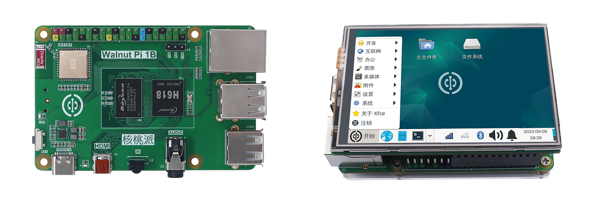

# Directory

### **WalnutPi 1st Gen Introduction**

- [WalnutPi Introduction](./intro/intro.md)
- [Product Specifications](./intro/hw-parameter.md)
- [Downloads](./intro/download.md)

### **Unboxing Guide**

- [Hardware Details](./getting_start/hw-detail.md)
- [WalnutPi 1B Peripheral Assembly](./getting_start/1b-peripherals.md)
- [WalnutPi ZeroW Peripheral Assembly](./getting_start/zerow-peripherals.md)
- [System Image Burning](./getting_start/os-install.md)
- [Power On](./getting_start/start_up.md)

### **WalnutPi OS Usage**

- [System Introduction](./os_software/os_intro.md)
- [Pre-installed Software](./os_software/software.md)
- [Terminal & Common Commands](./os_software/terminal.md)
- [WiFi Connection](./os_software/wifi.md)
- [Time Settings](./os_software/date.md)
- [System Language](./os_software/language.md)
- [Get IP Address](./os_software/ip_get.md)
- [SSH Remote Terminal](./os_software/ssh.md)
- [VNC Remote Desktop](./os_software/vnc.md)
- [Device Map](./os_software/map_device.md)
- [EMMC Flash](./os_software/emmc.md)
- [Shutdown & Reboot](./os_software/log_out.md)
- [CPU Temperature](./os_software/core_temp.md)
- [CPU ID](./os_software/cpu_id.md)
- [Audio](./os_software/audio.md)
- [IR Receiver](./os_software/ir.md)
- [USB Drive Mount](./os_software/usb_disk.md)
- [USB Camera](./os_software/usb_cam.md)
- [3.5-inch Display (Resistive Touch)](./os_software/3.5_LCD.md)
- [1.54-inch Display](./os_software/1.54_LCD.md)
- [Boot Logo](./os_software/boot_logo.md)
- [Auto-run Script at Boot](./os_software/auto_run.md)
- [config.txt](./os_software/config.txt.md)

### **GPIO Application**

- [GPIO Introduction](./gpio/gpio_intro.md)
- [GPIO Command Operations](./gpio/gpio_command.md)
- [GPIO Device Configuration](./gpio/gpio_config.md)
- [PWM](./gpio/pwm.md)

### **Python Embedded Programming**

- [Running Python Code](./python/python_run.md) 
- [Blinka (Python Library) Introduction](./python/blinka_intro.md) 
- **GPIO Basic Experiments**
    - [GPIO Introduction](./python/gpio/gpio_intro.md) 
    - [Light Up the First LED](./python/gpio/led.md) 
    - [Button](./python/gpio/key.md) 
    - [Active Buzzer](./python/gpio/active_buzzer.md) 
    - [UART (Serial Communication)](./python/gpio/uart.md) 
    - [I2C (OLED Display)](./python/gpio/i2c_oled.md) 
- **Sensors**
    - [Human Body Induction Sensor](./python/sensor/human_induction.md) 
    - [HC-SR04 Ultrasonic Distance](./python/sensor/hcsr04.md) 
    - [BMP280 Atmospheric Pressure](./python/sensor/bmp280.md) 
    - [MPU6050 6-Axis Accelerometer](./python/sensor/mpu6050.md) 
    - [VL53L1X Laser Ranging](./python/sensor/vl53l1x.md) 
    - [MLX90614 Infrared Temperature](./python/sensor/mlx90614.md) 
- **Expansion Modules**
    - [Relay](./python/module/relay.md) 
- **Network Applications**
    - [Socket Communication](./python/network/socket.md) 
    - [MQTT Communication](./python/network/mqtt.md) 
- **Other Tips**
    - [Auto-run Python Code at Boot](./python/skills/auto_run.md) 
    - [Python Calling Terminal Commands](./python/skills/command.md) 

### **C Embedded Programming**

- [Compiling C Code on Board](./c/c_run.md) 
- [IO Control](./c/io_gpioc.md) 
- [I2C](./c/i2c.md) 
- [SPI](./c/spi.md) 
- [UART (Serial)](./c/uart.md) 

### **PyQt5**

- [PyQt5 Introduction](./pyQT5/pyqt5_intro.md) 
- [Development Environment Setup](./pyQT5/development_setup.md) 
- [First Window](./pyQT5/first_window.md) 
- [Writing & Running Code](./pyQT5/code_run.md) 
- [Signals & Slots](./pyQT5/signal_slot.md) 
- **Widgets**
    - [Widgets Introduction](./pyQT5/widgets/widgets_intro.md) 
    - **Buttons**
        - [PushButton](./pyQT5/widgets/buttons/push_button.md) 
        - [ToolButton](./pyQT5/widgets/buttons/tool_button.md) 
    - **Display Widgets**
        - [Label](./pyQT5/widgets/display/label.md) 
    - **Input Widgets**
        - [LineEdit (Single-line Text)](./pyQT5/widgets/input/line_edit.md) 
        - [TextEdit (Multi-line Text)](./pyQT5/widgets/input/text_edit.md) 
- **Drawing**
    - [Drawing Introduction](./pyQT5/paint/paint_intro.md) 
    - **Draw Shapes**
        - [Drawing Shapes](./pyQT5/paint/shape/shape.md) 
        - [Pen & Brush Settings](./pyQT5/paint/shape/qpen_qbursh.md) 
    - **Draw Text**
        - [Writing Text](./pyQT5/paint/text/text.md) 
        - [Font Settings](./pyQT5/paint/text/qfont.md) 
    - [Drawing Images](./pyQT5/paint/image.md) 

### **OpenCV**

- [OpenCV Introduction](./opencv/intro.md) 
- [OpenCV Installation](./opencv/install.md) 
- [Basic Image Operations](./opencv/operate.md) 
- [Image Basics](./opencv/image.md) 
- **Drawing**
    - [Draw Shapes](./opencv/draw/shape.md) 
    - [Write Text](./opencv/draw/string.md) 
- **Image Processing**
    - [Resize](./opencv/process/resize.md) 
    - [Flip](./opencv/process/flip.md) 
    - [Binarization](./opencv/process/binary.md) 
- **Image Detection**
    - [Contour Detection](./opencv/detection/contour_detection.md) 
    - [Edge Detection](./opencv/detection/edge_detection.md) 
    - [Line Detection](./opencv/detection/line_detection.md) 
    - [Circle Detection](./opencv/detection/circle_detection.md) 
    - [Template Matching](./opencv/detection/template_match.md) 
- [USB Camera Usage](./opencv/usb_cam.md) 
- [LCD Usage](./opencv/lcd.md) 
- **Vision Recognition**
    - [Cascade Classifier Introduction](./opencv/vision/haar_cascade.md) 
    - [Face Detection](./opencv/vision/front_face_detection.md)
    - [Eye Detection](./opencv/vision/eye_detection%20copy.md) 
    - [Cat Face Detection](./opencv/vision/cat_face_detection.md) 
    - [License Plate Detection](./opencv/vision/plate_detection.md) 

### **Home Assistant**

- [Introduction](./home_assistant/intro.md) 
- [Home Assistant Installation](./home_assistant/install.md) 
- [Initial Configuration](./home_assistant/config.md) 
- [Concepts & Terminology](./home_assistant/concept.md) 
- [Dashboard](./home_assistant/dashboard.md) 
- **MQTT Integration**
    - [MQTT Server Installation](./home_assistant/mqtt/install.md) 
    - [Add MQTT Integration](./home_assistant/mqtt/add.md) 
    - **Add MQTT Devices & Entities**
        - [Discover Devices & Entities](./home_assistant/mqtt/device_entity/discovery.md) 
        - [LED](./home_assistant/mqtt/device_entity/led.md) 
        - [Button](./home_assistant/mqtt/device_entity/key.md) 
        - [Temperature Sensor DS18B20](./home_assistant/mqtt/device_entity/ds18b20.md) 
- [Camera Monitoring](./home_assistant/ip_camera.md) 
- [Automation](./home_assistant/automation.md) 
- [Integrating Off-the-Shelf Products](./home_assistant/other_device.md) 
- [Connect to Apple HomeKit](./home_assistant/homekit.md) 

### **Linux System Compilation**

- [Build Image System with walnutpi-build](./linux_build/walnutpi-build.md) 
- [Compile U-Boot](./linux_build/uboot.md) 
- [Compile Linux](./linux_build/linux.md) 
- [Compile Debian](./linux_build/debian.md) 
- [Cross-Compiler Installation](./linux_build/cross_compiler.md) 
- [Compile Drivers on Board](./linux_build/compile_driver.md) 

### **Android System Usage**

- [Image Burning](./android/burn.md) 
- [Power On](./android/start_up.md) 
- [System Usage](./android/android_os.md) 
- [Build a TV Box](./android/tv_box.md) 

### [**Community User Open Source Project Sharing**](./diy.md) 

### [**Update Notes**](./update.md)
