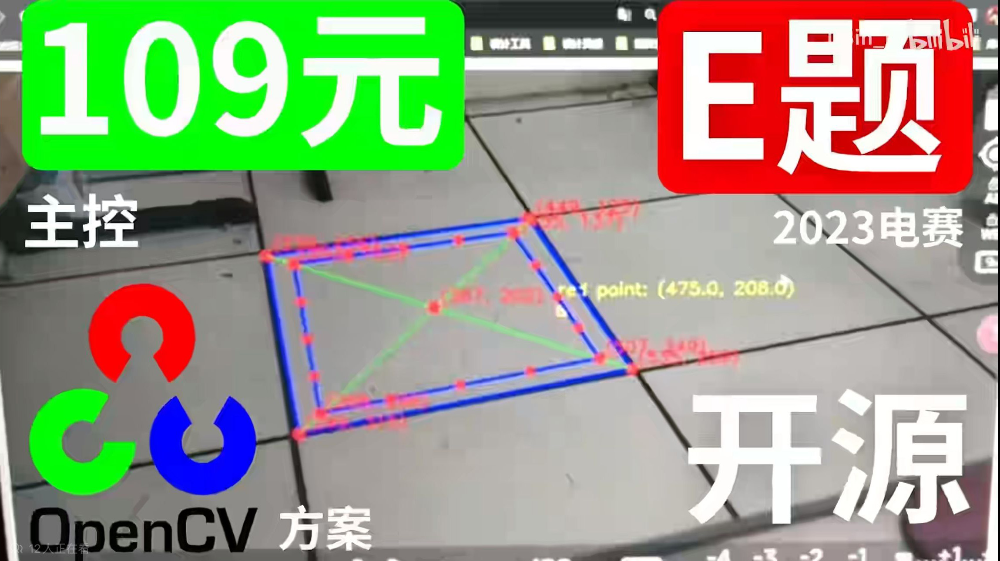
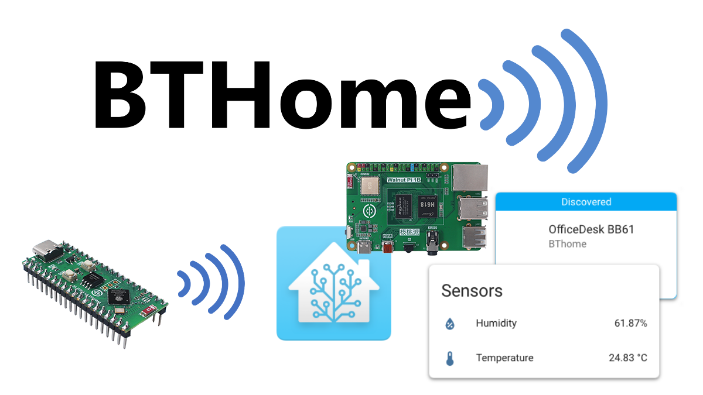
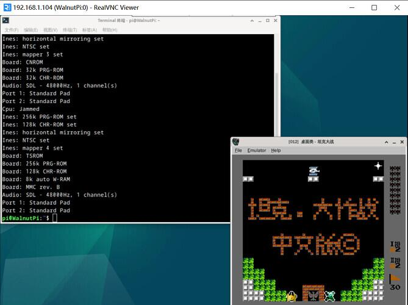
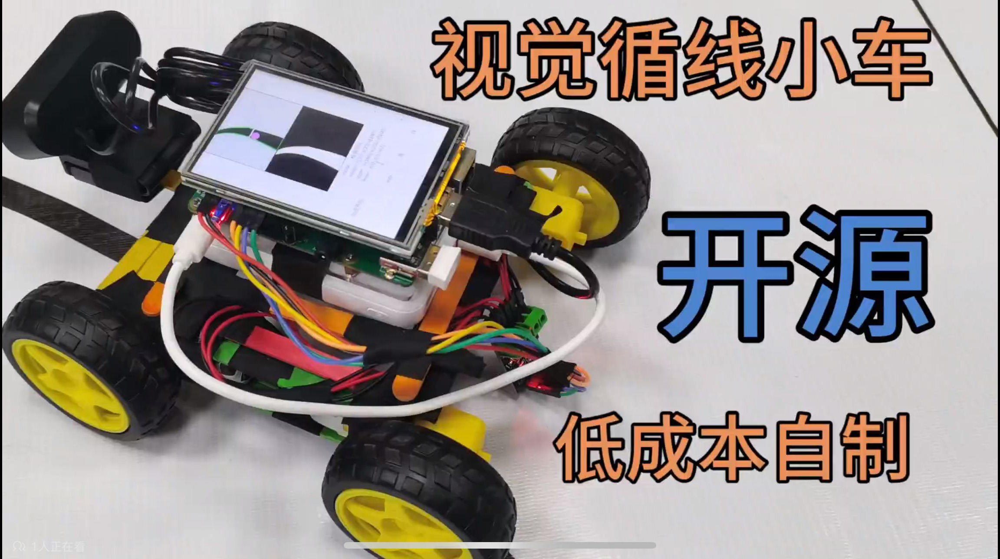
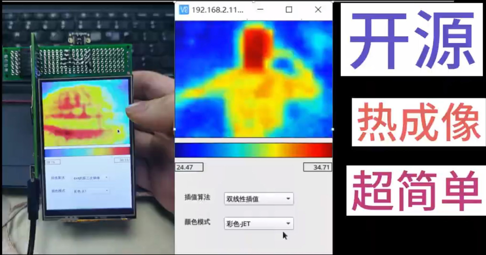
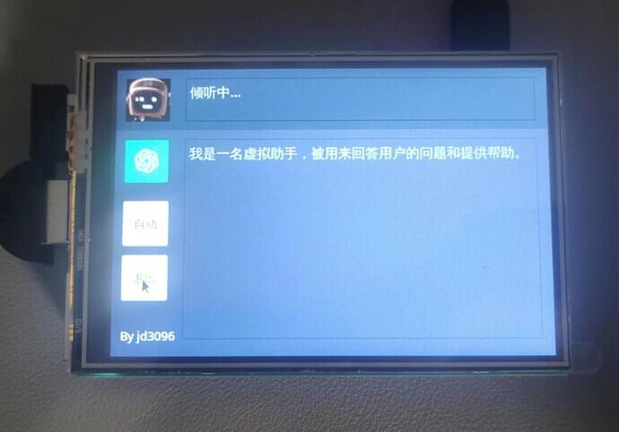
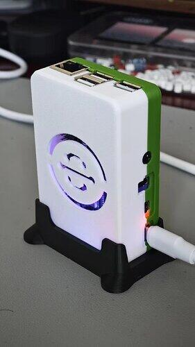

# Community Open Source Projects

Thanks to the following users for contributing projects to the WalnutPi open-source ecosystem. If you also have WalnutPi-related open-source projects, you can contact us via QQ group or email (walnutpi@qq.com). We will periodically gift WalnutPi-related products to project contributors.

## 2023 National Electronics Design Contest - Problem E (OpenCV)

- `User`: DBin_K

[The Cheapest Solution Ever? | 109 RMB Domestic Pi Main Controller OpenCV Solution - Open Source](https://www.bilibili.com/video/BV1RE421A7ba/?spm_id_from=333.337.search-card.all.click&vd_source=afb22e861cc5832170b148bd53698405)

## HomeAssistant BTHome Bluetooth Thermometer

- `User`: Dbl

[MicroPython Implementation of BTHome v2 Bluetooth Temperature & Humidity Sensor](https://forum.walnutpi.com/t/topic/234)

## NES Game Console

- `User`: Dbl

[[Nostalgia] 5 Steps to Make Your WalnutPi Play the Classic NES Games That Once Swept the World](https://forum.walnutpi.com/t/topic/74)

## Visual Line-Following Car

- `User`: IceBlue Maker

[[DIY] Build a Line-Following Car with Visual Recognition - Cheap and Easy](https://www.bilibili.com/video/BV1TK411i7Bb/?spm_id_from=333.999.0.0&vd_source=afb22e861cc5832170b148bd53698405)

## Thermal Imaging Camera

- `User`: IceBlue Maker

[[DIY] Make a Thermal Imager - The Sensor Is Just Around 100 RMB](https://www.bilibili.com/video/BV1tC41147bx/?spm_id_from=333.999.0.0&vd_source=afb22e861cc5832170b148bd53698405)

## External Network Penetration

- `User`: sc-bin

[[Software Recommendation] Zerotier - Access Your Home Intranet from Outside, Free and Fast Enough to Saturate Your Broadband](https://forum.walnutpi.com/t/topic/63)

## Deploy MQTT Server

- `User`: sc-bin

[[Software Installation] Installing MQTT Server (Mosquitto) on WalnutPi](https://forum.walnutpi.com/t/topic/40)

## pyQT5 GPT Voice Assistant

- `User`: jd3096

[WalnutPi pyQT5 GPT Voice Assistant Demo - With Video and Source Code](https://forum.walnutpi.com/t/topic/59)

## WalnutPi 1B Case

- `User`: jd3096

[I Made a Cool Case for WalnutPi 1B - Come Check It Out, With Model Files](https://forum.walnutpi.com/t/topic/167)

