# WalnutPi 1B Peripheral Assembly

- **Video Tutorial**

<iframe src="//player.bilibili.com/player.html?isOutside=true&aid=1903239911&bvid=BV11m411m7hS&cid=1506609737&p=1" scrolling="no" border="0" frameborder="no" framespacing="0" allowfullscreen="true" width="100%" height="500"></iframe>

  
  

After learning about WalnutPi's hardware in the previous section, we have a basic understanding of it. However, a single WalnutPi board cannot work on its own — it requires some essential peripherals, such as a power supply, keyboard, mouse, display, etc. In this section, we will introduce the WalnutPi 1B peripheral assembly in detail (**if you are using WalnutPi ZeroW, please refer to the next section**).

## Acrylic Base Plate

The acrylic base plate prevents the bottom of the PCB from short-circuiting with other metal objects, protects the desktop from scratches, and the space created underneath also improves heat dissipation.

Installing the WalnutPi acrylic base plate is very simple: peel off the acrylic protective film, insert copper standoffs in the middle, and tighten both top and bottom with M2.5 screws.

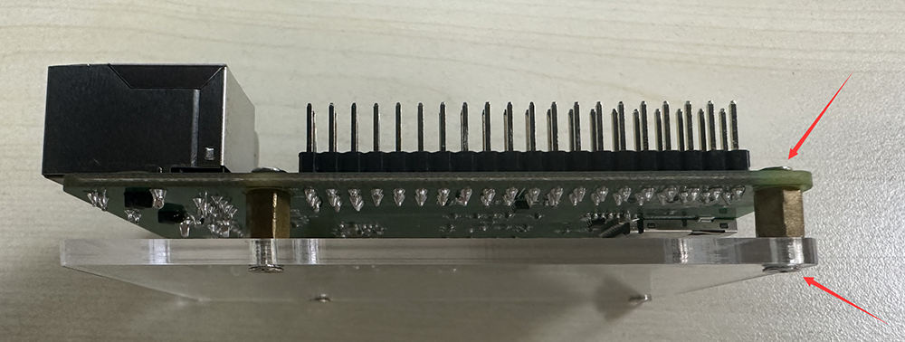

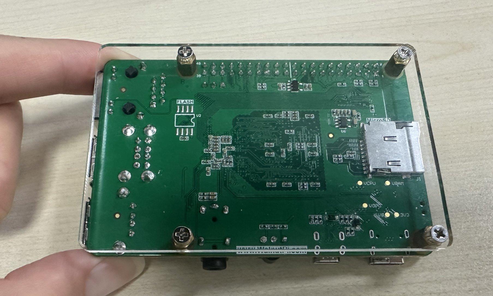

## Heat Sink

The heat sink helps cool the WalnutPi CPU, ensuring stable operation especially in high-temperature environments. Installation is also simple: peel off the thermal pad and stick it onto the SoC and RAM. Since the heat sink is conductive, be careful not to let it touch other components on the circuit board (capacitors, resistors) during installation to avoid short circuits.

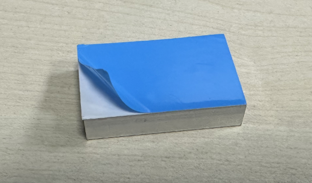

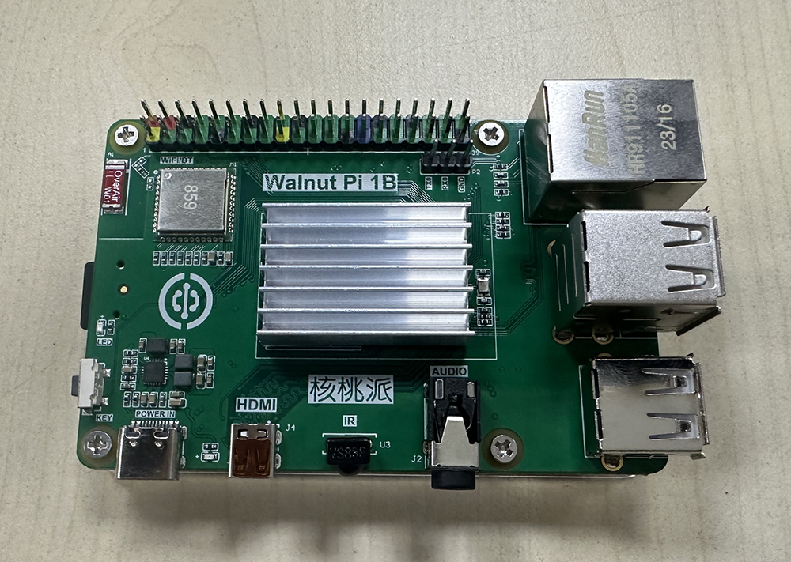

## MicroSD Card

The MicroSD card needs to have the operating system copied onto it in advance. This will be covered in detail in the next section on system and software. Here we only introduce the installation method. A MicroSD card of 16GB or larger is recommended.

Gently insert the MicroSD card as shown below. The self-locking latch will automatically secure the SD card.

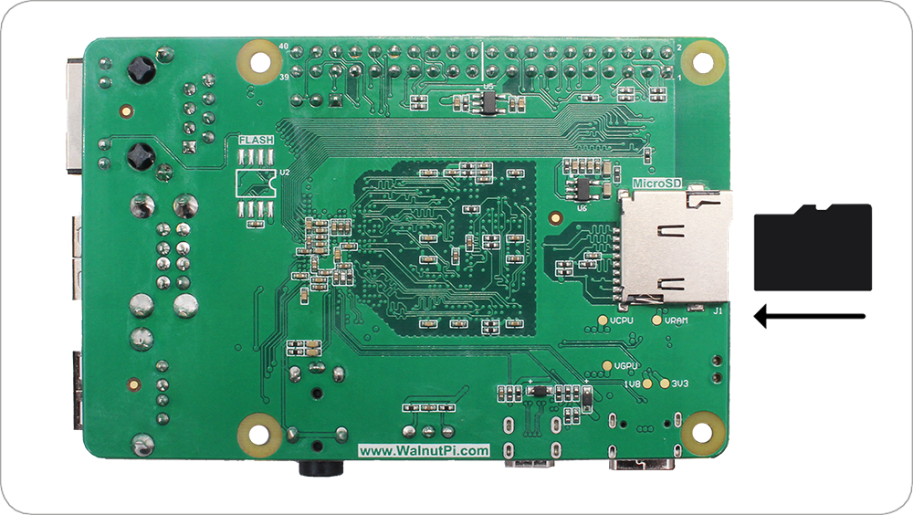

If you need to remove the SD card, simply press it inward and it will automatically eject.
:::danger Caution

Do not insert or remove the SD card while the device is powered on.

:::

## Keyboard and Mouse

WalnutPi supports both wired and wireless keyboards and mice.

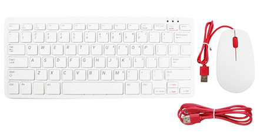

**Wired Keyboard & Mouse**

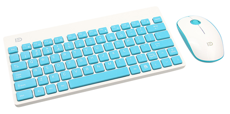

**Wireless Keyboard & Mouse**

Connect the keyboard and mouse to the USB port. The installation method for wired and wireless USB keyboards and mice is the same. Under normal circumstances, plugging and unplugging USB devices should not require much force — if it feels difficult, the connector may be upside down. Check that the USB orientation is correct.

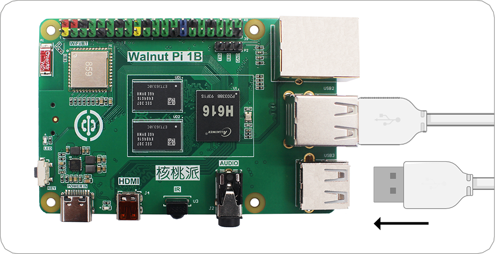

## Display

Most computer monitors or TVs come with an HDMI port.

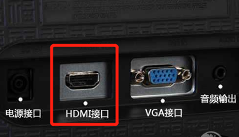

Using a micro-HDMI to HDMI cable, you can directly output WalnutPi's video signal to a display.

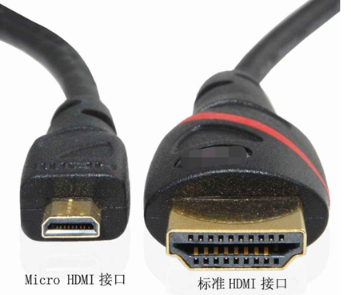

Connect the smaller end of the micro-HDMI cable to WalnutPi (the port near the Type-C power port), and the other end to the display. If your display has multiple input ports, you may need to switch input sources — this depends on your specific display.

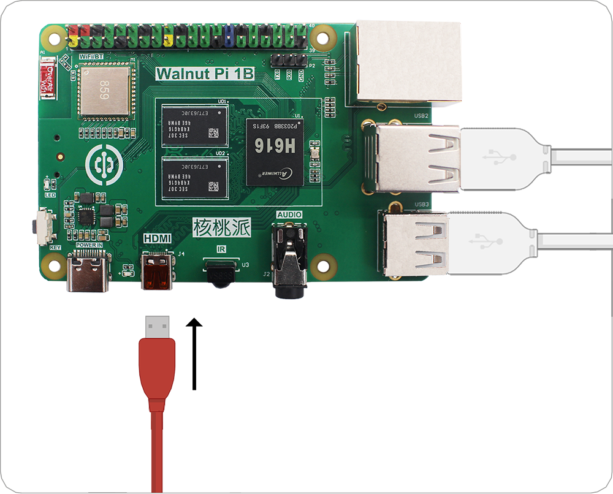

## Ethernet Cable (Optional)

To connect WalnutPi to a network, you can use either Ethernet or WiFi wireless. WiFi is commonly used, and WalnutPi's WiFi supports 5G connections. Here we mainly explain how to connect the Ethernet cable. Insert it into the Ethernet port with the plastic clip facing down until you hear a click. The other end of the cable is typically connected in the same way to any available port on a router, network hub, or switch. If you need to remove the cable, simply squeeze the plastic clip inward toward the plug and gently slide the cable out.

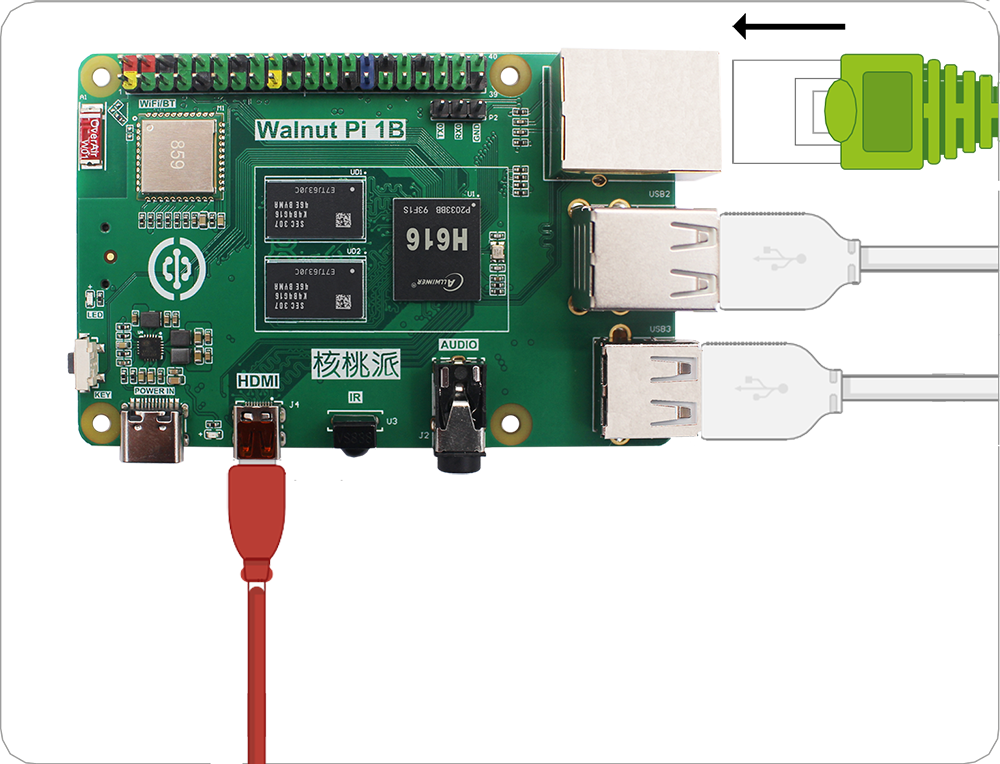

## Audio (Optional)

WalnutPi has a standard 3.5mm audio output jack. You can connect headphones or speaker devices for audio playback.

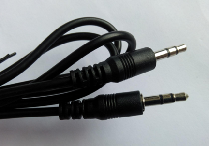

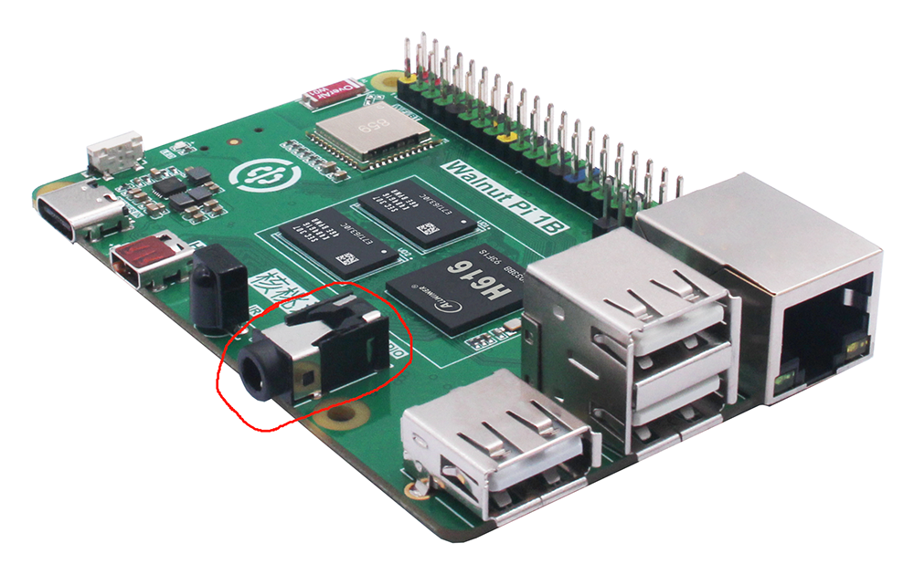

## Power Connection

The power requirement for WalnutPi is: a Type-C power supply of 5V 3A or above.

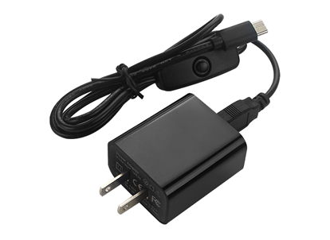

Connecting power is usually the final step — once powered on, it means we are ready to start using it. Connect the Type-C end of the power supply to WalnutPi. If the cable has a switch, remember to turn the switch on.

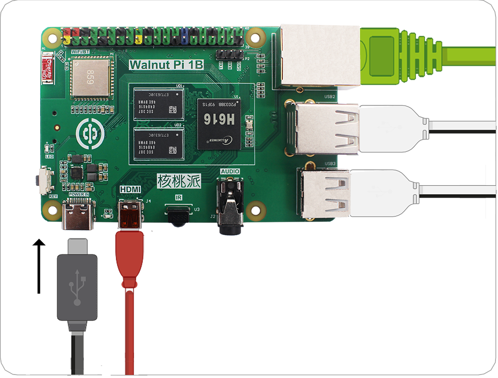

At this point, the WalnutPi hardware peripheral assembly is complete.
