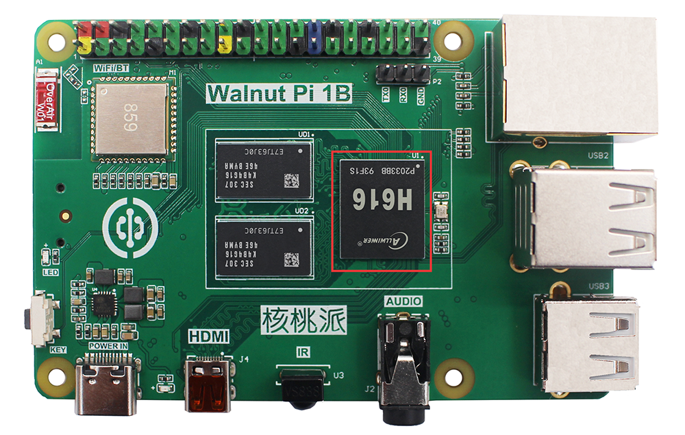
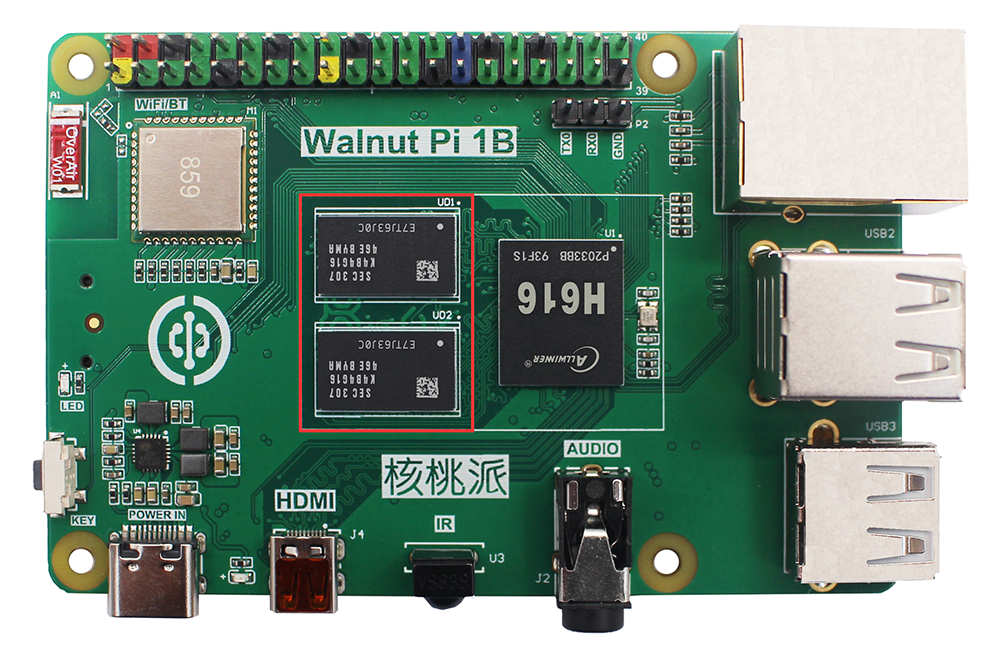
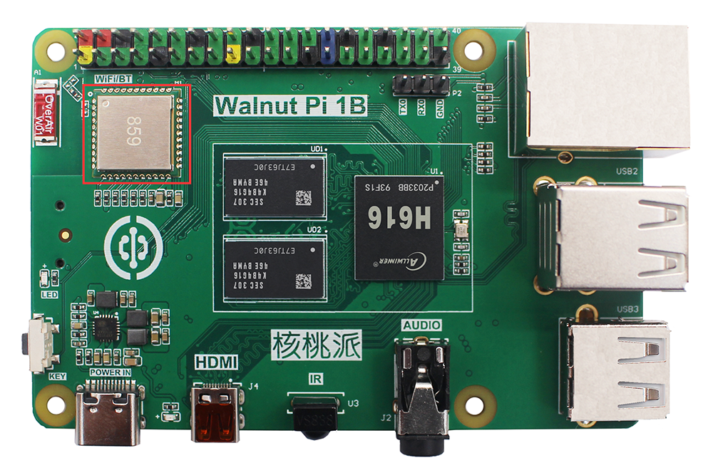
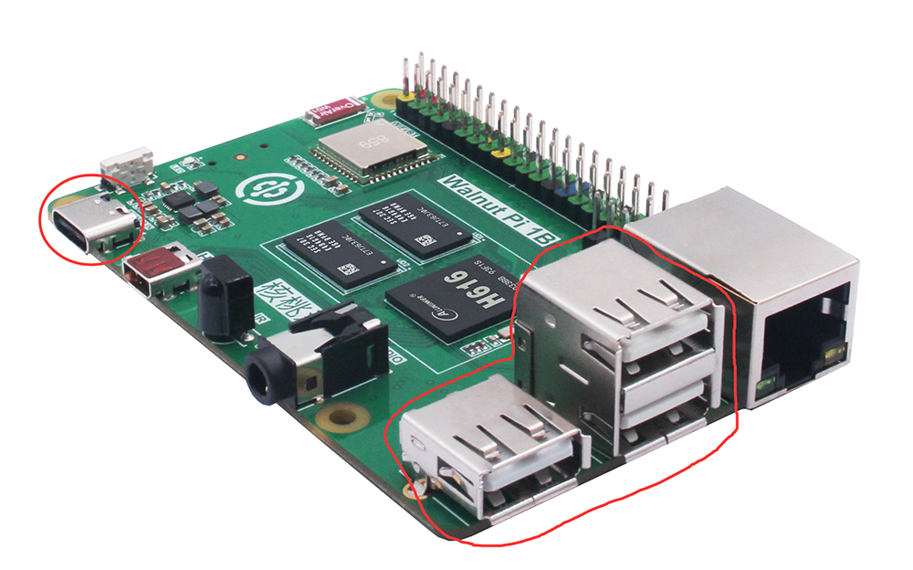
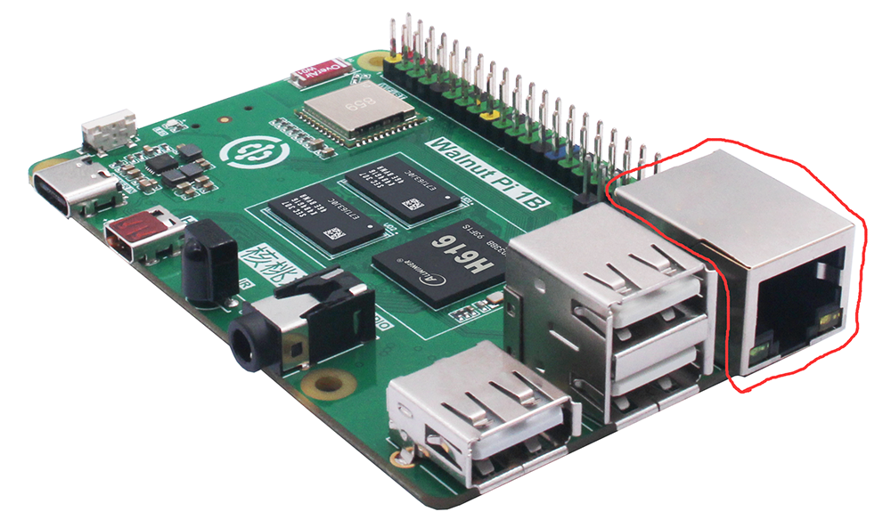
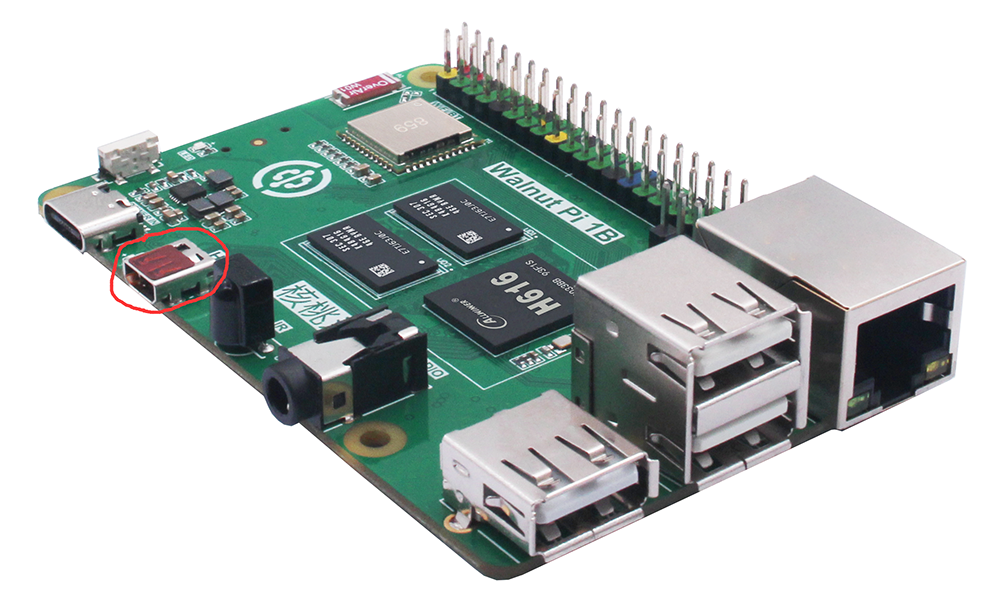
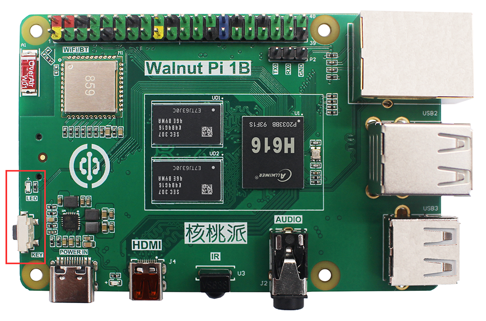
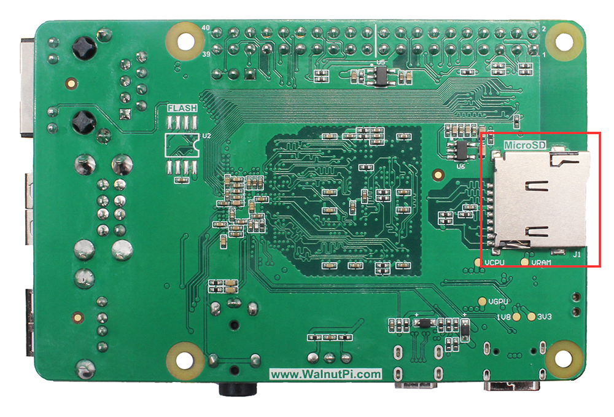
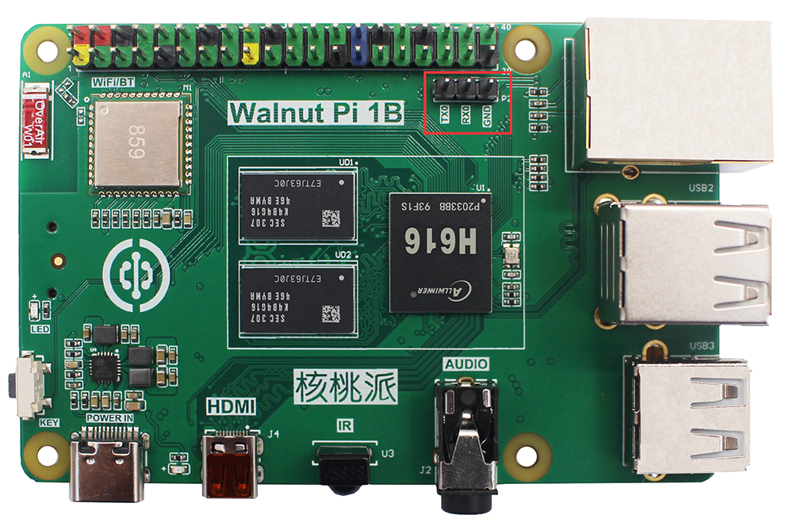
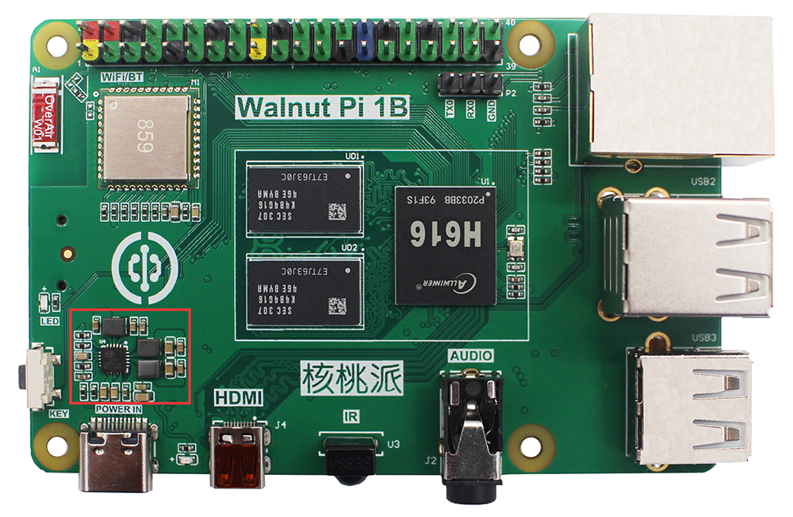

# Hardware Details

A detailed explanation of each hardware component of WalnutPi 1B. ZeroW, CM1, and BOX have similar functions.

## CPU

Like an ordinary computer, WalnutPi hardware consists of many components, each playing an important role in its overall operation. Let's start with the CPU. WalnutPi 1B uses an Allwinner H616/H618 quad-core high-performance Cortex-A53 processor with a clock speed of up to 1.5GHz.

**The Allwinner H616 and H618 are fully hardware and Linux driver compatible, with essentially no difference in benchmark performance.**

## RAM (Memory)

Next to the CPU are 2 black rectangular chips (shown below). This is WalnutPi's Random Access Memory (RAM), commonly referred to as memory.

When you use WalnutPi, RAM keeps your work running, and files are only saved to the microSD card when you explicitly save them. These components together form WalnutPi's volatile and non-volatile memory: RAM loses data when powered off, while the microSD card retains data when powered off.

**WalnutPi 1B currently offers a 1GB RAM version (composed of 2 x 512MB DDR3), while the 2G/4G versions use a single LPDDR4 chip. Since the H616/H618 memory access speed is approximately 1000Mbps, which does not reach the peak speed of either type, performance is the same.**

## WiFi and Bluetooth

In the upper left corner of WalnutPi, you will find a metal shield. This is the wireless module, which actually consists of two parts: WiFi and Bluetooth. WiFi is used to connect to wireless networks; Bluetooth can be used to connect to peripherals such as Bluetooth keyboards and mice, and can also send data to nearby sensors or devices like smartphones.

WalnutPi 1B's wireless module supports dual-band WiFi (2.4G and 5G) and Bluetooth 5.0.

## USB

WalnutPi has 4 standard USB 2.0 ports. Three of them are exposed as USB-A female connectors (as shown below), and one is on the Type-C power port (which can be expanded via a Type-C hub). These can connect to various USB peripherals, including keyboards, mice, USB cameras, USB drives, etc.

## Ethernet

WalnutPi has an onboard 100Mbps Ethernet port. You can connect WalnutPi to a wired computer network (router LAN port) using an Ethernet cable. If you look closely at the Ethernet port, you'll see two Light Emitting Diodes (LEDs) at the bottom. These are status LEDs that let you know the network connection is working. Typically, a solid green light indicates a successful connection, and a flashing amber light indicates data transmission.

## Audio Interface

WalnutPi has a standard 3.5mm audio jack, which is the common headphone jack. It can be used to connect headphones or speakers for more powerful sound.

## HDMI

WalnutPi has a High-Definition Multimedia Interface (HDMI 2.0) port, supporting 4K@60fps. The onboard micro-HDMI port typically requires a micro-HDMI to standard HDMI cable to connect to a display.

## IR Receiver

WalnutPi has one onboard infrared receiver.

## Buttons and LED

WalnutPi has one onboard programmable button and one LED.

## MicroSD Card Slot

The microSD card connector is on the back of WalnutPi. This is WalnutPi's storage: the microSD card inserted here contains all of WalnutPi's saved files, all installed software, and the running operating system.

## GPIO

On the top side of WalnutPi, there are 40-pin metal headers arranged in two rows of 20 pins each. This is the GPIO (General Purpose Input/Output) header. These pins are used to connect and communicate with other hardware, from LEDs and buttons to sensors, joysticks, and pulse rate monitors — essentially what we commonly refer to as microcontroller I/O pins.

WalnutPi uses color-coded 40-pin headers for easy wiring and to prevent misconnection and short circuits.

## Debug Serial Port

WalnutPi exposes a debug serial port. You can connect via a USB-to-TTL serial tool and use tools like PuTTY to view debug information or log into the system console.

## Power Management

Above the Type-C female connector on WalnutPi, you can see a small chip. This is the Power Management Chip (PMC), which converts the power input from the Type-C port into the power WalnutPi needs to operate. WalnutPi 1B requires a power input of 5V and a current of 3A or above.

