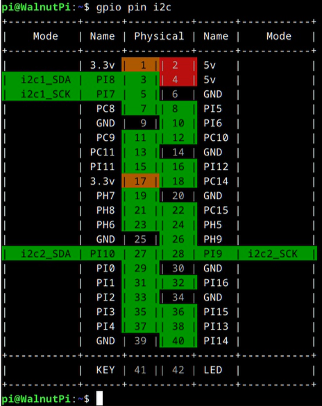
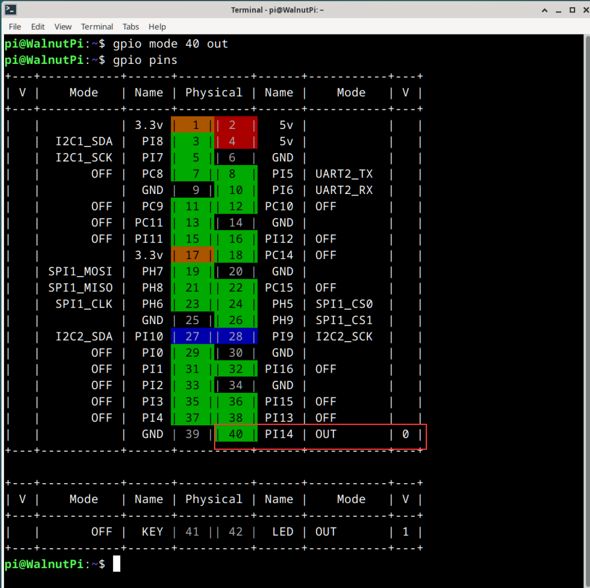
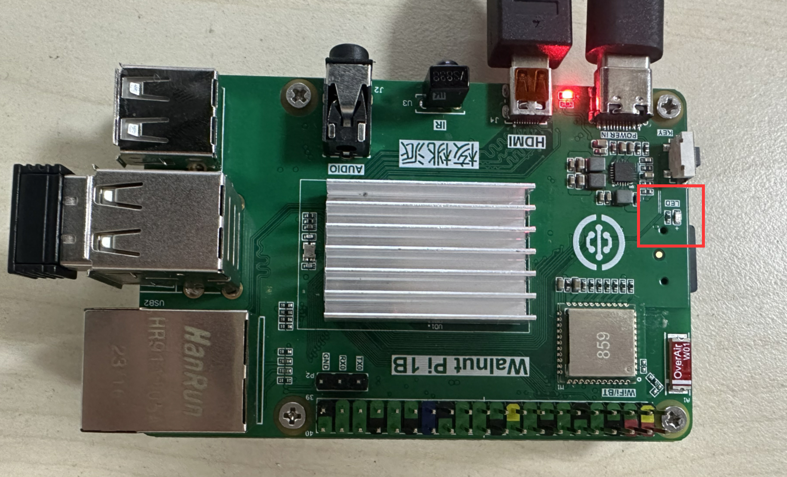
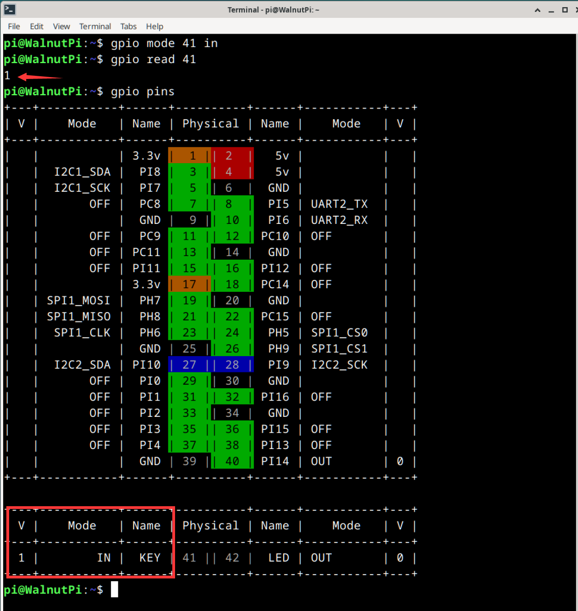
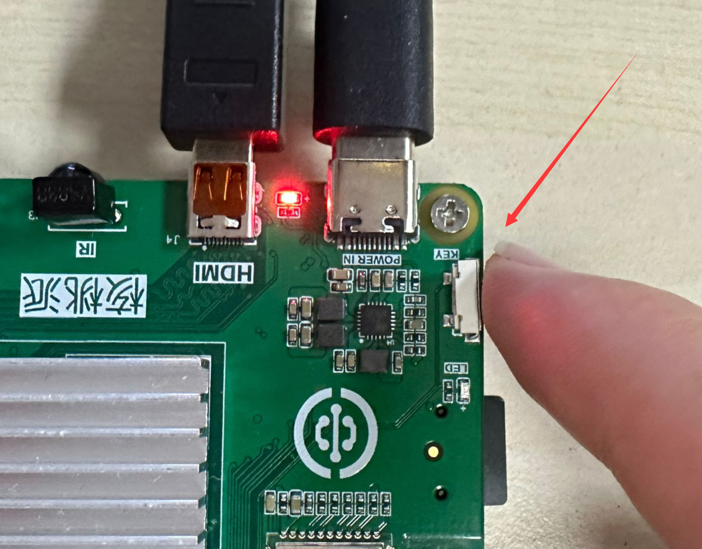
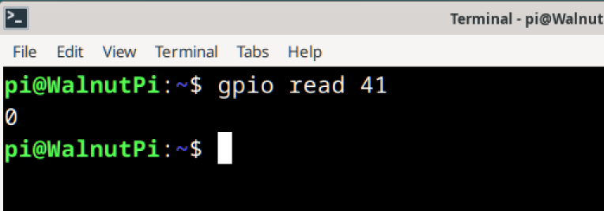

# GPIO Command-Line Operations

We provide a set of commands for quickly operating GPIO from the command line. This section mainly introduces how to use these commands.

To control GPIO using Python programming, please refer to this section: [**Python Embedded Programming - Lighting the First LED**](../python/gpio/led.md)

To control GPIO using C programming, please refer to this section: [**C Embedded Programming - Controlling GPIO**](../c/io_gpioc.md)

::::danger[Version Compatibility Notice]
Starting from WalnutPi system **v2.3**, WiringPi-based pin numbering has been deprecated in favor of using header pin numbers to reference pins.
::::


## View All Pin Statuses

Use the following command to see all pin definitions on the WalnutPi:

```bash
gpio readall
```
or
```bash
gpio pins
```


The columns in the table above are defined as follows:
- `Physical` : The header pin number on the board, used for all subsequent command operations
- `Name` : Pin name, which can be used when programming in Python
- `mode`: The current operating mode of the pin:
    - `OFF`: Initial state, not configured
    - `IN`: Input mode
    - `OUT`: Output mode
    - `Other`: Alternate function
- `V` : When the pin is in IN/OUT mode, the logic level of the pin. 1 is HIGH, 0 is LOW


## Locate I2C/UART/SPI Pins

This is a WalnutPi-specific feature for user convenience.

```bash
gpio pin [function]
```
This outputs a table showing the positions of pins with the specified function.
- `[function]`: Function type, choose from the following options:
    - `pwm`
    - `uart`
    - `spi`
    - `i2c`

For example, to find out which pins are I2C pins, enter the following command:

```bash
gpio pin i2c
```


## Set Pin Mode
```bash
gpio mode [PIN] [mode]
```
- `[PIN]`: The target pin's header number
- `[mode]`: Choose from the following:
    - `IN` : Input mode, floating
    - `IN_PULLUP` : Input mode, with internal pull-up enabled
    - `IN_PULLDOWN` : Input mode, with internal pull-down enabled
    - `OUT` : Output mode
    - `OFF` : Return to the initial unused state

For example, to set pin 40 to output mode, use the following command:
```bash
gpio mode 40 out
```
After configuration, use the **gpio pins** command to verify the pin status. You will see that pin PC8's mode has been changed to OUT.



## Control Pin Output Level

```bash
gpio write [PIN] [status]
```

- `[PIN]` is the wPi number of the pin you want to control.
- `[status]` : Pin output state.
    - `0` : LOW (0V)
    - `1` : HIGH (3.3V)


We can test this using the onboard blue LED. Since the LED is on by default after booting, let's turn it off with a command.

From the earlier table, we can see that the LED's pin number is **42**. First, set the LED pin mode to output:
```bash
gpio mode 42 out
```

Then set the output state to 0 (LOW, 0V):

```bash
gpio write 42 0
```


You can see that the blue LED on the WalnutPi has turned off.




## Read Pin Input Level

```bash
gpio read [PIN]
```

- `[PIN]` : The number of the pin to read.

We can test this using the onboard button, reading its input level. When the WalnutPi's onboard button is not pressed, it reads 1 (HIGH, 3.3V); when pressed, it reads 0 (LOW, 0V).

From the earlier table, we can see that the KEY button's wPi number is **41**. Since the board already has a pull-up resistor, we only need to set the KEY pin mode to input:
```bash
gpio mode 41 in
```

First, read the current voltage state of the button:

```bash
gpio read 41
```

You can see that the KEY pin's state is IN (input). Because of the pull-up resistor, when the button is not pressed, the pin's input level is 1 (HIGH, 3.3V).



Next, **press and hold the button**:



Then execute the read level command again. Because the switch is connected to ground, it pulls the pin level low, so you will see the input level change to 0 (LOW, 0V).
```bash
gpio read 41
```



## Toggle Pin Output Level

This function toggles the output level of a pin in output mode. For example, if the pin is currently outputting HIGH, executing this command will switch it to LOW, and executing it again will toggle it back to HIGH.

```bash
gpio toggle [PIN]
```
- `[PIN]` : The wPi number of the output pin.

For example, to toggle the onboard LED output state:
```bash
gpio toggle 42
```
