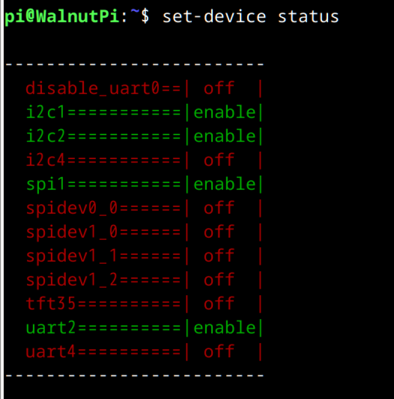
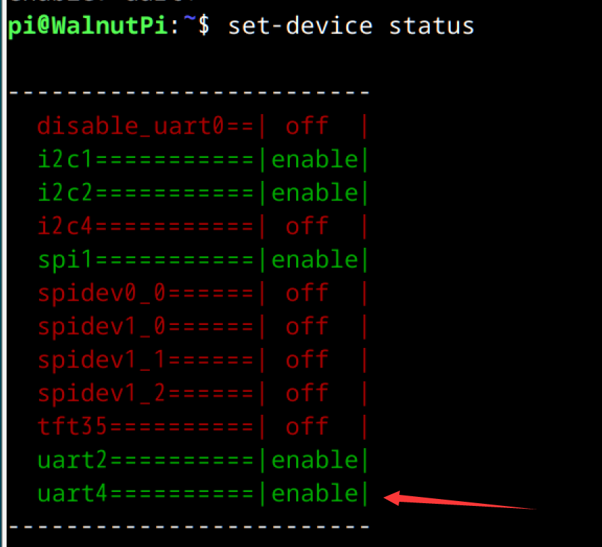

# Switching GPIO Functions

Some pins have **I2C, UART, SPI** and other functions. You need to use the `set-device` command to enable them before using Python or C for embedded programming.

The working principle of `set-device` is based on Linux's **device tree overlay** feature. We have written configuration files (.dtb) that contain information such as "configure pin XX as SPI and enable the corresponding driver." This command controls which configuration files (.dtb) the system loads at boot.

Note that some drivers are mutually exclusive. For example, enabling the 3.5-inch display occupies SPI1, so you cannot use the spidev1.0 driver at the same time. If you configure pins 38/40 of the WalnutPi 1B as UART4, those pins cannot use the hardware PWM function.

For example, the **PI13** pin can be configured as **pwm3** or **uart4_txd**, but if you set it to **uart4_txd**, the other function becomes unavailable.


## View GPIO Device Status

Use the following command to view the status of all GPIO devices:

```bash
set-device status
```
- Status **off**: the item is not active
- Status **enable**: the corresponding pins will be configured and the driver will be enabled.



## Enable a GPIO Device

Use the following command to enable a specific GPIO device:

```bash
sudo set-device enable xx
```

Example: enable **uart4**

```bash
sudo set-device enable uart4
```

After enabling, reboot the board for the changes to take effect:

```bash
sudo reboot
```

After running the above commands, use `set-device status` to see that the uart4 device has been enabled.



Running `gpio pins` will also show that the corresponding pins on the WalnutPi 1B have been switched to the appropriate operating mode.


## Disable a GPIO Device

Use the following command to disable a specific GPIO device:

```bash
sudo set-device disable xx
```

After disabling, reboot the board for the changes to take effect:

```bash
sudo reboot
```
