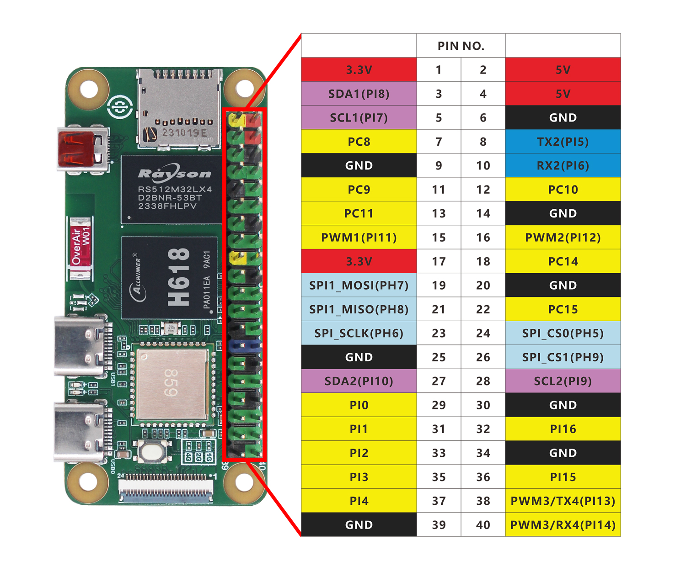

# GPIO Introduction

Let's take a detailed look at the WalnutPi's GPIO, which is the 40-pin GPIO header (similar to the Raspberry Pi). The WalnutPi is already a great single-board computer, but the GPIO design makes it easier for users to use the WalnutPi for various DIY electronics projects, giving you an experience comparable to a powerful microcontroller development board.

Below are the WalnutPi GPIO pinout diagrams:

- WalnutPi 1B

- WalnutPi ZeroW

From the tables and diagrams above, you can see that GPIO is similar to traditional microcontroller development. In addition to regular IO pins, there are also bus interfaces such as I2C, UART, SPI, as well as power output pins (3.3V and 5V). You can connect various sensors and modules, all of which will be covered in the later embedded programming chapters.

## Power Pins

The WalnutPi GPIO has two 5V and two 3.3V output pins, as well as eight GND pins, which can supply power to external devices.

## General-Purpose IO

All IO pins (except the power pins) can be configured as input/output pins. The IO voltage level is 3.3V.

## Other Functions

Some pins have additional functions, as listed below:

- PWM (Pulse Width Modulation)
    - PI11, PI12, PI13, PI14 provide hardware PWM functionality

- UART
    - TX2(PI5), RX2(PI6)
    - TX4(PI13), RX4(PI14)

- I2C
    - SDA1(PI8), SCL1(PI7)
    - SDA2(PI10), SCL2(PI9)

- SPI
    - SPI1: MOSI (PH7); MISO (PH8); SCLK (PH6); CS0 (PH5), CS1 (PH9)
