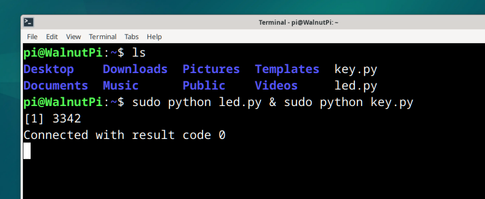
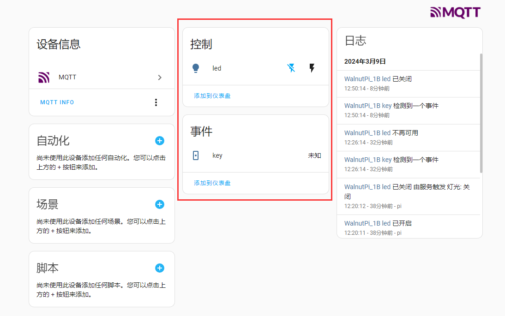
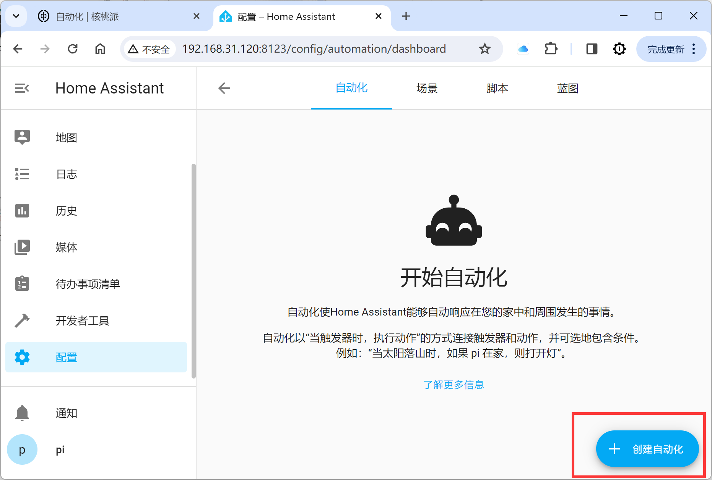
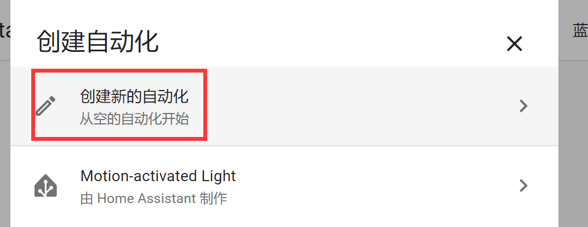
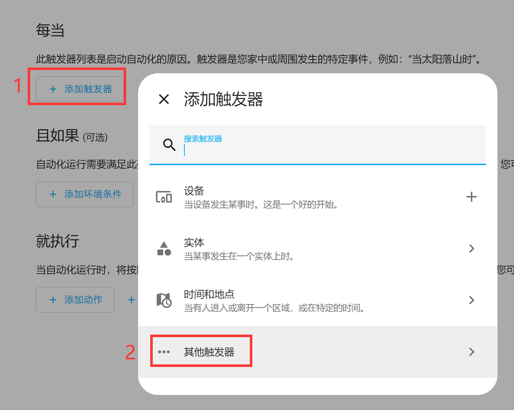
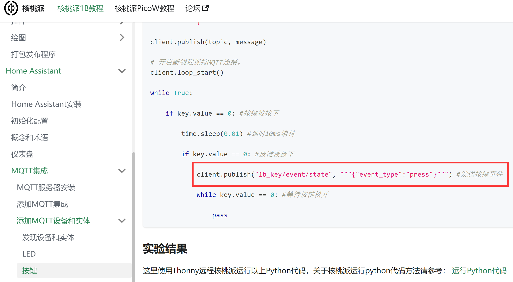
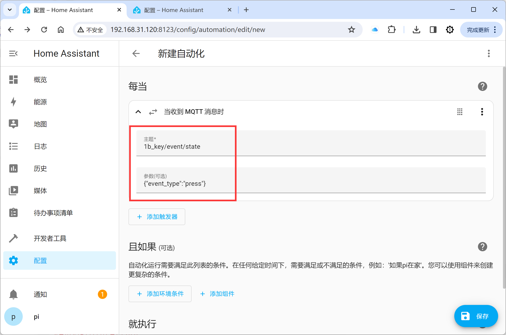
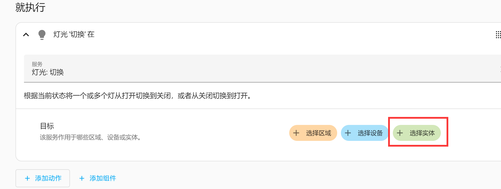
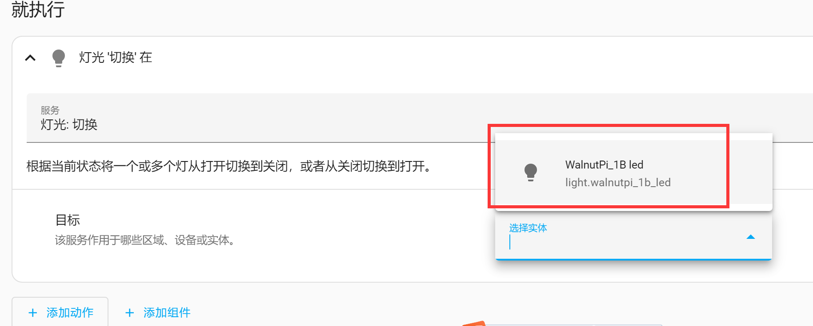
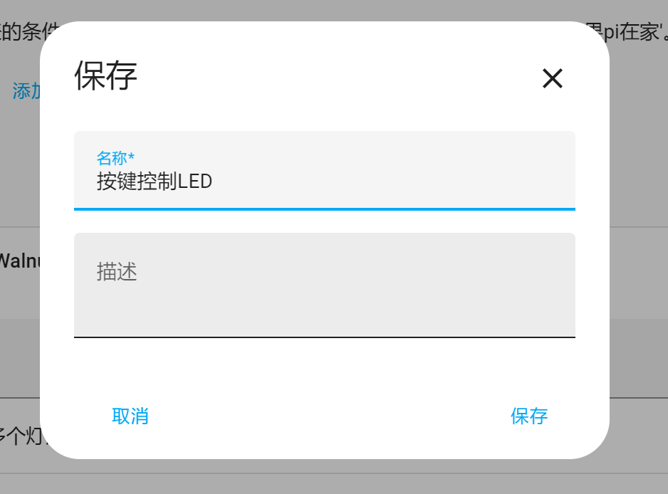

# Automation

In the previous sections, we added many devices and entities. The Automation feature in this section is used to create coordinated actions between these devices, entities, and events.

Automations consist of three key components:

1. Triggers - Events that start an automation. For example, when the sun sets or a motion sensor is activated.
2. Conditions - Optional tests that must be met for actions to run. For example, if someone is home.
3. Actions - Interactions with devices. For example, turning on a light.

## Button and LED

In the MQTT integration, we added LED and button entities, both controlled through the Home Assistant interface. Here, we will add an automation so that pressing the button on the WalnutPi 1B development board toggles the LED on and off, as a way to learn how to use Home Assistant automations.

For LED and button entity addition tutorials, refer to: [LED](../home_assistant/mqtt/device_entity/led.md) and [Button](../home_assistant/mqtt/device_entity/key.md) — not repeated here.

Copy the LED and button code from the above examples to the WalnutPi 1B development board. You can use the following command in the terminal to run both scripts simultaneously and register the entities with Home Assistant:

```bash
sudo python led.py & sudo python key.py
```



For more methods of running Python scripts, refer to the tutorial: [Running Python Code](../python/python_run.md)

After successfully running the code, open the Home Assistant MQTT device section — you can see the 2 newly added entities:



Next, let's set up the automation. Click **Configuration -- Automations & Scenes**:


<br></br>

Then click `Create Automation` in the lower-right corner:


<br></br>

Click **Create New Automation**:


<br></br>

Click **Add Trigger**, then select **Other Triggers**: (Because Home Assistant's device triggers do not support button devices, we can use MQTT messages to trigger.)


<br></br>

Search for "mqtt", then click **+** to add:


<br></br>

In the popup window, fill in the MQTT topic and message. From the [Button](../home_assistant/mqtt/device_entity/key.md) experiment, you can see the topic and message published when the WalnutPi 1B button is pressed:


<br></br>

MQTT Topic:
```
1b_key/event/state
```
MQTT Message:
```
{"event_type":"press"}
```

Fill in the above topic and message into the trigger:


<br></br>

In the **Then Do** section below, click `Add Action`, then select **Light**:


<br></br>

Select **Toggle**, which means each button press will toggle the LED state (on/off):


<br></br>

Then click `+ Choose Entity`:


<br></br>

The LED entity will be automatically recognized — click to select it:


<br></br>

Click `Save` in the lower-right corner:


<br></br>

In the popup window, enter a name for the newly created automation — the content is customizable:


<br></br>

Returning to the automations main page, you can see the newly created "automation":


<br></br>


Press the KEY button on the WalnutPi 1B. You will find that the LED's on/off state changes, implementing the light-switch automation:


<br></br>
