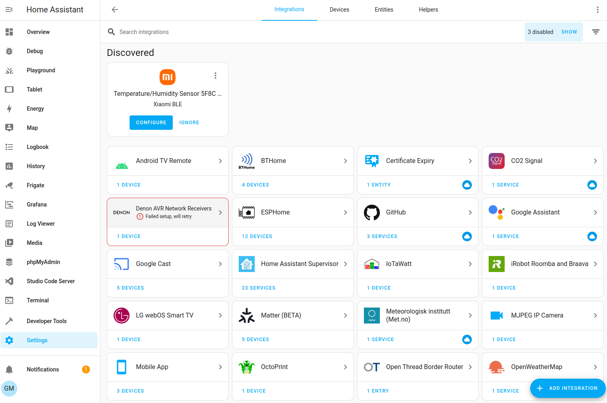
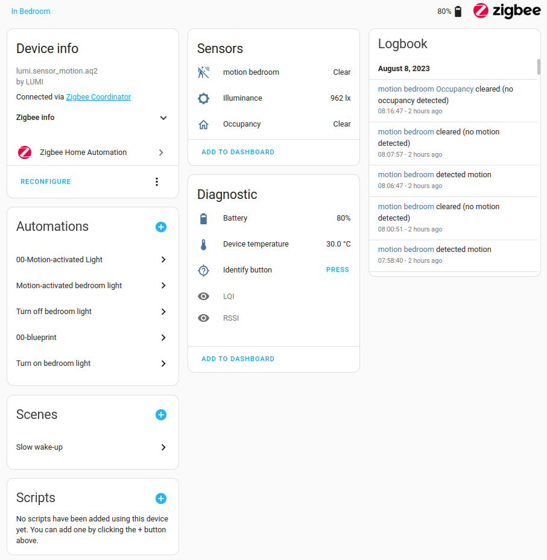
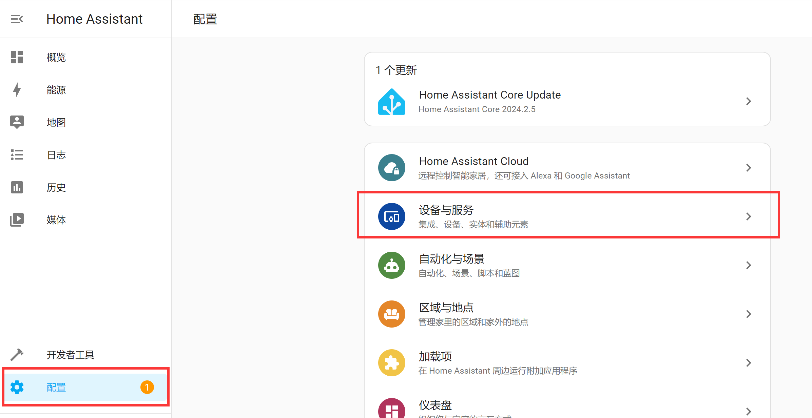
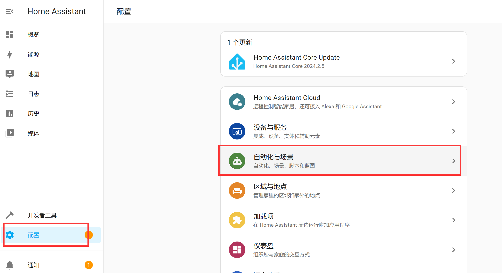
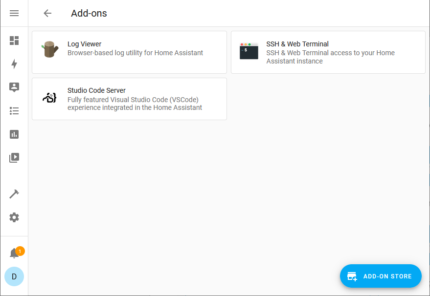

# Concepts and Terminology

Having completed the installation and configuration, we've successfully entered Home Assistant. Let's now look at some of the most important concepts in Home Assistant. Understanding these concepts will greatly help with subsequent use. For now, just get a general idea — detailed explanations will be provided in later tutorials during actual usage.

## Integrations

Integrations are software that allows Home Assistant to connect to other software and platforms. For example, a product named Philips Hue will use the Philips Hue integration, allowing Home Assistant to communicate with the hardware controller Hue Bridge. Any Home Assistant-compatible device connected to the Hue Bridge will appear as a device in Home Assistant.

Link to all integration introductions: https://www.home-assistant.io/integrations

## Entities

Entities are the basic building blocks that hold data in Home Assistant. An entity represents a sensor or functionality within Home Assistant. Entities are used to monitor physical properties or control other entities. An entity is typically part of a device or service.

## Devices

A device is a logical grouping of one or more entities. A device may represent a physical device that can have one or more sensors. Sensors appear as entities associated with the device. For example, a motion sensor is represented as a device. It can provide motion detection, temperature, and light level as entities. Entities have states such as detected when motion is detected and cleared when there is no motion.

::::tip Note
The relationship between Integrations, Devices, and Entities can be understood with the following example: Under the Xiaomi integration, there is a Xiaomi temperature/humidity sensor (1 device), and under the Xiaomi temperature/humidity sensor there are 2 entities — the temperature and humidity values respectively.
::::

**Integrations, Devices, and Entities are located under the Configuration option:**

## Automations

Automations enable device or event coordination and consist of three key components:

1. Triggers - Events that start an automation. For example, when the sun sets or a motion sensor is activated.
2. Conditions - Optional tests that must be met for actions to run. For example, if someone is home.
3. Actions - Interactions with devices. For example, turning on a light.

## Scenes

Scenes capture the state of entities so you can recreate the same scenario later. For example, a "Watch TV" scene would dim the living room lights, set them to warm white, and turn on the TV.

**Automations and Scenes are located under the Configuration option:**

## Add-ons

Add-ons are applications that can typically run alongside Home Assistant but provide a quick and easy way to install, configure, and run within Home Assistant. Add-ons provide additional functionality, while Integrations connect Home Assistant to other applications.

