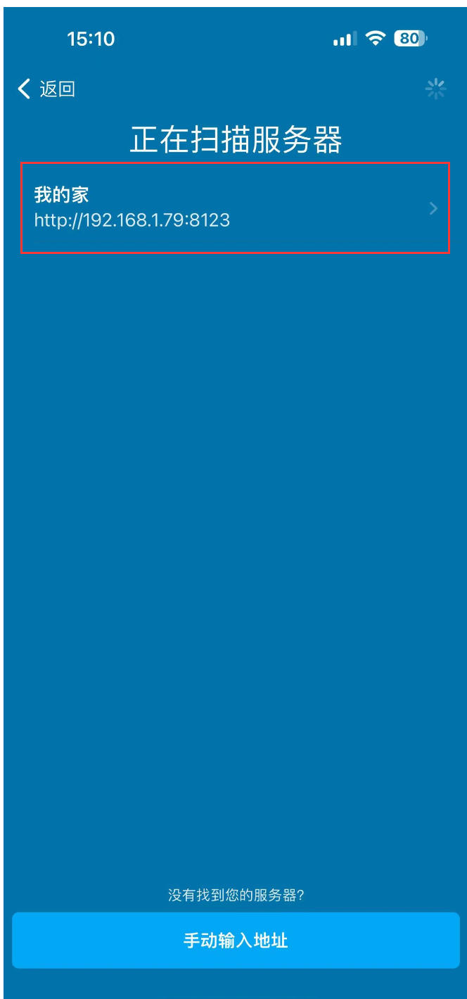
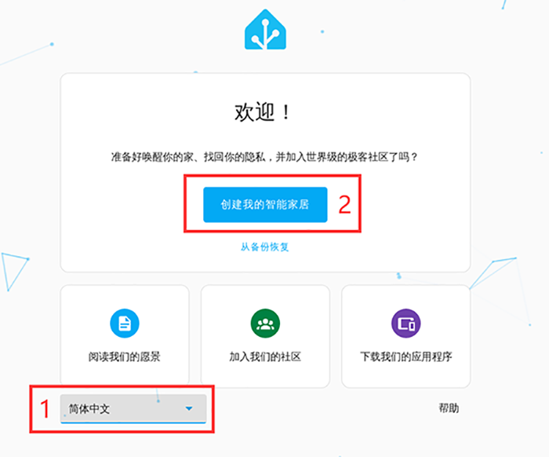
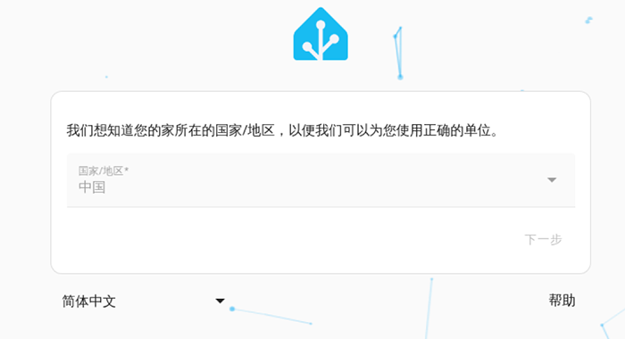
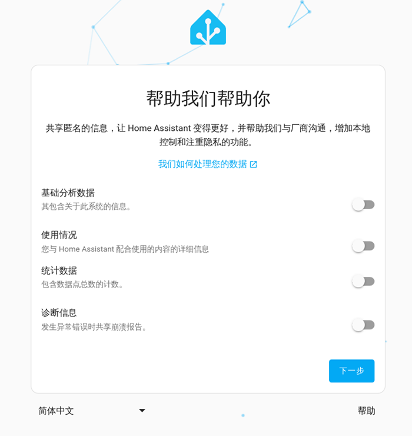
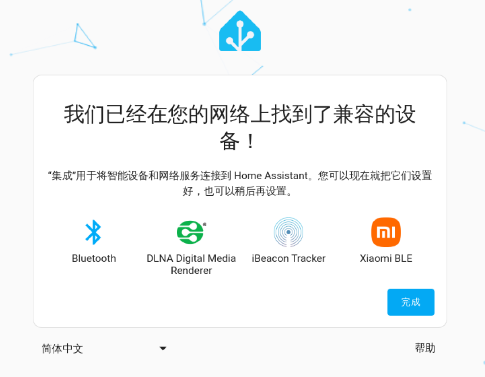
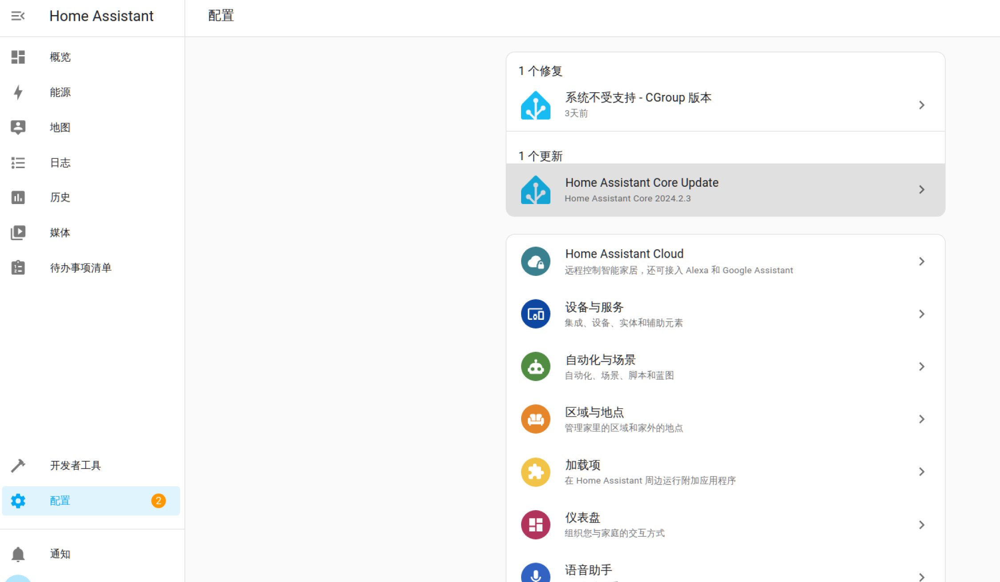
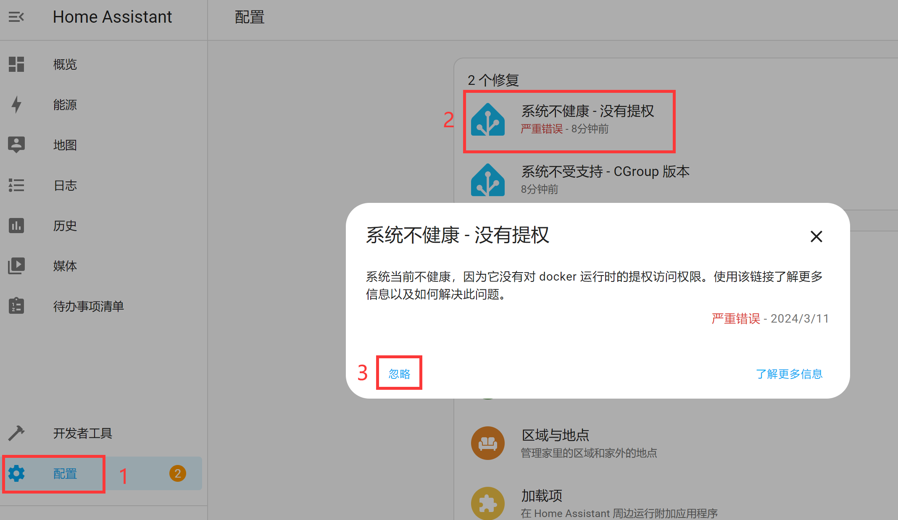
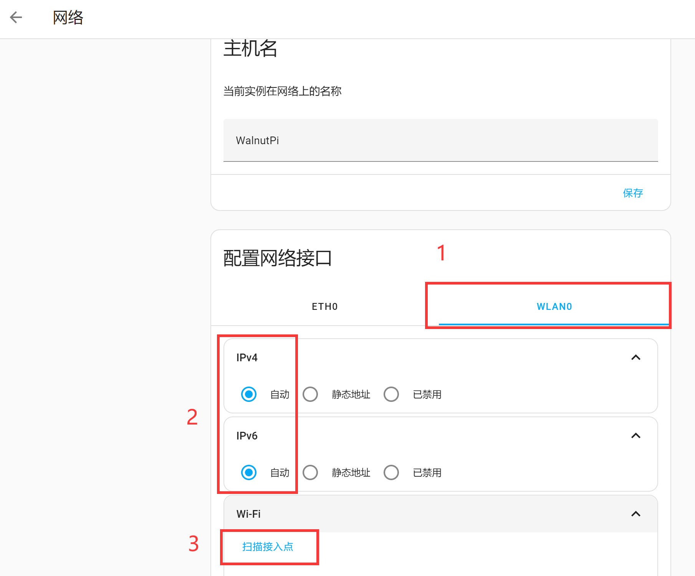

# Initial Configuration

## Connecting to the Network

After installation, first connect the WalnutPi to a 5V power supply, then connect to the router via Ethernet or WiFi.

### Via Ethernet

Connect one end of the Ethernet cable to the WalnutPi development board and the other end to the router.

### Via WiFi Connection

Refer to the WalnutPi WiFi connection tutorial: [**WiFi Connection**](../os_software/wifi.md)

## Mobile App Download (Optional)

Home Assistant provides an official app that functions the same as using a PC browser. Installation methods are as follows:

### iPhone

Search for "Home Assistant" in the App Store and install:

### Android Phone
Download the APK and install. The APK is located in the WalnutPi Home Assistant materials package — APP Application folder:

## Initial Setup

### Opening the Configuration Interface

It takes approximately 2-3 minutes for the Home Assistant host to boot and become operational. Once started and connected to the network, you can perform the initial Home Assistant configuration using a mobile phone or computer browser:

::::tip Note
After the WalnutPi starts, the blue LED blinks, indicating that it is waiting for Home Assistant to start. Once Home Assistant has finished starting, the LED will remain solid, indicating successful startup. At this point, you can proceed with the configuration steps below.
::::

- Open on Mobile

The benefit of using the app is that when your phone and Home Assistant are connected to the same router, it can automatically discover the Home Assistant host on the local network. Open the app and it will be discovered:

- Open in Browser

On a computer browser or the WalnutPi browser (Desktop Edition), enter: http://walnutpi.local:8123 to access the initialization interface.

(If this link does not work, use: http://XXXX:8123, where XXXX is your WalnutPi's current IP address, e.g.: http://192.168.1.100:8123) [**How to Get WalnutPi IP Address**](../os_software/ip_get.md)

::::tip Note
After configuration, it is recommended to log in using the IP address. http://walnutpi.local:8123 has been observed to occasionally fail to open.
::::

### Start Configuration

After entering, you will see the following welcome screen:

Select Simplified Chinese in the bottom-left corner, then click the **Create My Smart Home** button.

Enter your custom name, username, and password (please remember your account and password), then click Create Account:

Enter your geographic location. Users without internet access to global services may not see the map — just click Next to skip for now:

Select your region:

Choose whether to share usage data with the official team:

The system will indicate that some devices have been discovered — simply click Finish.

You will then enter the main interface. All configured users will see this main page upon login. The devices discovered earlier may appear on the main dashboard:

## Fix Prompts

The prompt to fix **Unhealthy System - Not Elevated** is due to the initial boot from the image — just click Ignore. Note that after ignoring, you need to restart the host, otherwise online updates and some plugin installations will not work.

::::tip Note

Restart Methods:

1. Execute `sudo reboot` via the WalnutPi terminal to restart.

2. Long-press the button for more than 6 seconds to shut down, then disconnect and reconnect power to restart.

**Directly cutting power to restart is not recommended, as some unsaved content may be lost.**
::::

The prompt to fix **Unsupported System - CGroup Version** — just click Ignore:

## System Update

When a Home Assistant update notification appears, you can click into it to update directly. Users without internet access to global services may experience longer update times (over 10 minutes) — please be patient and wait for the installation to complete.

## Network Management

Network management is used to manage the wired and wireless (WiFi) connections of the Home Assistant host.

Click `Configuration` -- `System`:

Click `Network`:

Here you can see the network status of wired Ethernet (ETH0) and wireless WiFi (WLAN0), including IP addresses, as well as features for scanning WiFi hotspots and connecting to them.

To connect to a WiFi hotspot, you need to enable both IPv4 and IPv6 on WLAN0, then scan, select the hotspot, enter the password, and connect. After a successful connection, you can see the IP information.

::::tip Note
After changing the network connection method, the IP address will change. Remember to update the login address for the Home Assistant host accordingly.
::::

## Safe Shutdown

Long-press the WalnutPi button for more than 6 seconds — the LED will blink a few times and then you can release it. The shutdown process will begin. Wait until the blue LED turns off, indicating that shutdown is complete.

::::danger Warning
Directly cutting power to shut down the WalnutPi is not recommended, as Home Assistant data may save incorrectly or be lost.
::::

