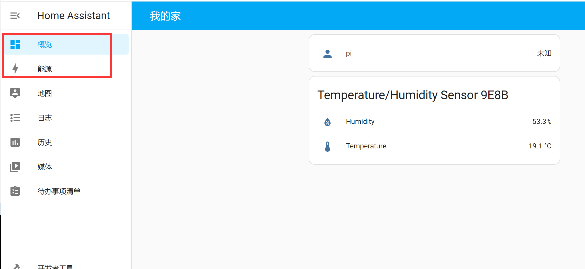
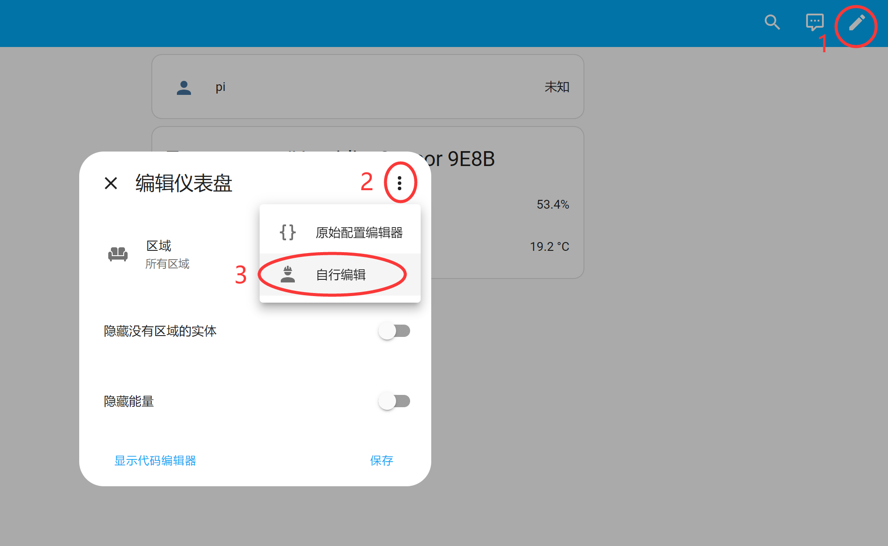
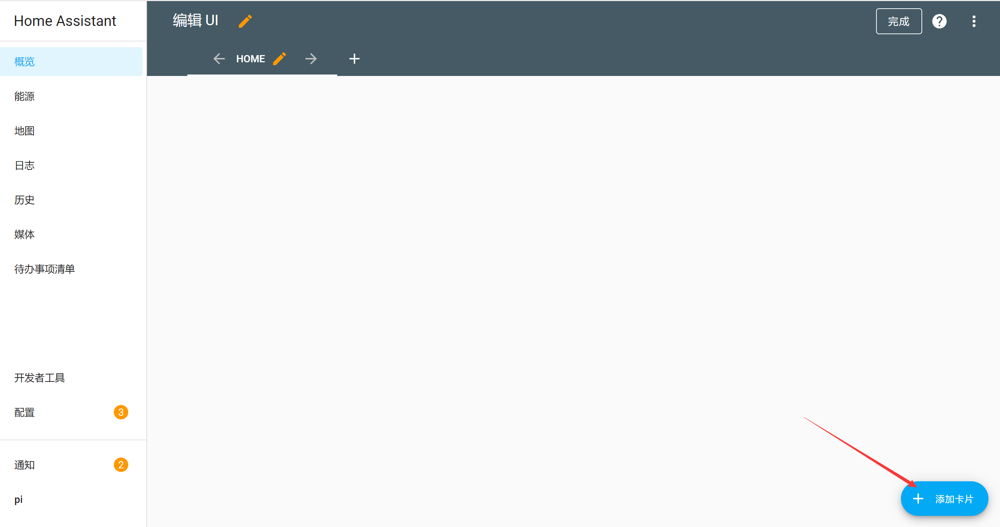
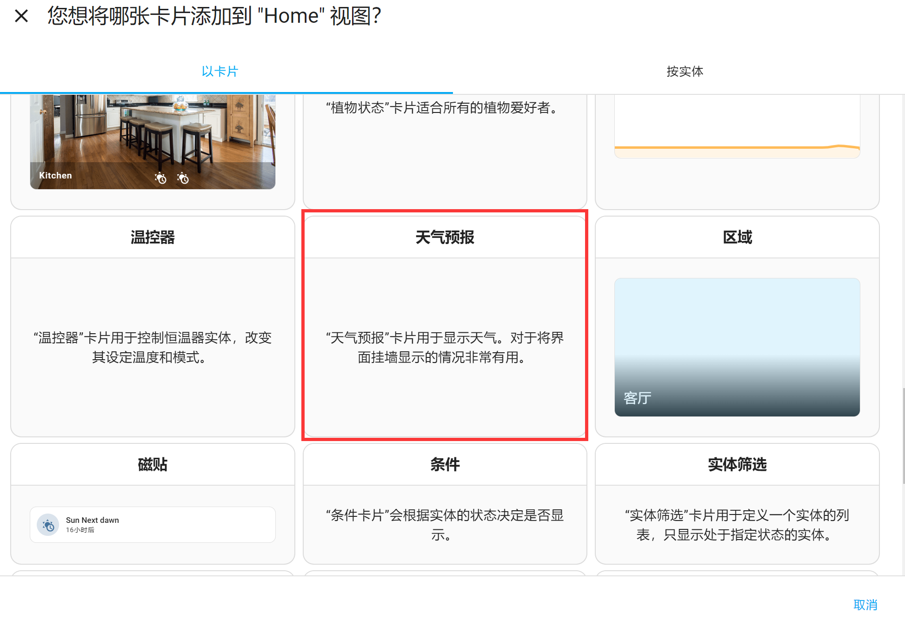
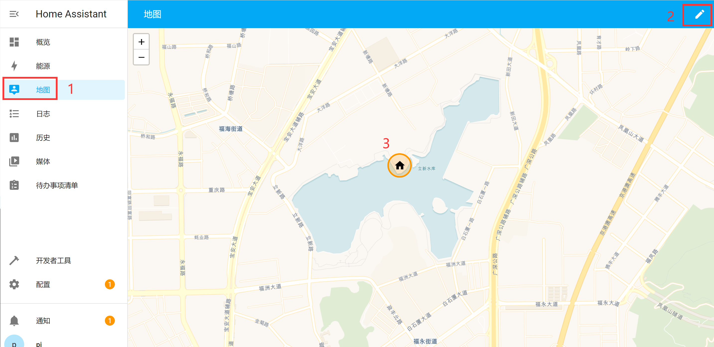
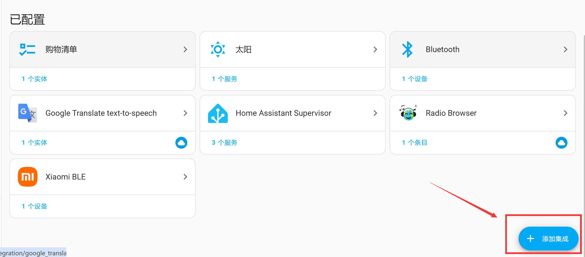
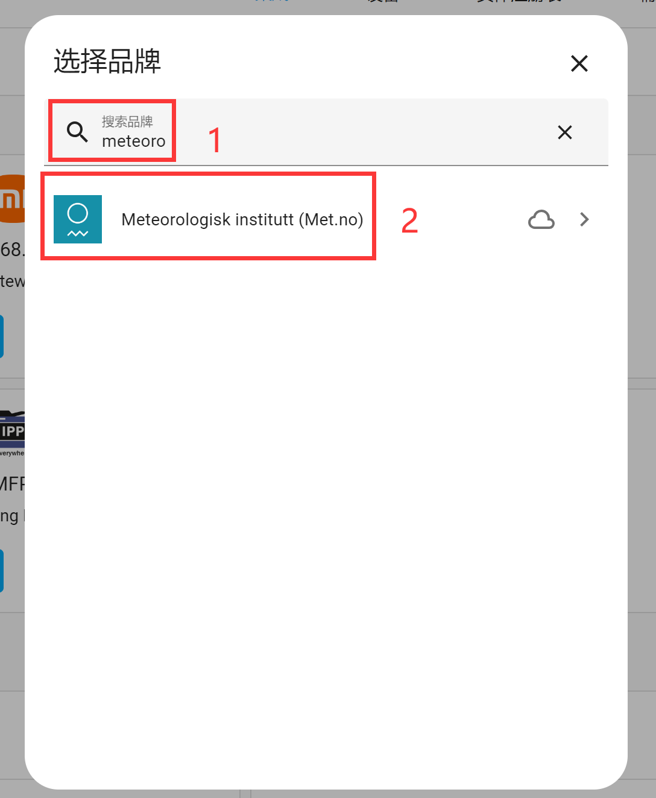
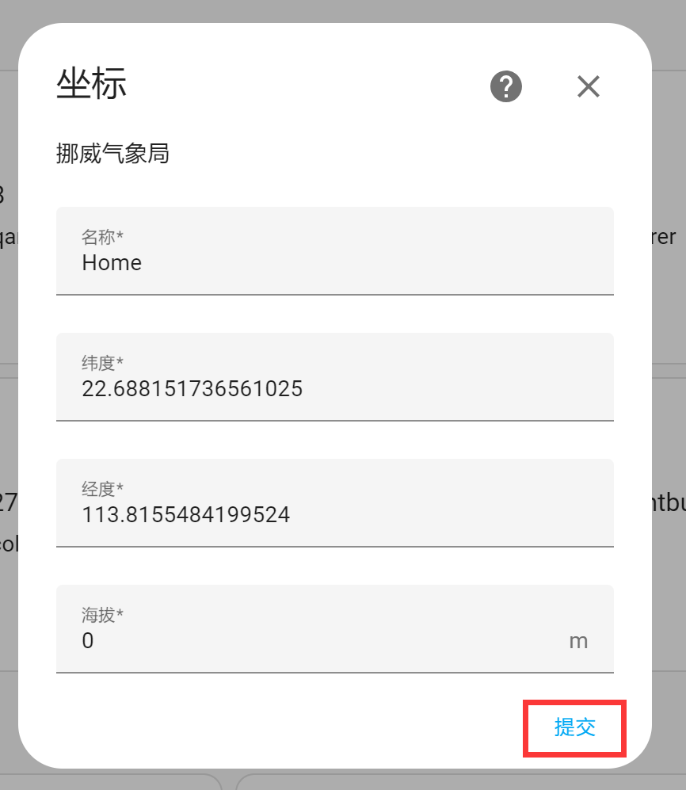
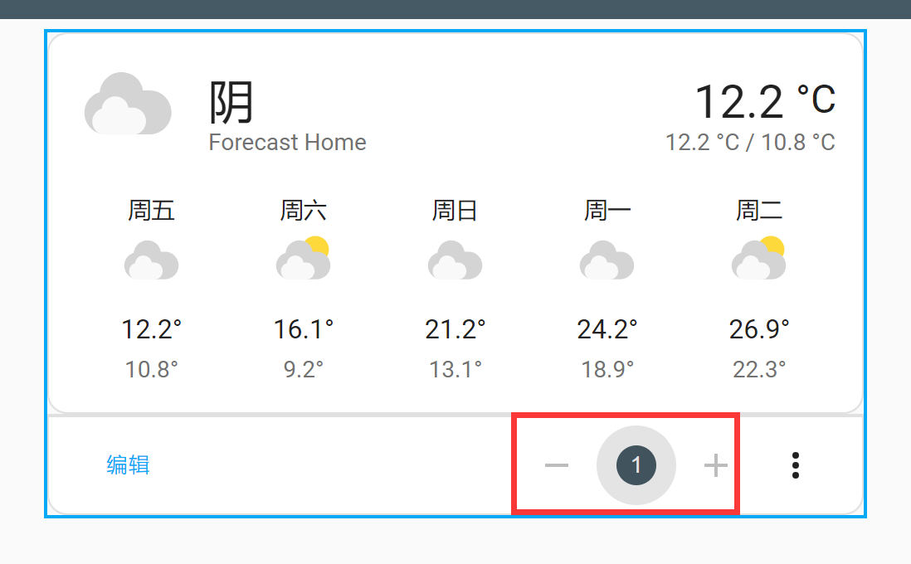

# Dashboard

The dashboard is the homepage you see after logging into Home Assistant. It is used to display various types of information, and users can customize the page. By default, there are **Overview** and **Energy** interfaces. The most commonly used is the **Overview** page. Upon first login, you will see that the page is almost empty.

Let's next explain how to add a new card to the dashboard. Click the **pencil** button in the upper-right corner. In the dialog that appears, click the button in the upper-right corner and select **Edit Dashboard**:

A new window will pop up. If you want to start editing from an empty dashboard, simply check the option in the lower-left corner (don't worry about losing devices — they can all be added back later), then click **Edit Dashboard**:

The following interface will then appear. From now on, clicking the **pencil** button in the upper-right corner will always bring you to this interface. Click the **Add Card** button in the lower-right corner:

Let's take adding a **Weather Forecast** card as an example to see how to add cards to the dashboard. You can see there are many cards. Scroll down to Weather Forecast. In the image below, only a card description is shown, indicating that this card has not yet been bound to a service:

Let's go back to the homepage and first modify your location via the map:

Add an integration under Configuration -- Devices & Services:

In the popup window, search for the keyword "**meteoro**" and select the Meteorologisk institutt service (a weather station service):

Then set the name and latitude/longitude coordinates. If you've already set the location on the map earlier, there's no need to set it again here. Click the **Submit** button to complete the configuration:

You can see that the service has been successfully added in Integrations:

Now go back to the Overview homepage, click the **pencil** button in the upper-right corner, then click **Add Card**, find Weather Forecast, and you'll notice that weather data is now available:

Click to select it, then configure the relevant information in the popup window. For this demo, we'll use the default settings. Click Save.

A weather card now appears on the dashboard:

When there are multiple cards on the dashboard, you can change their order by modifying the number below each card:

