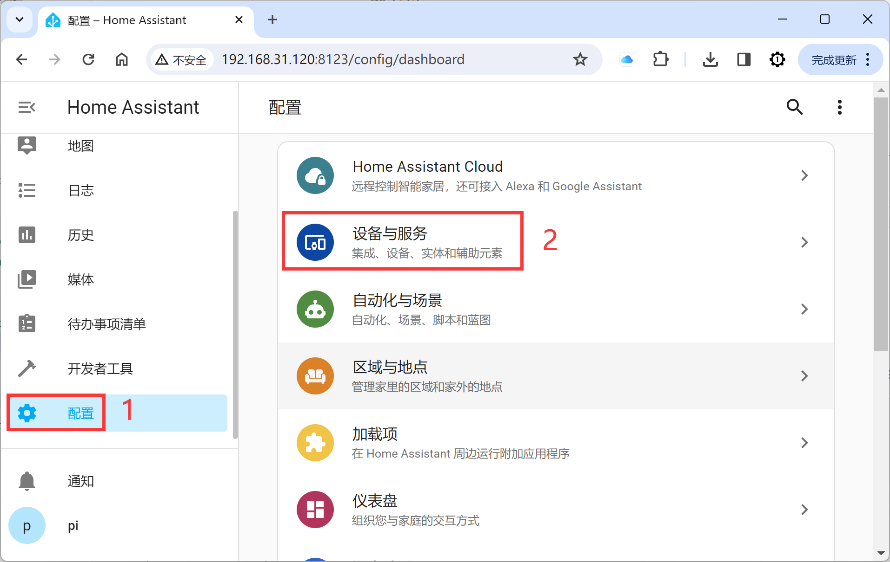
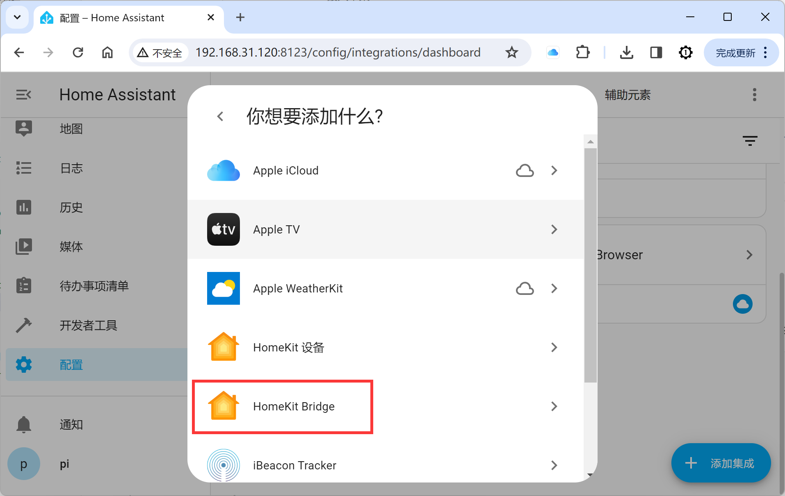
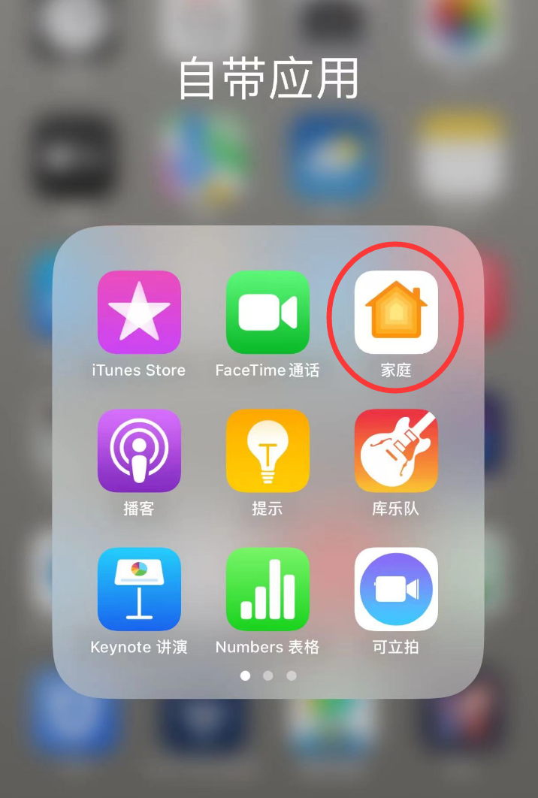
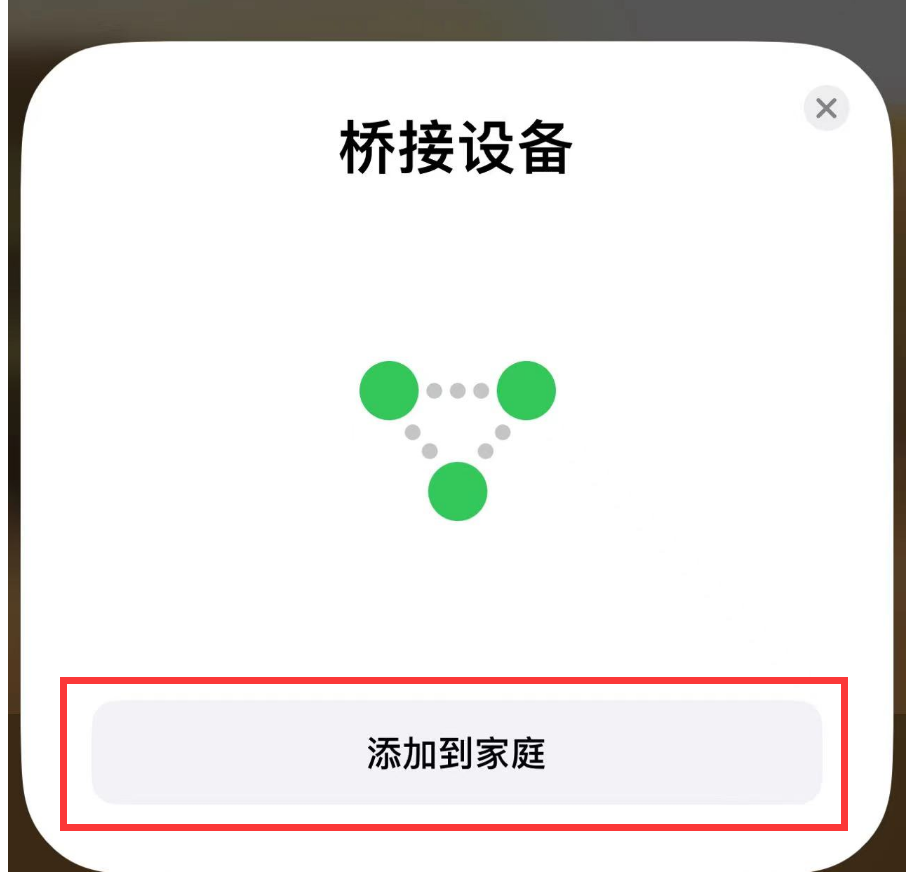
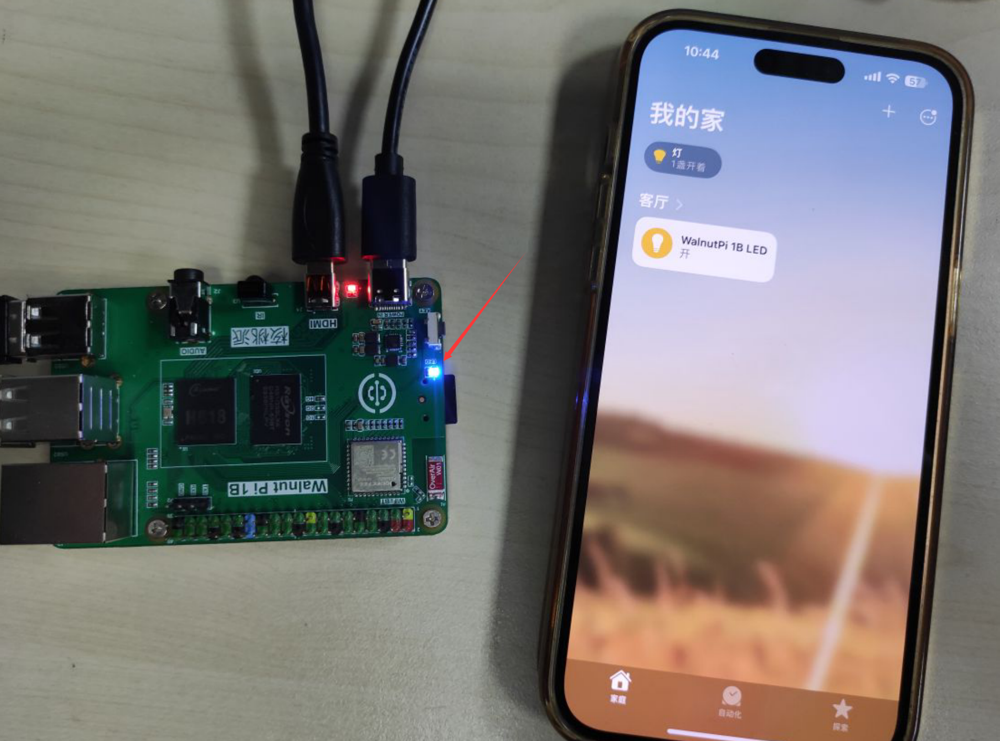

# Connecting to Apple HomeKit

Apple HomeKit is the built-in smart home app on iPhones. Simply add the HomeKit Bridge integration in WalnutPi Home Assistant to bind specific devices and control them on your iPhone.

This section takes an LED light as an example, adding the registered LED entity to HomeKit. Ensure you have already added the LED entity. Refer to the tutorial: [LED](../home_assistant/mqtt/device_entity/led.md) section.

First, add the HomeKit Bridge integration to bridge HomeKit and Home Assistant devices.

Search for the keyword "homekit" and click the Apple entry that appears:

Click `HomeKit Bridge`:

Here, select the domains to include. These are actually Home Assistant component categories. Since the LED used here belongs to the light category, just make sure light is checked.

Click Finish:

At this point, a new notification will appear in the left notification bar:

A QR code will appear.

Open the built-in "Home" app on your iPhone:

Select Scan Accessory:

Scan the QR code that appeared in Home Assistant:

Then follow the prompts to add. After successful addition, you will see the LED device entity appear in the Apple app.

You can now control the WalnutPi's LED through the Apple Home app.

