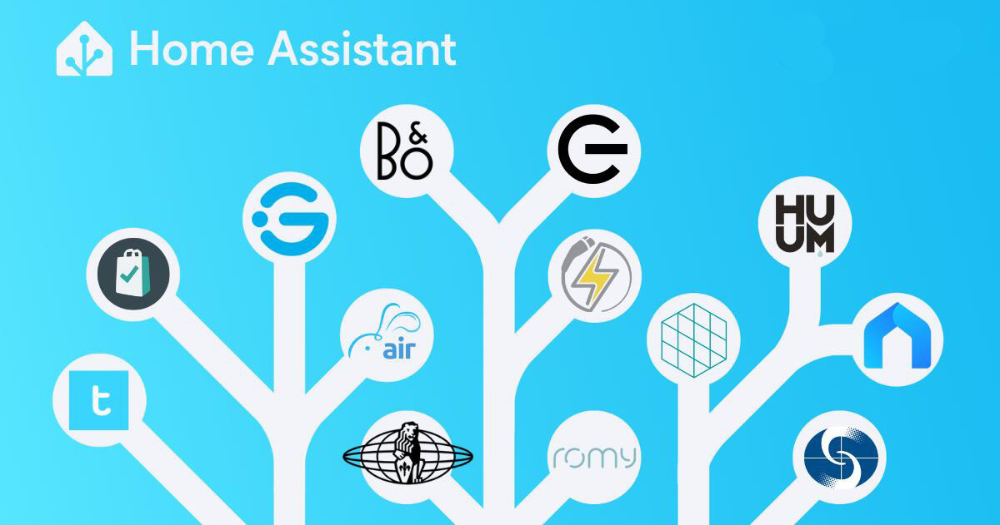
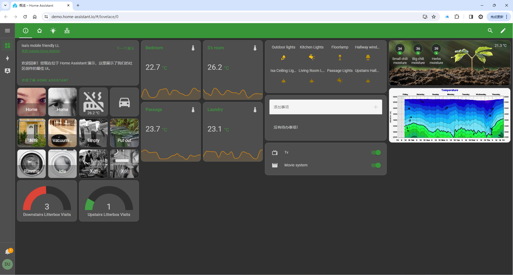
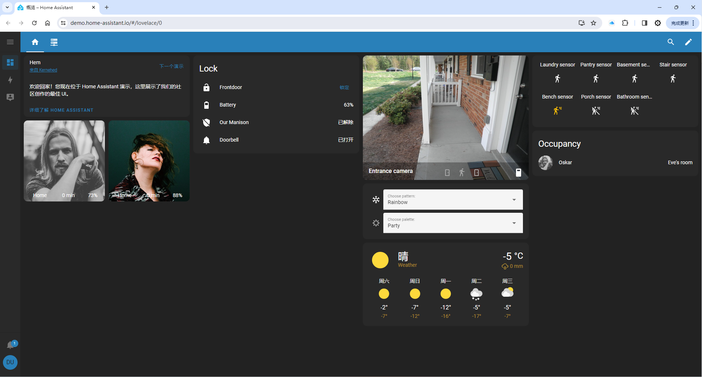

# Introduction

- Video Demo:

<!-- <iframe src="//player.bilibili.com/player.html?aid=1401200644&bvid=BV1rr421p788&cid=1452093879&p=1" high_quality="1" allowfullscreen="allowfullscreen" width="100%" height="500" scrolling="no" frameborder="0" sandbox="allow-top-navigation allow-same-origin allow-forms allow-scripts"></iframe> -->

<iframe src="//player.bilibili.com/player.html?aid=1401200644&bvid=BV1rr421p788&cid=1452093879&p=1" scrolling="no" border="0" frameborder="no" framespacing="0" allowfullscreen="true" width="100%" height="500"></iframe>

  
  

Home Assistant is free and open-source software for home automation, designed to be an independent integration platform and central control system for smart home devices within the IoT (Internet of Things) ecosystem, with a strong focus on local control and privacy. Users can access it through a web-based user interface and companion apps for Android and iOS to control various IoT devices.

Simply put, Home Assistant is a software application that can be installed on multiple platforms, including Windows, macOS, Linux operating systems, virtual machines, NAS systems, and single-board computers (such as WalnutPi, Raspberry Pi, etc.). Think of it as an advanced smart home hub that is compatible with protocols from numerous manufacturers (over 2000 integrations), such as Apple HomeKit, Xiaomi, Midea appliances, and more. Since these brand products are independent of each other, Home Assistant allows you to bridge them together, while also supporting custom hardware devices. With its dashboard, you can visually edit your personal interface, making it ideal for DIY applications in smart homes, smart offices, and other IoT scenarios.

## What Can Home Assistant Do, and What Are the Benefits?

- **True Whole-Home Device Coordination**

Home Assistant can connect to and control most smart home products on the market — a thermometer from brand A, a wireless switch from brand B, a smart plug from brand C. You no longer need to install a bunch of apps on your phone. By accessing Home Assistant through an app or web browser, you can centrally manage all devices throughout your home.

Home Assistant provides an Automation feature that lets you set trigger conditions and subsequent actions, enabling true coordination among various home devices. Want the lights to turn on automatically when the door opens? Simply open the app, click to create an automation task, and add the motion sensor and light bulb.

- **Code It Yourself, Unleash Unlimited Possibilities**

If you're not satisfied with the smart home devices available on the market, you can build your own. Home Assistant offers many integration methods, allowing your DIY devices to participate in whole-home coordination.

If you still find that Home Assistant's features don't meet your needs, don't worry — you can write your own programs to control various devices in your home. Home Assistant provides APIs that let you write a Python program to directly read and control smart home devices from various brands, without needing to study each manufacturer's communication protocol yourself.

## Official Website

https://www.home-assistant.io/

Here are some examples from the official website:

