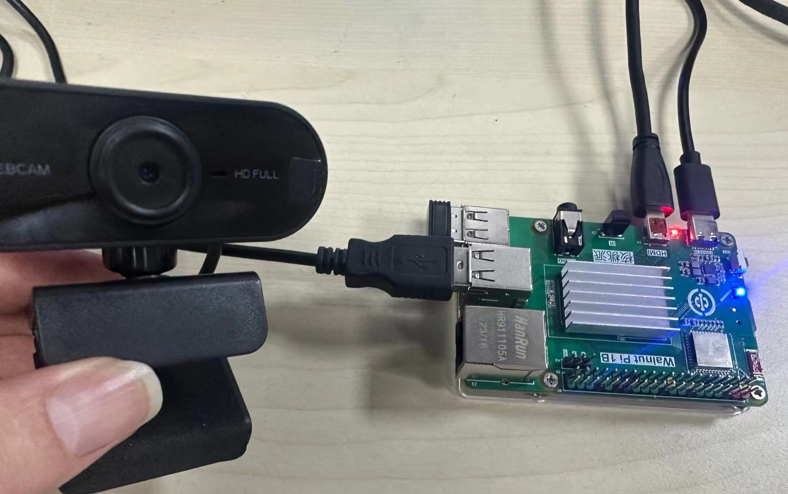
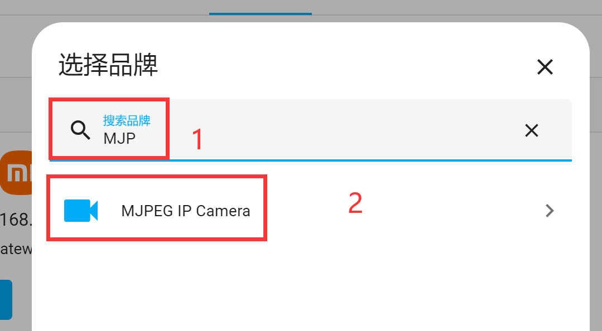
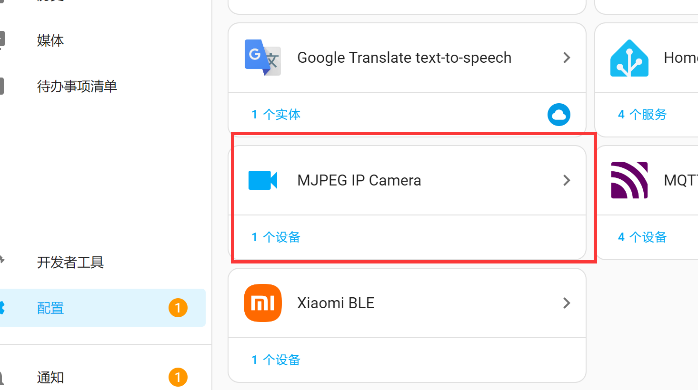
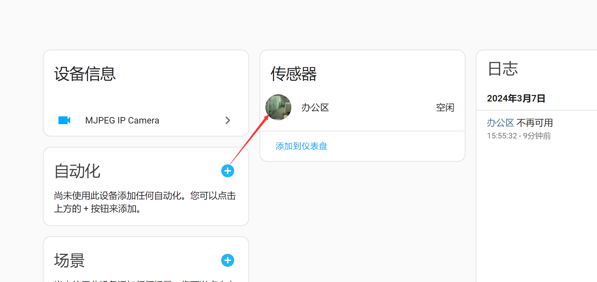
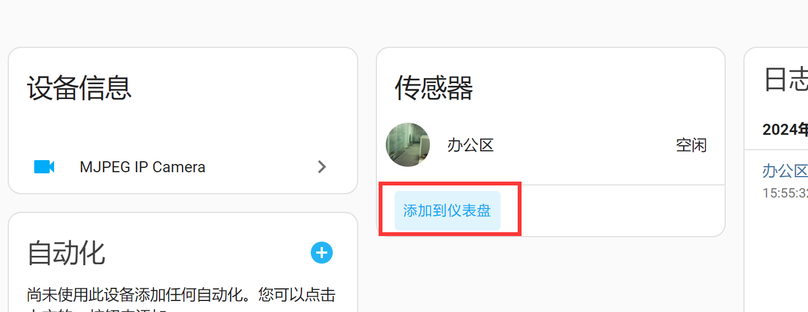
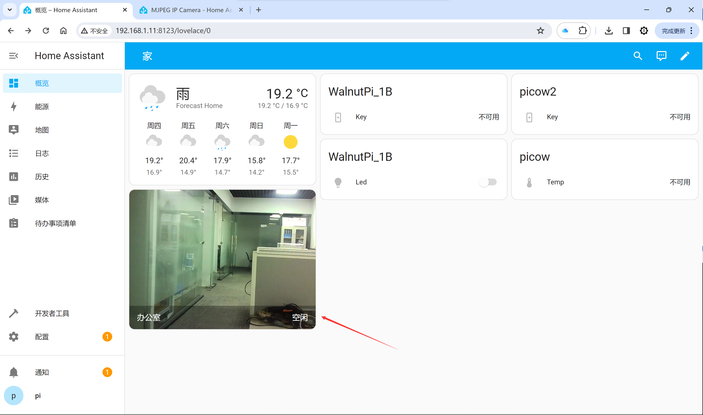
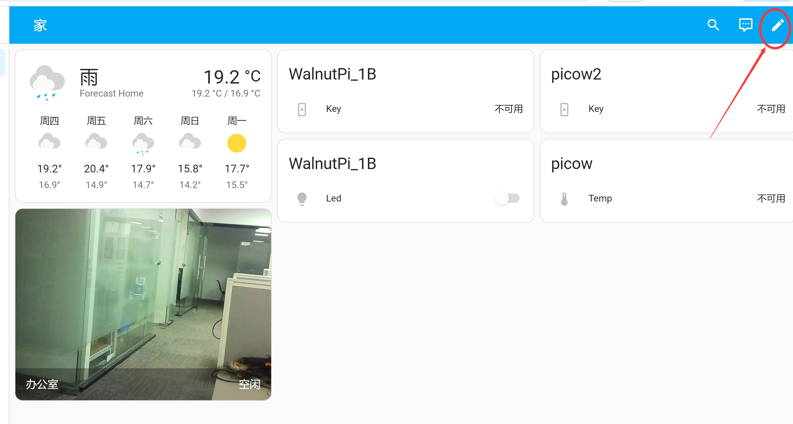
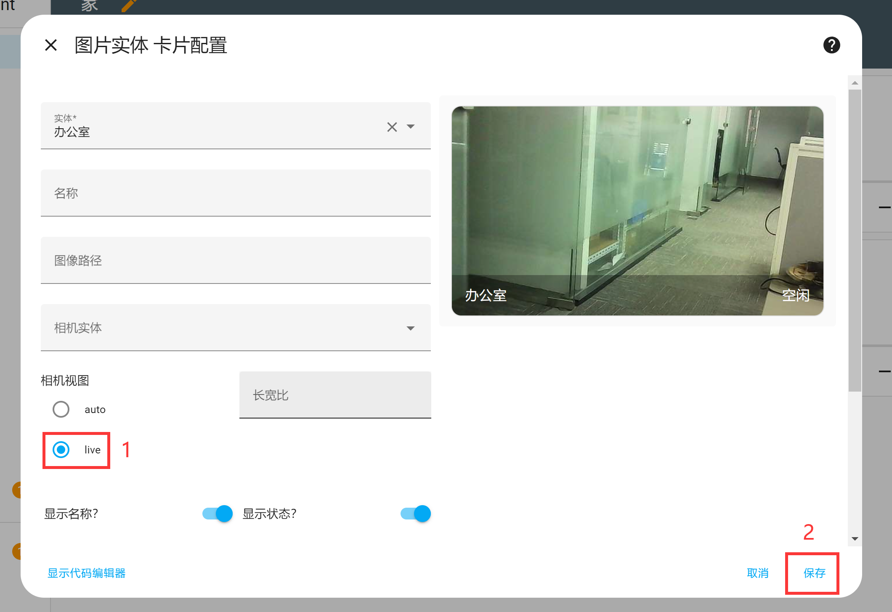

# Camera Surveillance

Home Assistant integrates the **MJPEG IP Camera** integration, which can interface with the WalnutPi USB camera usage methods introduced earlier, enabling surveillance monitoring from the Home Assistant interface.

For the WalnutPi USB camera tutorial, see the previous [USB Camera section](../os_software/usb_cam.md) — not repeated here.

After following the above tutorial to start the camera and testing it successfully, next add the device in Home Assistant:

Open **Configuration** -- **Add Integration**:

In the popup dialog, search for the keyword **MJPEG**, then select **MJPEG IP Camera** below:

Next, fill in the camera information:

- `Name`: Custom;
- `MJPEG URL`: Enter the IP address of the USB camera plus the string. [Get WalnutPi IP Address](../os_software/ip_get.md), e.g.: http://192.168.1.11:8080/?action=stream. If the USB camera is connected to the Home Assistant host itself, you can directly use 127.0.0.1 (localhost IP).

After completion, you can see MJPEG IP Camera added in the integrations list:

Open the device and click the small circle below to view the camera surveillance feed:

It can be added to the homepage dashboard:

After adding, you may find that the dashboard surveillance feed does not update in real time. Configure as follows to fix this:

Click the small pencil button in the upper-right corner to enter card editing:

Click **Edit** in the lower-left corner of the surveillance feed:

Select camera view mode: live:

After completing and returning, refresh the webpage and you will see the camera feed updating in real time:

