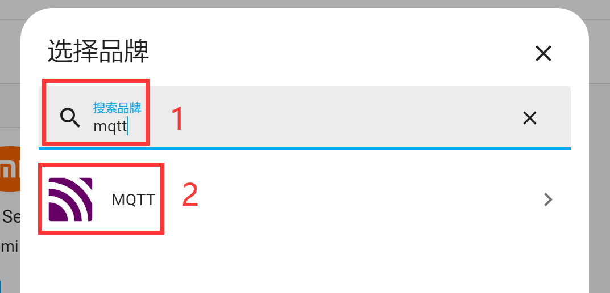

# Adding MQTT Integration

After setting up the MQTT server in the previous section, this section explains how to add the MQTT integration in Home Assistant. Once added successfully, we can then incorporate various custom devices according to the protocol.

Click **Configuration**, then click **Add Integration** in the lower-right corner:

In the popup window, search for "mqtt" and select MQTT to enter:

Then select the option shown below:

Fill in the MQTT server information in order:
- `Server`: The domain name or IP address of the MQTT server. Since the MQTT server used here is also installed on the WalnutPi, you can enter: 127.0.0.1, which means localhost;
- `Port`: 1883 if not modified;
- `Username` and `Password`: Both are set to "pi" as configured in the previous section tutorial.

Click Submit. If the connection is successful, a confirmation prompt will appear. If not, refer to the previous section tutorial to check whether the MQTT server was installed successfully.

After successful installation, you can see MQTT now listed under the integrations.

Click into it to view MQTT integration information. Through **Options**, you can reconfigure the MQTT integration server and other information settings:

After adding the integration, you can then add various MQTT devices.

