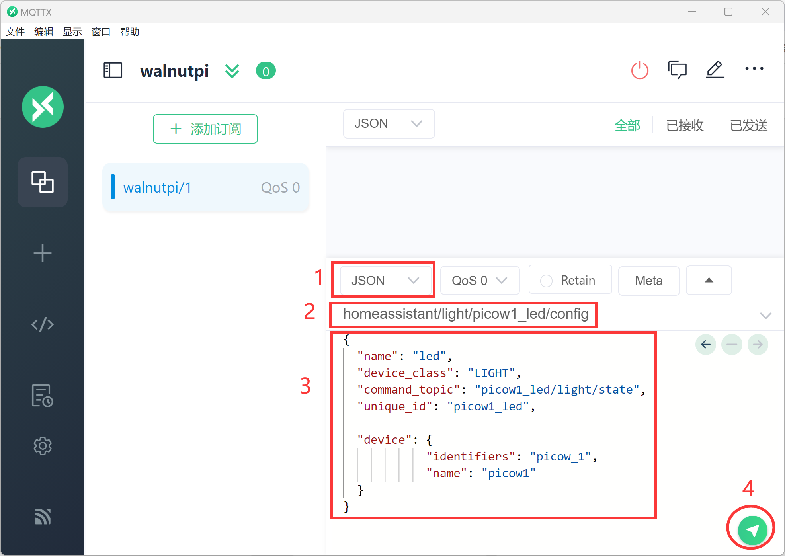
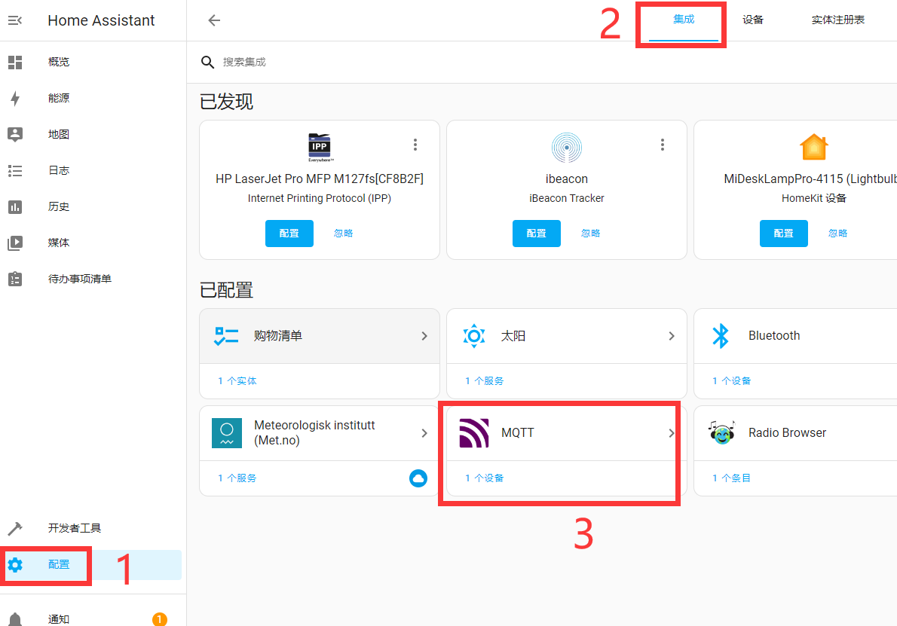

# Discovering Devices and Entities

MQTT device discovery allows us to directly use specific MQTT devices without excessive configuration work. This configuration method is implemented through MQTT topics and message content. In simple terms, for example, if there is a light device that sends a specific topic and message to the MQTT server, Home Assistant will automatically configure the device and entity information upon receiving the relevant data.

To avoid duplication, each entity must have a unique identifier to distinguish it. This means that the MQTT topics and messages for different devices and entities must follow a specific format.

## Topic Format

This refers to the MQTT topic.

```
<discovery_prefix>/<component>/[<node_id>/]<object_id>/config
```
- `<discovery_prefix>`: The discovery prefix, defaults to homeassistant
- `<component>`: A predefined component in the MQTT integration, e.g., light
- `<node_id>` (optional): The ID of the node providing the topic, generally not used. The node ID may only contain characters from the character class `[a-zA-Z0-9_-]` (alphanumeric, underscores, and hyphens).
- `<object_id>`: The entity ID, must be unique. May only contain characters from the character class `[a-zA-Z0-9_-]` (alphanumeric, underscores, and hyphens).

Example: `homeassistant/light/picow1_led/config` could represent an LED on a WalnutPi PicoW (WalnutPi MCU development board), with component type light.

For more details, refer to the official documentation: https://www.home-assistant.io/integrations/mqtt#mqtt-discovery

## Message Format

This message is sent together with the above topic to inform the host of the current entity and device information. The format must use `json` type. Since different devices and entities have different information, and the official Home Assistant documentation has many components, examples are used here for easy understanding. For other components needed later, refer to the official documentation.

Below is an example of registering an entity and binding a device:

```json
{
    "name":"led",
    "device_class":"LIGHT",
    "command_topic":"picow1/light/led/state",
    "unique_id":"picow1_led",
               
    "device":{
                "identifiers":"picow_01",
                "name":"picow1"
            }
}
```

### Entity

- `name`: Entity name, custom;
- `device_class`: Component type, related to the topic configuration above, must not be wrong. For example, `LIGHT` here is an available entity under the `light` component;
- `command_topic`: Used to publish related attribute topics after registering the entity, such as the on/off state of the light. Custom, just ensure different entities have different topics;
- `unique_id`: Entity ID, custom, must guarantee uniqueness for each entity;

### Device

Informs Home Assistant which device the entity corresponds to.

- `identifiers`: Identification identifier, unique for each device;
- `name`: Device name, custom;

**Multiple entities can be registered to the same device (note that topics must be unique).** For example:

A development board (device) has LED1 light (entity) and LED2 light (entity).

A temperature/humidity sensor (device) has temperature (entity) and humidity (entity).

::::tip Note
In Home Assistant, the entity is the smallest unit, and users are allowed to register only entities without registering devices. However, for ease of differentiation during use, it is generally recommended to register devices simultaneously.
::::

## Device Discovery Test

Let's use the MQTT assistant to test having the Home Assistant host discover an entity and device.

Use MQTTX assistant to connect to the WalnutPi MQTT server. Reference: [MQTTX Usage Tutorial](../install.md#connecting-to-the-walnutpi-mqtt-server-and-testing).

Select `json` as the data format, then enter in the send field:

Topic:
```
homeassistant/light/picow1_led/config
```

Message:
```json
{
  "name": "led",
  "device_class": "LIGHT",
  "command_topic": "picow1_led/light/state",
  "unique_id": "picow1_led",
  
  "device": {
            "identifiers": "picow_1",
            "name": "picow1"
  }
}
```

After entering, click the send button in the lower-right corner:



Open the MQTT integration you just added:



You can see that 1 device and 1 entity have been added. This page updates dynamically:


Click into it to see detailed information about the device and entity:


At this point, we have successfully discovered devices and entities. Detailed usage methods will be explained in later tutorials for different devices and entities.


