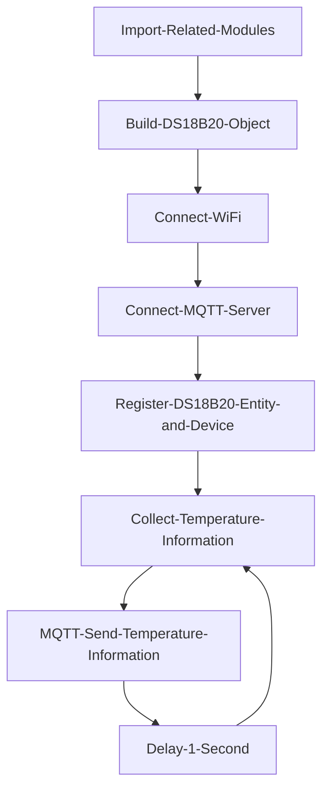
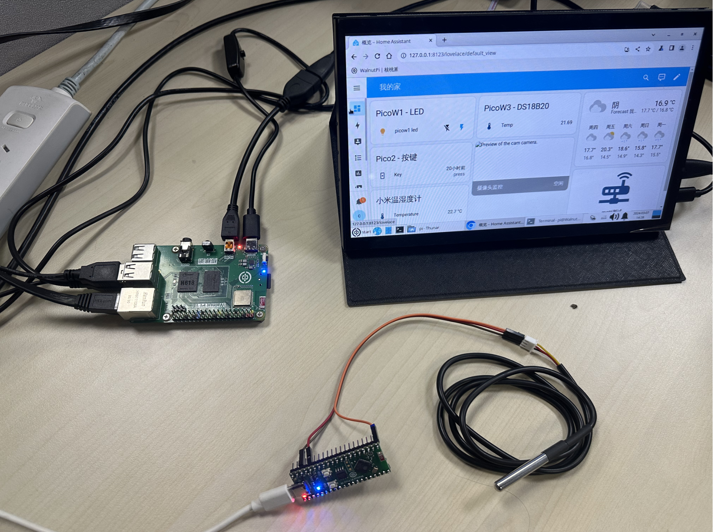
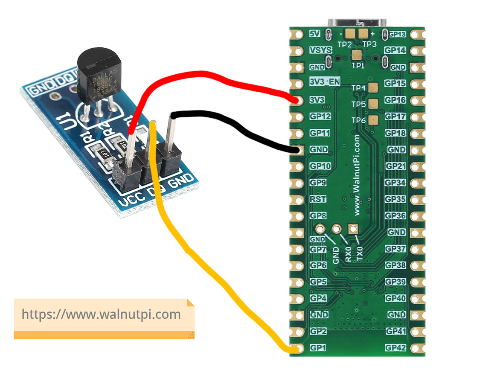
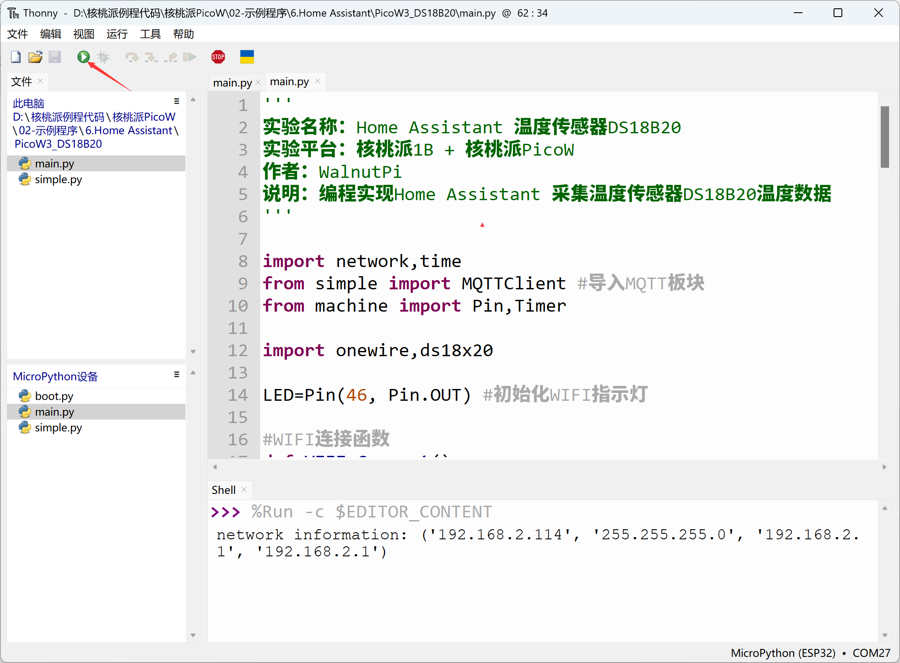
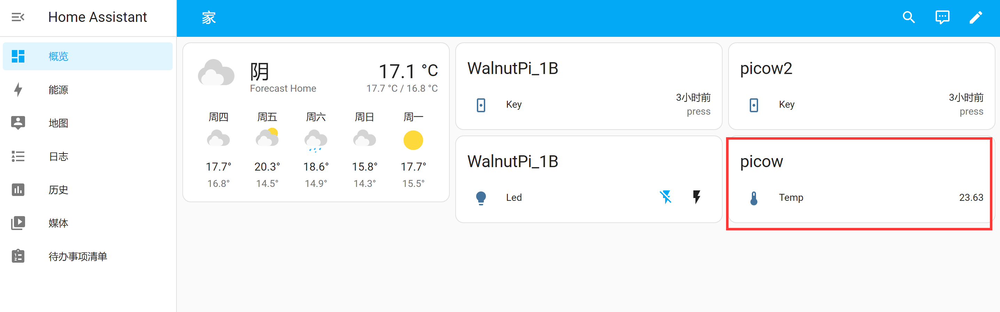

# Temperature Sensor DS18B20

## Introduction
This section focuses on adding a common DS18B20 temperature sensor to the Home Assistant host to achieve periodic temperature collection. For ease of demonstration, this tutorial will use WalnutPi PicoW (ESP32S3) to drive the DS18B20, then report temperature data to the WalnutPi Home Assistant host every second.


- DS18B20 Metal Probe Package


## Experiment Objective
Add a DS18B20 temperature sensor to the WalnutPi Home Assistant host to collect temperature data.

## Experiment Explanation

The temperature sensor needs to use the sensor in the Home Assistant MQTT component. The key to the experiment is understanding the topic information for discovering MQTT devices and the control methods. Details are as follows:


## MQTT Topic

The following topic is used for the Home Assistant host to discover the device via MQTT:

```
homeassistant/sensor/picow_ds18b20/config
```

- `homeassistant`: default prefix
- `sensor`: The MQTT component used for the temperature sensor is sensor
- `picow_ds18b20`: Entity ID, must be unique. This is a custom content here, representing the WalnutPi PicoW temperature sensor;
- `config`: default suffix

## MQTT Message

```json
{
    "name": "temp",
    "device_class": "temperature",
    "state_topic": "picow_ds18b20/sensor/temperature/state",
    "unique_id": "picow_ds18b20",
    "value_template": "{{ value_json.temperature }}" ,
                  
    "device": {
                "identifiers": "picow_x", 
                "name": "picow"
              }
}
```

### Entity

- `"name":"temp"`: Entity name, custom;
- `"device_class":"temperature"`: Component type, related to the topic configuration above, must not be wrong. For example, `temperature` here is an available entity under the `sensor` component;
- `"state_topic":"picow_ds18b20/sensor/temperature/state"`: Used to publish related attribute topics after registering the entity. Here it is used to send temperature data. The topic content is custom, just ensure different entities have different topics;
- `"unique_id":"picow_ds18b20"`: Entity ID, custom, must guarantee uniqueness for each entity;

### Device

Informs Home Assistant which device the entity corresponds to.

- `"identifiers":"picow_x"`: Identification identifier, unique for each device, e.g.: picow_1, pico_2 ...
- `"name":"picow"`: Device name, custom;

For more MQTT sensor content, refer to the official documentation: https://www.home-assistant.io/integrations/sensor.mqtt/

The code writing flow is as follows:



## Implementation Based on WalnutPi PicoW

This experiment uses WalnutPi PicoW (ESP32-S3) to connect the DS18B20 temperature sensor. For usage methods, refer to: [WalnutPi PicoW Tutorial](../../../../walnutpi_picow/sensor/ds18b20.md). Ensure that WalnutPi PicoW and WalnutPi 1B are connected to the same router:



### Reference Code
```python
'''
Experiment Name: Home Assistant Temperature Sensor DS18B20
Experiment Platform: WalnutPi 1B + WalnutPi PicoW
Author: WalnutPi
Description: Program to have Home Assistant collect DS18B20 temperature sensor data
'''

import network,time
from simple import MQTTClient #Import MQTT module
from machine import Pin,Timer

import onewire,ds18x20

LED=Pin(46, Pin.OUT) #Initialize WIFI indicator LED

#WIFI connection function
def WIFI_Connect():

    global LED

    wlan = network.WLAN(network.STA_IF) #STA mode
    wlan.active(True)                   #Activate interface
    start_time=time.time()              #Record time for timeout judgment

    if not wlan.isconnected():
        print('connecting to network...')
        wlan.connect('01Studio', '88888888') #Enter WIFI SSID and password

        while not wlan.isconnected():

            #LED blinking as indicator
            LED.value(1)
            time.sleep_ms(300)
            LED.value(0)
            time.sleep_ms(300)

            #Timeout judgment: 15 seconds without connection is considered timeout
            if time.time()-start_time > 15 :
                print('WIFI Connected Timeout!')
                break

    if wlan.isconnected():
        #LED on
        LED.value(1)

        #Serial port print information
        print('network information:', wlan.ifconfig())

        return True

    else:
        return False


#Receive data task
def MQTT_Rev(tim):
    client.check_msg()

#Execute WIFI connection function and check if connection is successful
if WIFI_Connect():
    
    CLIENT_ID = 'WalnutPi-PicoW-X' # Client ID
    SERVER = '192.168.1.118'  # MQTT server address
    PORT = 1883    
    USER='pi'
    PASSWORD='pi'
    
    client = MQTTClient(CLIENT_ID, SERVER, PORT, USER, PASSWORD) #Create client object
    client.connect()
    
    #Register device
    TOPIC = "homeassistant/sensor/picow_ds18b20/config"
    mssage = """{
                  "name": "temp",
                  "device_class": "temperature",
                  "state_topic": "picow_ds18b20/sensor/temperature/state",
                  "unique_id": "picow_ds18b20",
                  "value_template": "{{ value_json.temperature }}" ,
                  
                  "device": {
                    "identifiers": "picow_x", 
                    "name": "picow"
                      }
                 }
            """

    client.publish(TOPIC, mssage)


#Initialize DS18B20
ow= onewire.OneWire(Pin(1)) #Enable OneWire bus
ds = ds18x20.DS18X20(ow)        #Sensor is DS18B20
rom = ds.scan()         #Scan sensor addresses on OneWire bus, supports multiple sensors simultaneously

def temp_get(tim):
    ds.convert_temp()
    temp = ds.read_temp(rom[0]) #Temperature display, rom[0] is the first DS18B20
    
    print(str('%.2f'%temp)+' C') #Terminal print temperature info

    TOPIC = "picow_ds18b20/sensor/temperature/state"
    mssage = '{"temperature": %.2f}'%temp
    client.publish(TOPIC, mssage)


#Start RTOS Timer 1
tim = Timer(1)
tim.init(period=1000, mode=Timer.PERIODIC,callback=temp_get) #Period is 1000ms

while True:
    
    pass

```

### Experiment Results

Based on the above code, connect the DS18B20 to pin 1 of WalnutPi PicoW. The wiring diagram is as follows:



Use Thonny IDE to connect to the WalnutPi PicoW development board and run the above code:



After running successfully, you can find the DS18B20 sensor device in the MQTT integration:


It can be added to the homepage dashboard:



