# Button

## Introduction
This section focuses on adding a button to the Home Assistant host to implement button-press event detection. For ease of demonstration, this tutorial will use both WalnutPi 1B and WalnutPi PicoW (ESP32S3) as MQTT nodes for operation.

- WalnutPi 1B Button

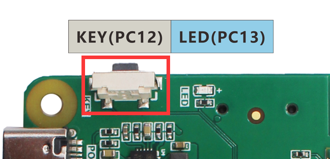

- WalnutPi PicoW Button


## Experiment Objective
Add a button to the WalnutPi Home Assistant host and implement button-press event detection.

## Experiment Explanation

The button uses the event component in the Home Assistant MQTT component. The key to the experiment is understanding the topic information for discovering MQTT devices and the control methods. Details are as follows:


## MQTT Topic

The following topic is used for the Home Assistant host to discover the device via MQTT:

```
homeassistant/event/1b_key/config
```

- `homeassistant`: default prefix
- `event`: The MQTT component used for the button is event
- `1b_key`: Entity ID, must be unique. This is a custom content here, representing the WalnutPi 1B button;
- `config`: default suffix

## MQTT Message

```json
{
    "name":"key",
    "device_class":"doorbell",
    "state_topic": "1b_key/event/state",
    "event_types": "press",
    "unique_id":"1b_key",
           
    "device":{
                "identifiers":"1b_01",
                "name":"WalnutPi_1B"
              }
}
```

### Entity

- `"name":"key"`: Entity name, custom;
- `"device_class":"doorbell"`: Component type, related to the topic configuration above, must not be wrong. For example, `doorbell` here is an available entity under the `event` component;
- `"state_topic":"1b_key/event/state"`: Used to publish related attribute topics after registering the entity. Here it is used to send button state. The topic content is custom, just ensure different entities have different topics;
- `"unique_id":"1b_key"`: Entity ID, custom, must guarantee uniqueness for each entity;

### Device

Informs Home Assistant which device the entity corresponds to.

- `"identifiers":"1b_01"`: Identification identifier, unique for each device;
- `"name":"WalnutPi_1B"`: Device name, custom;

For more MQTT light content, refer to the official documentation: https://www.home-assistant.io/integrations/event.mqtt/

The code writing flow is as follows:

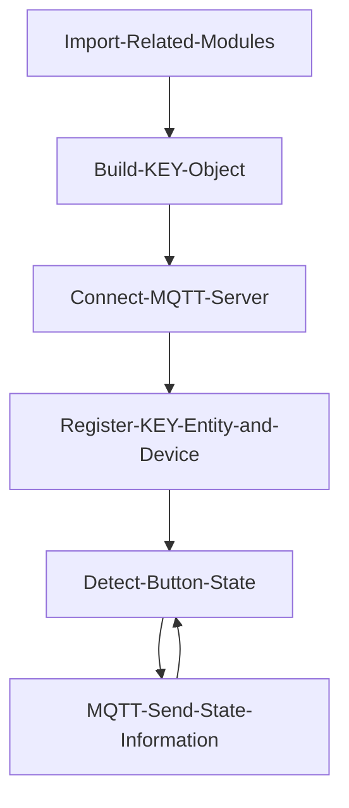

## Implementation Based on WalnutPi 1B

WalnutPi 1B has an onboard programmable button. In earlier tutorials, we learned how to use Python programming on WalnutPi for MQTT communication [MQTT Communication](../../../python/network/mqtt.md). Implement on this basis:

### Reference Code

```python
'''
Experiment Name: Home Assistant Button
Experiment Platform: WalnutPi 1B
Author: WalnutPi
Description: Program to implement Home Assistant button-press detection.
'''

#Import related libraries
import paho.mqtt.client as mqtt

import board,time
from digitalio import DigitalInOut, Direction

#Build button object and initialize
key = DigitalInOut(board.KEY) #Define pin number
key.direction = Direction.INPUT #IO as input

#MQTT server and user information
CLIENT_ID = 'WalnutPi-KEY' # Client ID
SERVER = '127.0.0.1' #Represents localhost IP address
PORT = 1883    
USER='pi'
PASSWORD='pi'

#Build mqtt client object
client = mqtt.Client(CLIENT_ID)

#Configure username and password
client.username_pw_set(USER, PASSWORD)

#Initiate connection
client.connect(SERVER,PORT)

#Register device on first startup
topic = "homeassistant/event/1b_key/config"
message = """{
           "name":"key",
           "device_class":"doorbell",
           "state_topic": "1b_key/event/state",
           "event_types": "press",
           "unique_id":"1b_key",
           
           "device":{
                      "identifiers":"1b_01",
                      "name":"WalnutPi_1B"
                    }
            }"""

client.publish(topic, message)

# Start a new thread to maintain MQTT connection.
client.loop_start()

while True:
    
    if key.value == 0: #Button pressed
        
        time.sleep(0.01) #Delay 10ms for debouncing
        
        if key.value == 0: #Button pressed
            
            client.publish("1b_key/event/state", """{"event_type":"press"}""") #Send button event
            
            while key.value == 0: #Wait for button release
                
                pass
```

### Experiment Results

Use Thonny to remotely run the above Python code on WalnutPi. For methods of running Python code on WalnutPi, refer to: [Running Python Code](../../../python/python_run.md)

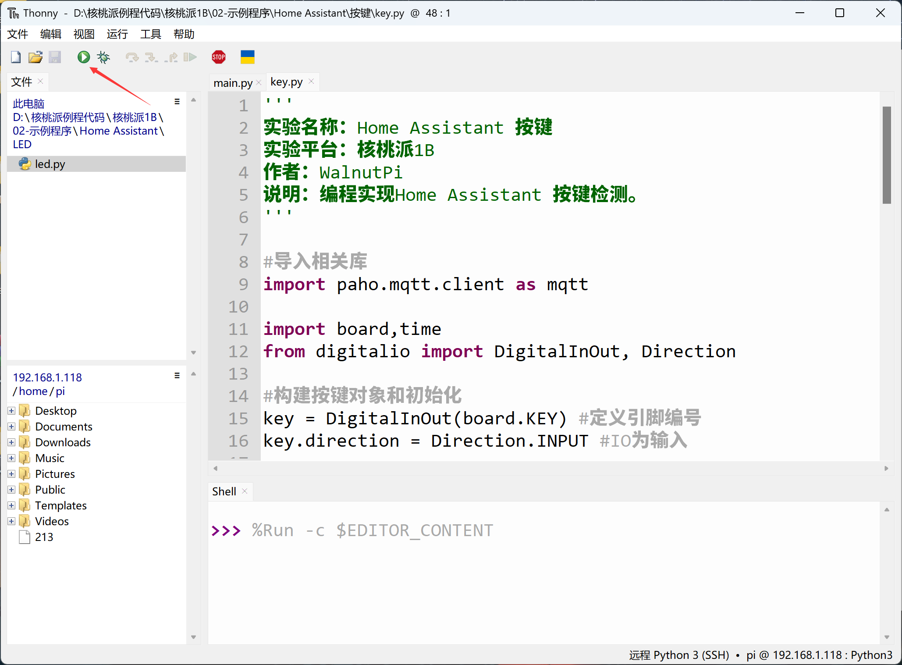

After running, you can see that the Home Assistant host displays 2 devices and 3 entities. This is because we registered the button to the same device as the LED from the previous section:

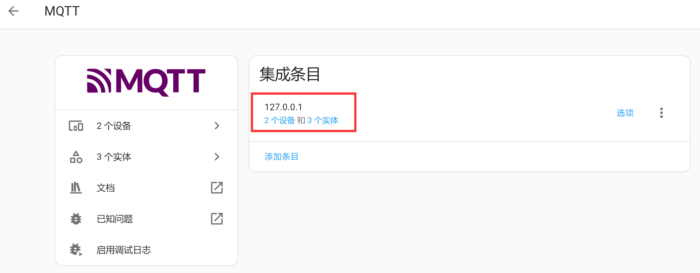

Click **Devices** and open the WalnutPi_1B device:

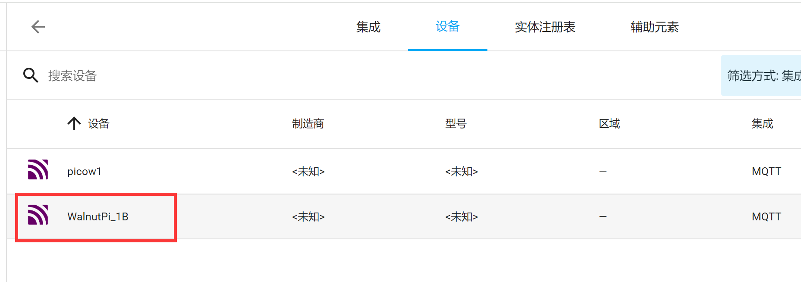

You can see that the right-side entities now include an additional event — this is the button we just added (a device can have multiple entities):

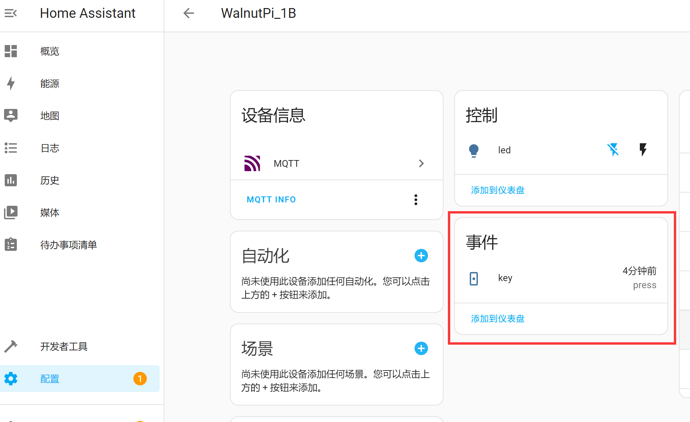

Press the button on WalnutPi 1B:

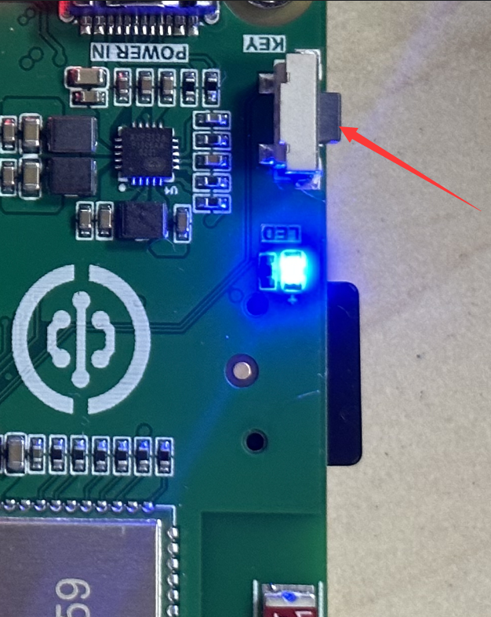

On the Home Assistant host page, you can see that a Press event has been triggered:


You can click **Add to Dashboard**:


Home Assistant will automatically select the card type:


After adding, you can see the button entity on the Overview homepage:


## Implementation Based on WalnutPi PicoW

WalnutPi PicoW (ESP32-S3) has an onboard programmable button. For usage methods, refer to: [WalnutPi PicoW Tutorial](https://www.walnutpi.com/picow/directory). Ensure that WalnutPi PicoW and WalnutPi 1B are connected to the same router:


### Reference Code
```python
'''
Experiment Name: Home Assistant Button
Experiment Platform: WalnutPi 1B + WalnutPi PicoW
Author: WalnutPi
Description: Program to implement Home Assistant button-press detection
'''
import network,time
from simple import MQTTClient #Import MQTT module
from machine import Pin,Timer

LED=Pin(46, Pin.OUT) #Initialize WIFI indicator LED

#WIFI connection function
def WIFI_Connect():

    global LED

    wlan = network.WLAN(network.STA_IF) #STA mode
    wlan.active(True)                   #Activate interface
    start_time=time.time()              #Record time for timeout judgment

    if not wlan.isconnected():
        print('connecting to network...')
        wlan.connect('01Studio_2.4G', '01studio0123456789') #Enter WIFI SSID and password

        while not wlan.isconnected():

            #LED blinking as indicator
            LED.value(1)
            time.sleep_ms(300)
            LED.value(0)
            time.sleep_ms(300)

            #Timeout judgment: 15 seconds without connection is considered timeout
            if time.time()-start_time > 15 :
                print('WIFI Connected Timeout!')
                break

    if wlan.isconnected():
        #LED on
        LED.value(1)

        #Serial port print information
        print('network information:', wlan.ifconfig())

        return True

    else:
        return False


#Receive data task
def MQTT_Rev(tim):
    client.check_msg()

#Execute WIFI connection function and check if connection is successful
if WIFI_Connect():
    
    CLIENT_ID = 'WalnutPi-PicoW2' # Client ID
    SERVER = '192.168.1.118'  # MQTT server address
    PORT = 1883    
    USER='pi'
    PASSWORD='pi'
    
    client = MQTTClient(CLIENT_ID, SERVER, PORT, USER, PASSWORD) #Create client object
    client.connect()
    
    #Register device
    TOPIC = "homeassistant/event/picow2_key/config"
    mssage = """{
                  "name": "key",
                  "device_class": "doorbell",
                  "state_topic": "picow2_key/event/state",
                  "event_types": "press",
                  "unique_id": "picow2_key",
                  
                  "device": {
                    "identifiers": "picow_2",
                    "name": "picow2"
                  }
                }
            """

    client.publish(TOPIC, mssage)


KEY=Pin(0,Pin.IN,Pin.PULL_UP) #Build KEY object

#LED state toggle function
def fun(KEY):
    time.sleep_ms(10) #Debounce
    if KEY.value()==0: #Confirm button pressed
        
        #Send mqtt button information
        TOPIC = "picow2_key/event/state"
        mssage = """{"event_type":"press"}"""
        client.publish(TOPIC, mssage)

KEY.irq(fun,Pin.IRQ_FALLING) #Define interrupt, falling edge trigger

while True:
    
    pass

```

### Experiment Results

Use Thonny to connect to the WalnutPi PicoW development board and run the above code:

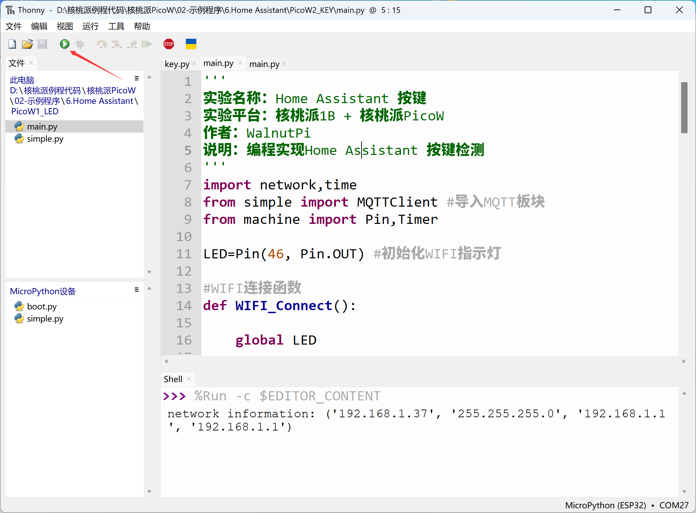

After successful connection, you can see that the WalnutPi Home Assistant host has an additional device:


Enter the device to see the registered key event entity:

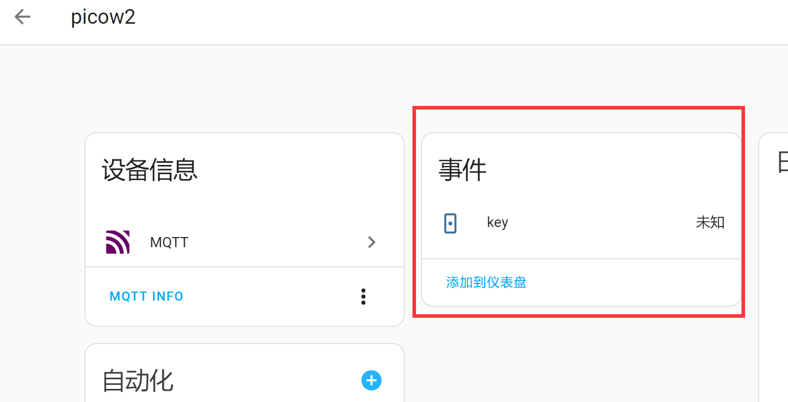

Press the button on WalnutPi PicoW:


The WalnutPi Home Assistant host detects the press event:

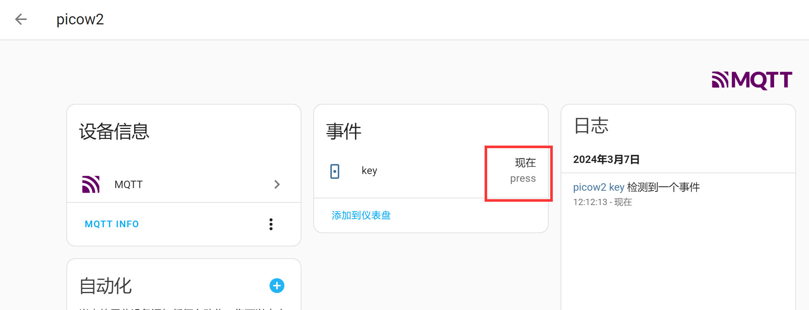

Similarly, you can control the LED switch on the right and add it to the dashboard:


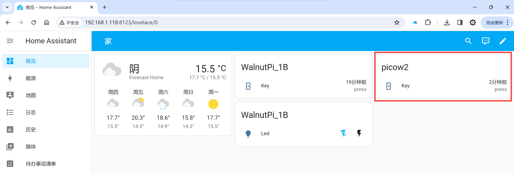


