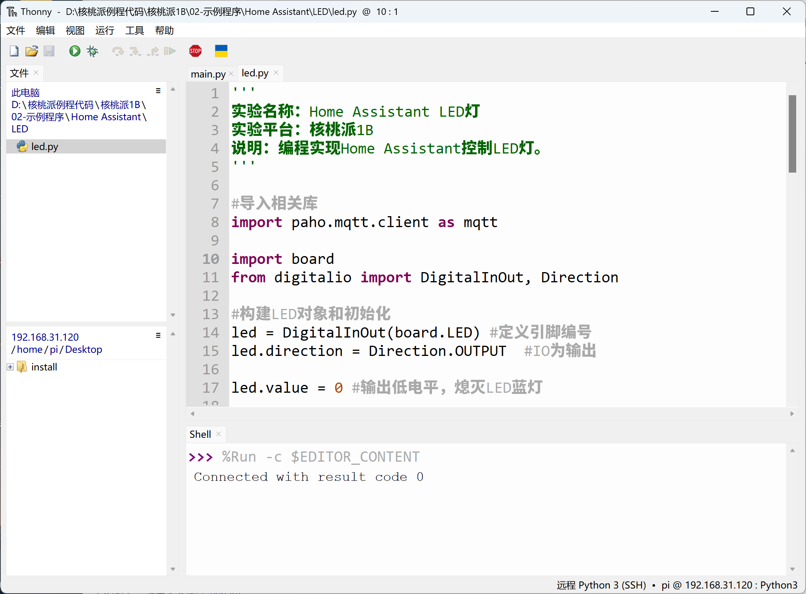
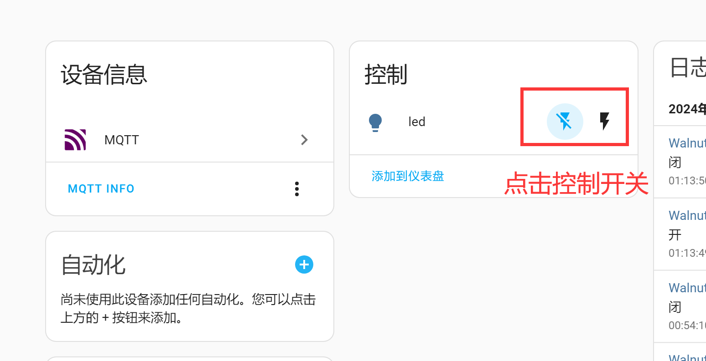
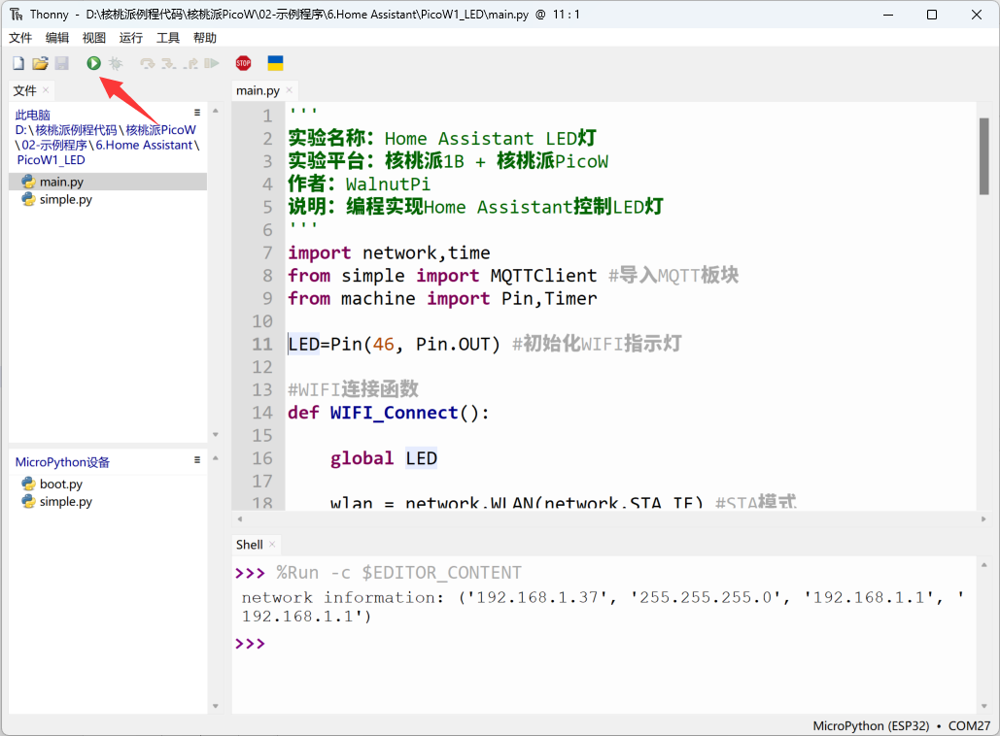
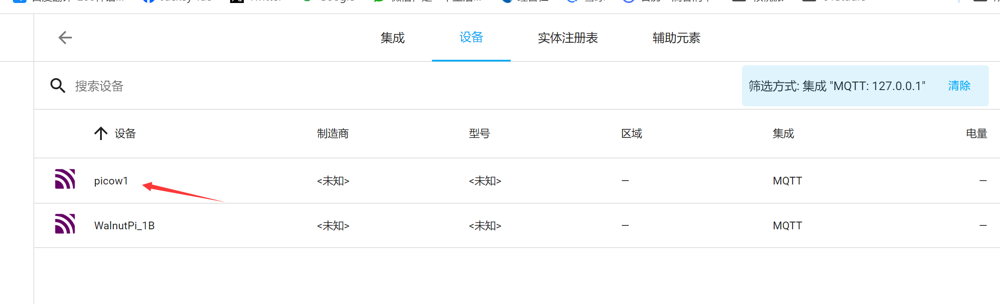
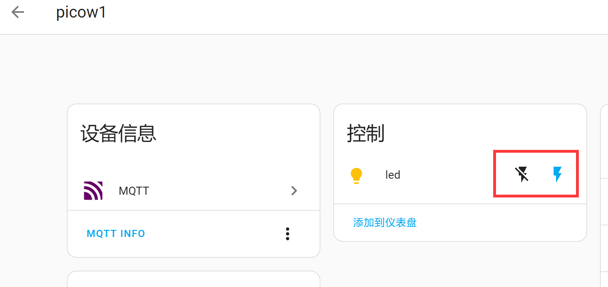

# LED

## Introduction
This section focuses on adding an LED to Home Assistant to implement on/off control. For ease of demonstration, this tutorial will use both WalnutPi 1B and WalnutPi PicoW (ESP32S3) as MQTT nodes for operation.

- WalnutPi 1B LED


- WalnutPi PicoW LED


## Experiment Objective
Add an LED to the WalnutPi Home Assistant host and implement on/off control.

## Experiment Explanation

An LED can be treated as a single-color light fixture, using the light component in Home Assistant MQTT. The key to the experiment is understanding the topic information for discovering MQTT devices and the control methods. Details are as follows:

## MQTT Topic

The following topic is used for the Home Assistant host to discover the device via MQTT:

```
homeassistant/light/1b_led/config
```

- `homeassistant`: default prefix
- `light`: The MQTT component corresponding to the LED is light
- `1b_led`: Entity ID, must be unique. This is a custom content here, representing the WalnutPi 1B LED;
- `config`: default suffix

## MQTT Message

```json
{
    "name":"led",
    "device_class":"LIGHT",
    "command_topic":"1b_led/light/state",
    "unique_id":"1b_led",
               
    "device":{
                "identifiers":"1b_01",
                "name":"WalnutPi_1B"
            }
}
```

### Entity

- `"name":"led"`: Entity name, custom;
- `"device_class":"LIGHT"`: Component type, related to the topic configuration above, must not be wrong. For example, `LIGHT` here is an available entity under the `light` component;
- `"command_topic":"1b_led/light/state"`: Used to publish related attribute topics after registering the entity, such as the on/off state of the light. Custom, just ensure different entities have different topics;
- `"unique_id":"1b_led"`: Entity ID, custom, must guarantee uniqueness for each entity;

### Device

Informs Home Assistant which device the entity corresponds to.

- `"identifiers":"1b_01"`: Identification identifier, unique for each device;
- `"name":"WalnutPi_1B"`: Device name, custom;

For more MQTT light content, refer to the official documentation: https://www.home-assistant.io/integrations/light.mqtt/

The code writing flow is as follows:

```mermaid
graph TD
    Import Related Modules-->Build LED Object-->Connect MQTT Server-->Register LED Entity and Device-->Receive MQTT Information-->Control LED On/Off-->Receive MQTT Information;
```

## Implementation Based on WalnutPi 1B

WalnutPi 1B has an onboard programmable LED. In earlier tutorials, we learned how to use Python programming on WalnutPi for MQTT communication [MQTT Communication](../../../python/network/mqtt.md). Implement on this basis:

### Reference Code

```python
'''
Experiment Name: Home Assistant LED Light
Experiment Platform: WalnutPi 1B
Description: Program to have Home Assistant control the LED light.
'''

#Import related libraries
import paho.mqtt.client as mqtt

import board
from digitalio import DigitalInOut, Direction

#Build LED object and initialize
led = DigitalInOut(board.LED) #Define pin number
led.direction = Direction.OUTPUT  #IO as output

led.value = 0 #Output low level, turn off blue LED

#MQTT server and user information
CLIENT_ID = 'WalnutPi-LED' # Client ID
SERVER = '127.0.0.1' #Represents localhost IP address
PORT = 1883    
USER='pi'
PASSWORD='pi'

#Build mqtt client object
client = mqtt.Client(CLIENT_ID)

#Configure username and password
client.username_pw_set(USER, PASSWORD)

topic = "picow1/light/led/state"

#Callback function executed when client receives CONNACK response from server
def on_connect(client, userdata, flags, rc):
    print("Connected with result code "+str(rc))
    # Using subscribe in on_connect() means that if we lose connection and reconnect, subscriptions will be renewed.
    client.subscribe("1b_led/light/state")

# Callback function executed when receiving published information from other devices on the server
def on_message(client, userdata, msg):
    
    print(msg.topic+" "+str(msg.payload)) #Print topic and information

    if msg.payload == b'ON' : #Turn on LED
        
        led.value = 1
    
    if msg.payload == b'OFF' : #Turn off LED
        
        led.value = 0

#Configure connection and message receive callback functions
client.on_connect = on_connect
client.on_message = on_message

#Initiate connection
client.connect(SERVER,PORT)

#Register device on first startup
topic = "homeassistant/light/1b_led/config"
message = """{
           "name":"led",
           "device_class":"LIGHT",
           "command_topic":"1b_led/light/state",
           "unique_id":"1b_led",
           
           "device":{
                      "identifiers":"1b_01",
                      "name":"WalnutPi_1B"
                    }
            }"""

client.publish(topic, message)

# Start a new thread to maintain MQTT connection.
client.loop_start()

while True:

    pass

```

### Experiment Results

Use Thonny to remotely run the above Python code on WalnutPi. For methods of running Python code on WalnutPi, refer to: [Running Python Code](../../../python/python_run.md)



After running, you can see that a new device and entity appear on the Home Assistant host:


Click **Devices** to see device-related information. The LED on the right is the entity — click the switch button to turn the LED on/off:



At the same time, MQTT messages are sent to the device:


Controlling the WalnutPi 1B LED on/off:


You can also click **Add to Dashboard**:


Home Assistant will automatically select the card type:


After adding, you can see the device on the Overview homepage:


## Implementation Based on WalnutPi PicoW

WalnutPi PicoW (ESP32-S3) has an onboard programmable LED. For usage methods, refer to: [WalnutPi PicoW Tutorial](https://www.walnutpi.com/picow/directory). Ensure that WalnutPi PicoW and WalnutPi 1B are connected to the same router:


### Reference Code
```python
'''
Experiment Name: Home Assistant LED Light
Experiment Platform: WalnutPi 1B + WalnutPi PicoW
Author: WalnutPi
Description: Program to have Home Assistant control the LED light
'''

import network,time
from simple import MQTTClient #Import MQTT module
from machine import Pin,Timer

LED=Pin(46, Pin.OUT) #Initialize WIFI indicator LED

#WIFI connection function
def WIFI_Connect():

    global LED

    wlan = network.WLAN(network.STA_IF) #STA mode
    wlan.active(True)                   #Activate interface
    start_time=time.time()              #Record time for timeout judgment

    if not wlan.isconnected():
        print('connecting to network...')
        wlan.connect('01Studio', '88888888') #Enter WIFI SSID and password

        while not wlan.isconnected():

            #LED blinking as indicator
            LED.value(1)
            time.sleep_ms(300)
            LED.value(0)
            time.sleep_ms(300)

            #Timeout judgment: 15 seconds without connection is considered timeout
            if time.time()-start_time > 15 :
                print('WIFI Connected Timeout!')
                break

    if wlan.isconnected():
        #LED on
        LED.value(1)

        #Serial port print information
        print('network information:', wlan.ifconfig())

        return True

    else:
        return False


#Set MQTT callback function, executed when there is a message
def MQTT_callback(topic, msg):
    
    print('topic: {}'.format(topic))
    print('msg: {}'.format(msg))
    
    if msg == b'ON' :
        
        LED.value(1)
    
    if msg == b'OFF' :
        
        LED.value(0)

#Receive data task
def MQTT_Rev(tim):
    client.check_msg()

#Execute WIFI connection function and check if connection is successful
if WIFI_Connect():
    
    CLIENT_ID = 'WalnutPi-PicoW1' # Client ID
    SERVER = '192.168.1.118'  # MQTT server address
    PORT = 1883   
    USER='pi'
    PASSWORD='pi'
    
    client = MQTTClient(CLIENT_ID, SERVER, PORT, USER, PASSWORD) #Create client object
    client.set_callback(MQTT_callback)  #Configure callback function
    client.connect()
    
    #Register device
    TOPIC = "homeassistant/light/picow1_led/config"
    mssage = """{
                  "name": "led",
                  "device_class": "LIGHT",
                  "command_topic": "picow1_led/light/state",
                  "unique_id": "picow1_led",
                  
                  "device": {
                            "identifiers": "picow_1",
                            "name": "picow1"
                            }
                }"""

    client.publish(TOPIC, mssage)
    
    #Subscribe to topic 
    TOPIC = 'picow1_led/light/state' # TOPIC name
    client.subscribe(TOPIC) #Subscribe to topic

    #Start RTOS timer, number 1, period 100ms, execute socket communication receive task
    tim = Timer(1)
    tim.init(period=100, mode=Timer.PERIODIC,callback=MQTT_Rev)

```

### Experiment Results

Use Thonny to connect to the WalnutPi PicoW development board and run the above code:



After successful connection, you can see that the WalnutPi Home Assistant host has an additional device:



Enter the device. Similarly, you can control the LED switch on the right and add it to the dashboard:



When clicking the switch, PicoW receives MQTT messages and prints information in the Thonny IDE terminal below, with the LED performing the corresponding on/off operation.


