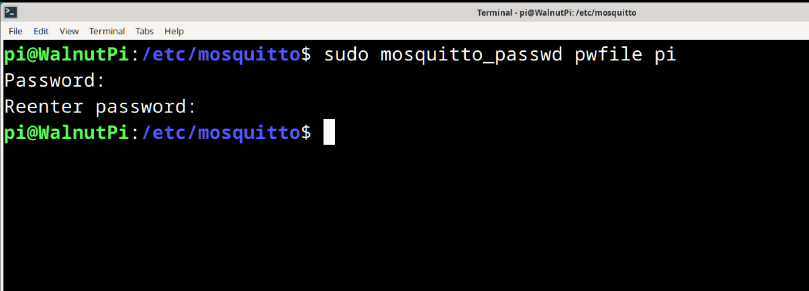
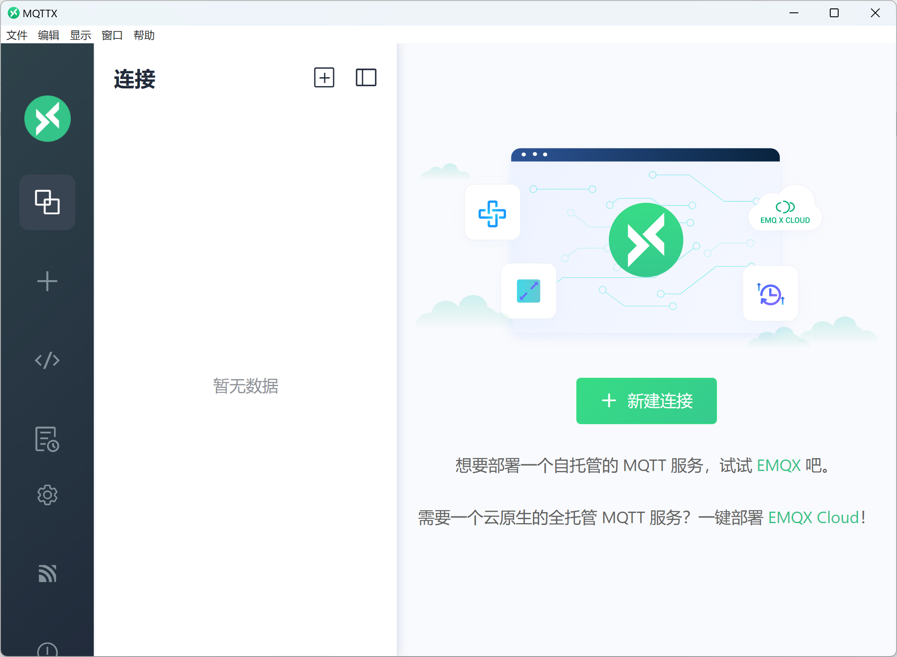
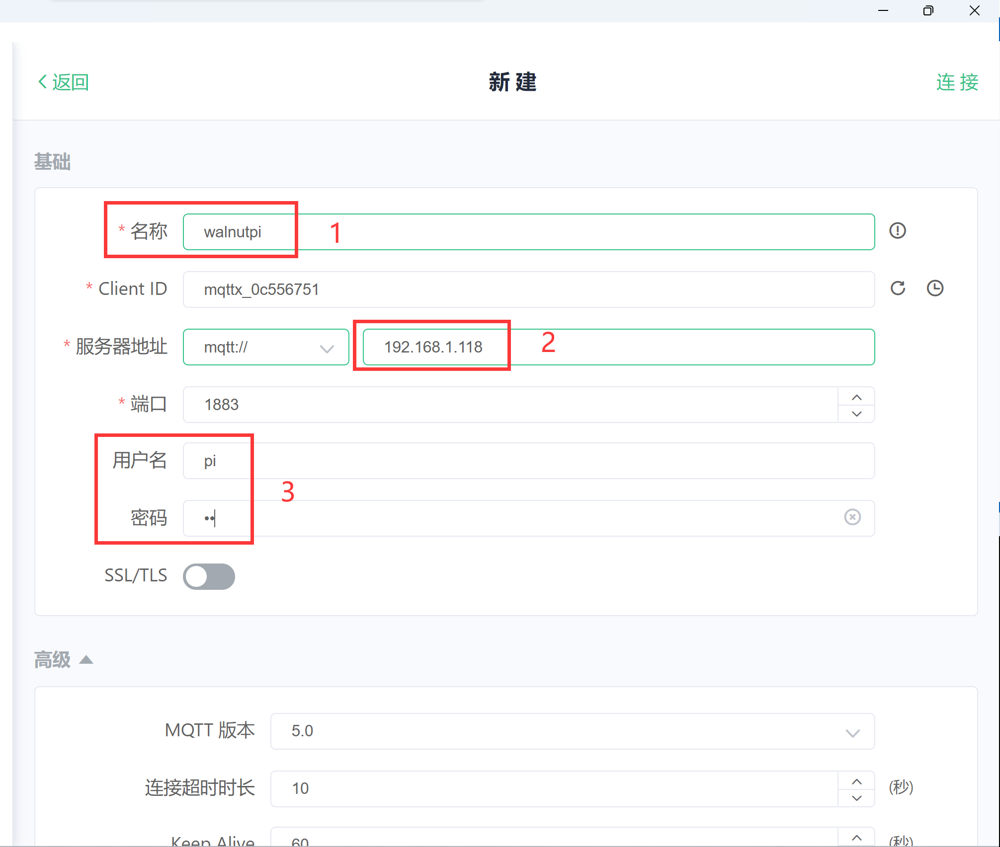
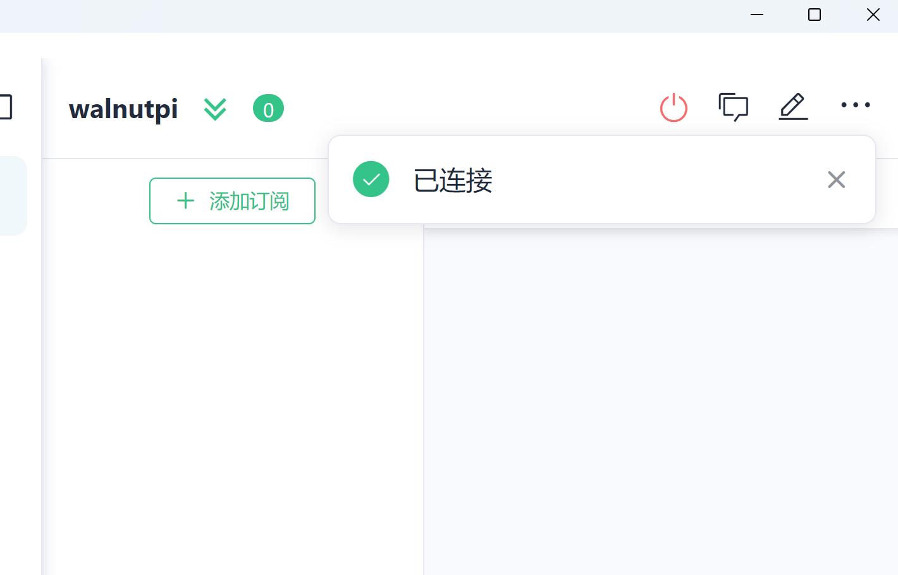
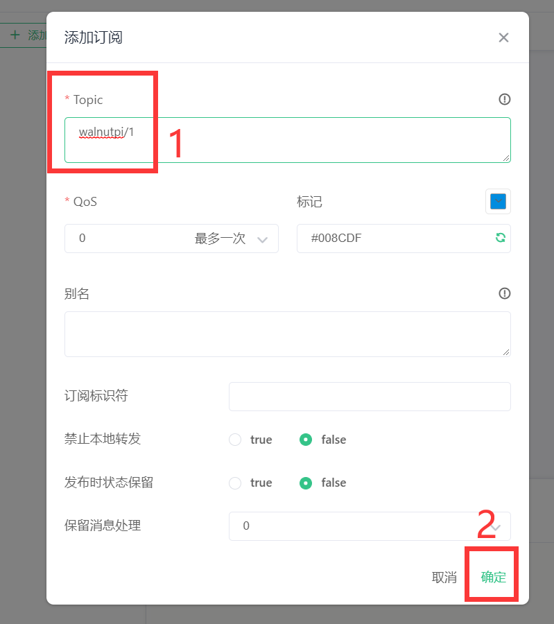
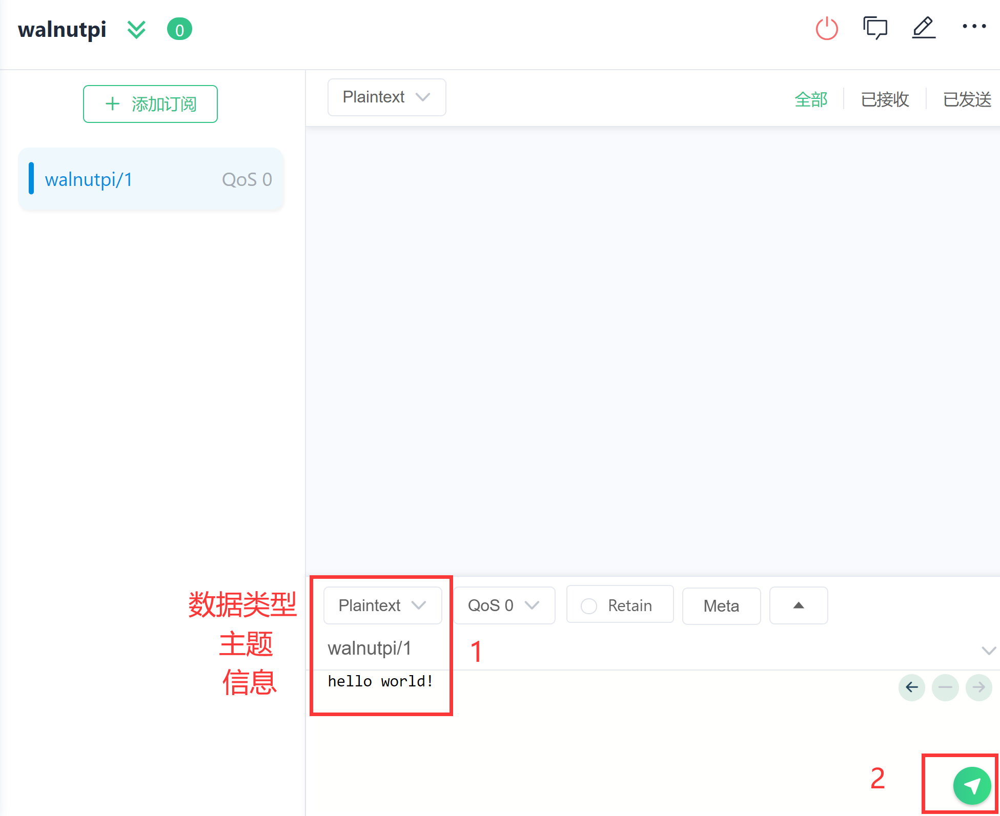
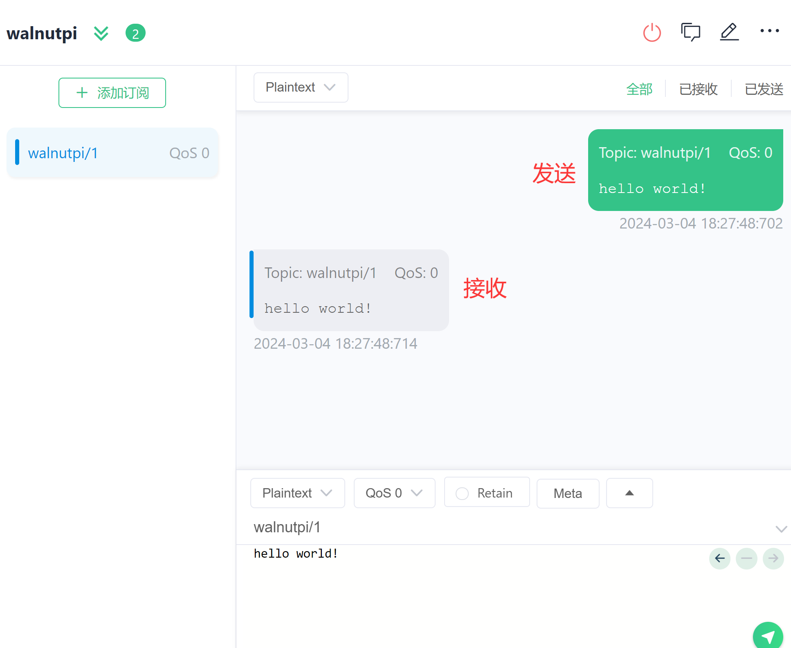

# MQTT Server Installation

MQTT (also known as MQ Telemetry Transport) is a machine-to-machine or "Internet of Things" connectivity protocol based on TCP/IP. It allows extremely lightweight publish/subscribe message transport. MQTT is a very versatile protocol that makes it very easy to connect our own devices. For a detailed WalnutPi MQTT tutorial, refer to: [MQTT Communication](../../python/network/mqtt.md)


Using the MQTT integration requires an MQTT server.

::::tip Note
If you are using the WalnutPi Home Assistant image, the MQTT server is already pre-installed and set to start automatically at boot.
::::


If you installed Home Assistant on a standard WalnutPi image, you will need to manually install and configure the MQTT server. The installation tutorial is as follows:

## Installation

Open the WalnutPi terminal and install using the apt command:

```bash
sudo apt install mosquitto
```

Set to start automatically at boot:

```bash
sudo service mosquitto start
```

## General Configuration

Here you can configure the MQTT server port and bind file information. In the WalnutPi **/etc/mosquitto/conf.d** directory, create a new configuration file using the terminal. The name can be anything — the system will detect it automatically, e.g., default.conf:

```bash
sudo nano /etc/mosquitto/conf.d/default.conf
```

Enter the following content:
```
# Modify the port
port 1883

# Do not allow anonymous access, require username & password to connect to the server
allow_anonymous false

# Specify the username & password file to use, needs to be created manually
password_file /etc/mosquitto/pwfile

# Specify the access control file path, needs to be created manually
acl_file /etc/mosquitto/aclfile
```

Then press Ctrl+X to save and exit.

## Creating an Account

This username and password are used to log into the MQTT server. In the WalnutPi **/etc/mosquitto/** directory, use the following command to create a new file. The filename must match the name **pwfile** configured earlier.

```bash
sudo touch /etc/mosquitto/pwfile
```

After creating the file, use the mosquitto_passwd command to create the username and password. Here, we'll test by creating an account with username: pi and password: pi.

```bash
sudo mosquitto_passwd /etc/mosquitto/pwfile pi
```

Then follow the prompts to enter the password.

::::tip Note
The password will not be displayed. Pay attention to case sensitivity, and you will need to enter it twice.
::::



## Setting Account Permissions

This feature mainly allows different users to filter out irrelevant information from the MQTT server. It is optional — if not set, it means receiving all topic information.

In the WalnutPi **/etc/mosquitto/** directory, use the following command to create an account permissions file. The filename must match the name **aclfile** configured earlier.

```bash
sudo nano /etc/mosquitto/aclfile
```

Enter the following in the file:

```
user pi
topic #
```

Then press Ctrl+X to save and exit.

The above content means that the pi user receives all MQTT topic information. For example: **topic walnutpi/#** means only receiving topic information starting with **walnutpi/**. Other topics will be filtered out.

After all configuration is complete, restart the MQTT service with the following command to apply the changes:


After configuration, restart the MQTT server for the configuration to take effect:

```bash
sudo service mosquitto restart
```

## Testing the MQTT Server

After installing the MQTT server on the WalnutPi, you can test it using an MQTT assistant tool. A feature-rich test assistant called MQTTX is recommended here. It supports Windows, Mac, Linux and other platforms. In future MQTT experiments, the MQTT assistant will be frequently used for debugging. The following is based on Windows installation and usage:

### Downloading and Installing MQTTX

Download address: https://mqttx.app/zh/downloads

Choose the appropriate version for your computer. The image below is for Windows 64-bit:


After downloading, simply install it.

### Connecting to the WalnutPi MQTT Server and Testing

Open the installed MQTTX — the interface is very clean and simple:



Click the + button next to the connection, then select **New Connection** to create a new connection:


Enter the WalnutPi MQTT server information:
- `Name`: Arbitrary;
- `Server Address`: Enter the IP address of the WalnutPi;
- `Username and Password`: The username and password configured earlier. If using the Home Assistant image, the default username is: pi; password: pi.

Other settings can remain at their defaults.



Then click **Connect**. After a successful connection, a confirmation prompt will appear:



After connecting, subscribe to a test topic. Click **Add Topic**:


In the popup window, enter the topic: walnutpi/1. Here, `walnutpi/1` is the topic name and can be customized. Click Confirm.



Then return to the main window. On the right side, select the data type as shown below and enter the topic and message. The topic must match the subscription. After entering, click the send button in the lower-right corner:



You can see two messages in the dialog box: the right one is the sent content and the left one is the received content. This confirms that the WalnutPi MQTT server is sending and receiving normally.




