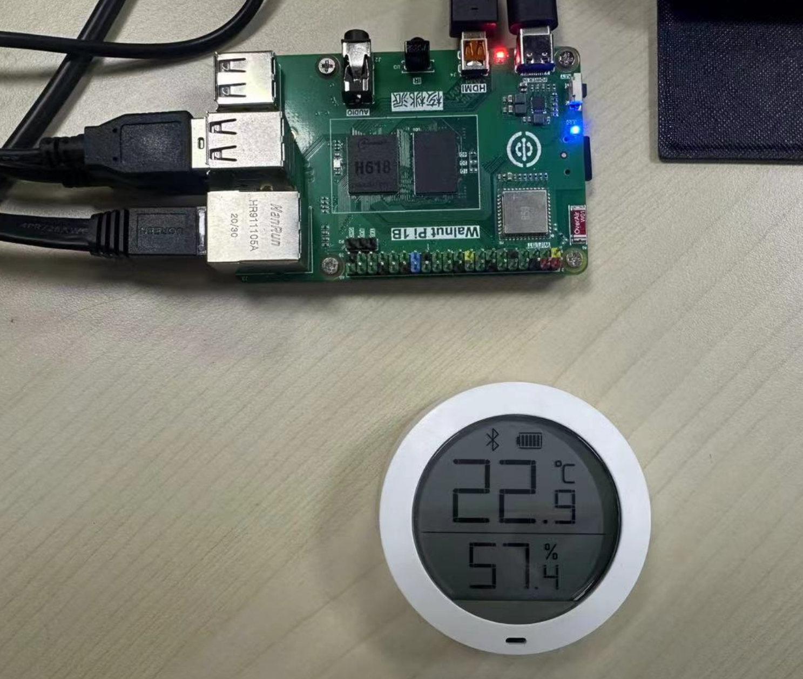
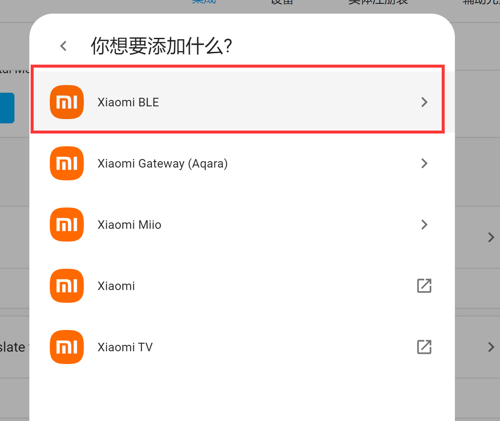
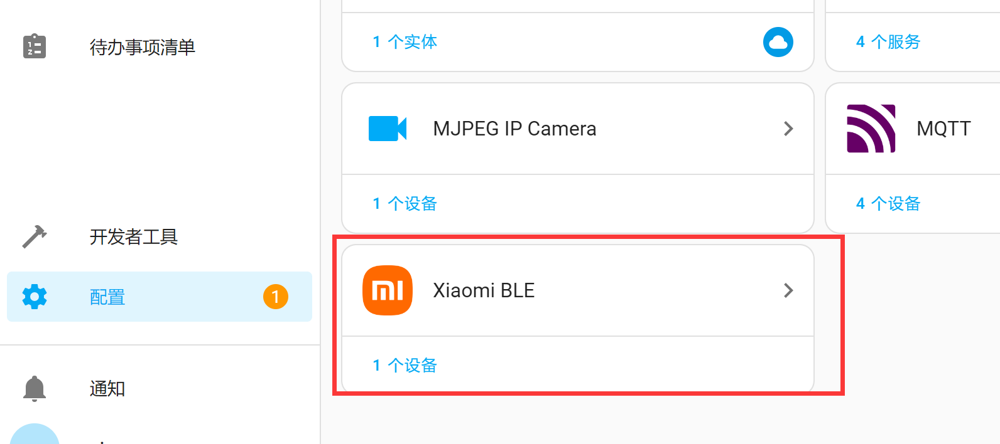

# Adding Commercial Products

## Xiaomi Temperature and Humidity Sensor

Below are several commercially available Xiaomi temperature and humidity sensors.

  

These types of temperature/humidity sensors broadcast information such as temperature, humidity, and battery level via Bluetooth broadcasting without requiring a connection. They can be directly discovered by the WalnutPi Home Assistant host.

Bring the Xiaomi temperature/humidity sensor close to the WalnutPi Home Assistant host:

  

Click **Configuration** -- **Add Integration**, and search for **xiaomi** in the popup window:

  

Select Xiaomi BLE:

  

You can see that a device has appeared — click Submit.

  

The Xiaomi BLE integration now appears in the integrations list.

  

Click into it to see the associated devices and entities, then click **Devices** to view the data information:

  

It can be added to the homepage dashboard:

