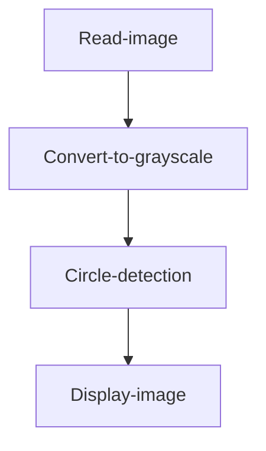
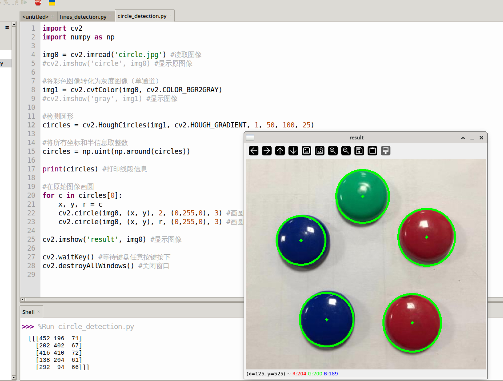

# Circle Detection

## Introduction

This section teaches how to use OpenCV to detect circles in an image.

## Experiment Objective

Detect circles in an image and draw them for display.

## Experiment Explanation

The OpenCV Python library provides the `HoughCircles()` function for detecting circles in an image.

### HoughCircles() Usage

```python
circles = cv2.HoughCircles(image, method, dp, minDist, param1, param2, minRadius, maxRadius)
```
Circle detection. Returns `circles` as an array of multiple circles (center coordinates + radius). Example: `[[x0,y0,r0],[x1,y1,r1]]`
- `image`: Original image.
- `method`: Detection method; defaults to `cv2.HOUGH_GRADIENT`.
- `dp`: Accumulator resolution setting, usually 1.
- `minDist`: Minimum distance between circle centers.
- `param1`: Maximum threshold for Canny edge detection (optional).
- `param2`: The larger the value, the smaller and more precise the detected circles (optional).
- `minRadius`: Minimum radius of detected circles (optional).
- `maxRadius`: Maximum radius of detected circles (optional).

Read the image, convert it to a grayscale image, and then perform circle detection. The code flow is as follows:



<br></br>

The reference code is as follows:

```python
'''
Experiment Name: Circle Detection
Experiment Platform: WalnutPi 1B
'''

import cv2
import numpy as np

img0 = cv2.imread('circle.jpg') # Read the image
cv2.imshow('circle2', img0) # Display the original image

# Convert the color image to a grayscale image (single channel)
img1 = cv2.cvtColor(img0, cv2.COLOR_BGR2GRAY)
#cv2.imshow('gray', img1) # Display the image

# Detect circles
circles = cv2.HoughCircles(img1, cv2.HOUGH_GRADIENT, 1, 50, 100, 20)

# Convert all coordinate and radius information to integers
circles = np.uint(np.around(circles))

print(circles) # Print circle information

# Draw circles on the original image
for c in circles[0]:    
    x, y, r = c
    cv2.circle(img0, (x, y), 2, (0,255,0), 3) # Draw the center point
    cv2.circle(img0, (x, y), r, (0,255,0), 3) # Draw the circle outline

cv2.imshow('result', img0) # Display the image

cv2.waitKey() # Wait for any keyboard key to be pressed
cv2.destroyAllWindows() # Close the window

```

## Experiment Results

Run the above code on the WalnutPi; the experiment results are as follows. You can see that the circular objects are detected:


